# Arsenal de sólidos 3D (Blender)

> Arquivo **gerado** por `gerar_catalogo.py` a partir de `solidos/*.json`. Não edite à mão: edite a ficha e regere.

Cada sólido tem uma ficha com "usar quando / não usar quando". Consulte o índice, abra a ficha do que parecer
servir e confira os critérios antes de decidir. Status: `planejado` (só ideia), `estudo` (funciona, aparência
não aprovada), `aprovado` (pode entrar em vídeo).

| id | Nome | Status | Áreas |
|---|---|---|---|
| `amperiano_circular` | Contorno amperiano circular | aprovado | eletromagnetismo/lei_de_ampere |
| `amperiano_retangular` | Contorno amperiano retangular | aprovado | eletromagnetismo/lei_de_ampere |
| `anel_carregado` | Anel carregado (aro) | aprovado | eletromagnetismo/campo_eletrico, mecanica/momento_de_inercia |
| `anteparo_fenda_dupla` | Anteparo de fenda dupla | aprovado | otica/interferencia, otica/difracao |
| `aro_rolando` | Aro rolando sem deslizar | aprovado | mecanica/rolamento, mecanica/momento_de_inercia |
| `atomo_bohr` | Átomo de Bohr: salto e fóton | aprovado | fisica4/estrutura_atomica |
| `autovetores_elipsoide` | Autovetores e elipsoide de uma matriz simétrica | aprovado | algebra_linear/autovalores_e_autovetores |
| `barra_trilhos_fem_movimento` | Barra em trilhos num campo B (fem de movimento) | aprovado | eletromagnetismo/inducao_eletromagnetica |
| `biot_savart_espira` | Biot–Savart numa espira | aprovado | eletromagnetismo/biot_savart |
| `caixa_gas_cinetica` | Gás ideal em recipiente com êmbolo (teoria cinética) | aprovado | termodinamica/teoria_cinetica, termodinamica/processos_em_gases |
| `campo_vetorial` | Campo vetorial (setas) | aprovado | calculo/campos_vetoriais, eletromagnetismo/campo_eletrico |
| `capacitor_esferico` | Capacitor esférico (esferas concêntricas, em corte) | aprovado | eletromagnetismo/condutores_e_capacitores |
| `capacitor_placas_paralelas` | Capacitor de placas paralelas | aprovado | eletromagnetismo/condutores_e_capacitores |
| `cargas_pontuais` | Cargas pontuais e forças de Coulomb | aprovado | eletromagnetismo/lei_de_coulomb |
| `casca_cilindrica_oca` | Casca cilíndrica oca | aprovado | eletromagnetismo/lei_de_gauss, eletromagnetismo/campo_eletrico |
| `casca_esferica_oca` | Casca esférica oca (com corte em octante) | aprovado | eletromagnetismo/lei_de_gauss, eletromagnetismo/campo_eletrico |
| `cilindro_coaxial` | Cilindro coaxial (condutor maciço + casca externa, em corte) | aprovado | eletromagnetismo/lei_de_gauss, eletromagnetismo/campo_eletrico |
| `cilindro_macico_isolante` | Cilindro maciço isolante com cargas no volume | aprovado | eletromagnetismo/lei_de_gauss, eletromagnetismo/campo_eletrico |
| `cilindro_rolando` | Cilindro rolando sem deslizar | aprovado | mecanica/rolamento, mecanica/momento_de_inercia |
| `colisao_1d` | Colisão unidimensional entre dois blocos | aprovado | mecanica/colisoes |
| `colisao_2d` | Colisão elástica em 2D | aprovado | mecanica/colisoes |
| `condutor_com_cavidade` | Condutor com cavidade e cargas induzidas | aprovado | eletromagnetismo/condutores_e_capacitores |
| `cone_de_luz` | Cone de luz no espaço-tempo | aprovado | fisica4/relatividade_especial |
| `curva_inclinada` | Curva inclinada (pista com inclinação) | aprovado | mecanica/movimento_circular |
| `dioptro_plano` | Dioptro plano: refração e reflexão interna total | aprovado | otica/otica_geometrica |
| `dipolo_eletrico` | Dipolo elétrico e seu campo | aprovado | eletromagnetismo/campo_eletrico |
| `disco_carregado` | Disco carregado | aprovado | eletromagnetismo/campo_eletrico, mecanica/momento_de_inercia |
| `divergencia_local` | Divergência local (cubo elementar) | aprovado | calculo/campos_vetoriais |
| `elemento_volume` | Elemento de volume dV (cartesiano, cilíndrico, esférico) | aprovado | calculo/integrais_triplas, calculo/jacobiano |
| `equipotenciais` | Superfícies equipotenciais (carga pontual e dipolo) | aprovado | eletromagnetismo/potencial_eletrico |
| `esfera_macica_isolante` | Esfera maciça isolante com cargas no volume | aprovado | eletromagnetismo/lei_de_gauss, eletromagnetismo/campo_eletrico |
| `esfera_rolando` | Esfera rolando sem deslizar | aprovado | mecanica/rolamento, mecanica/momento_de_inercia |
| `espelho_esferico` | Espelho esférico (côncavo e convexo) | aprovado | otica/otica_geometrica |
| `espira_em_campo_magnetico` | Espira de corrente num campo magnético (torque) | aprovado | eletromagnetismo/forca_magnetica, eletromagnetismo/dipolo_magnetico |
| `explosao` | Explosão em três fragmentos | aprovado | mecanica/colisoes, mecanica/momento_linear |
| `filme_fino` | Filme fino e interferência | aprovado | otica/interferencia |
| `fio_infinito` | Fio infinito (retilíneo) | aprovado | eletromagnetismo/lei_de_ampere |
| `gaussiana_caixa` | Superfície gaussiana em caixa (pillbox) | aprovado | eletromagnetismo/lei_de_gauss |
| `gaussiana_cilindrica` | Superfície gaussiana cilíndrica (fechada) | aprovado | eletromagnetismo/lei_de_gauss |
| `gaussiana_esferica` | Superfície gaussiana esférica | aprovado | eletromagnetismo/lei_de_gauss |
| `giroscopio_precessao` | Giroscópio e precessão | aprovado | mecanica/momento_angular, mecanica/torque |
| `gradiente_colina` | Gradiente numa colina (curvas de nível) | aprovado | calculo/gradiente, calculo/funcoes_de_varias_variaveis |
| `haste_carregada` | Haste carregada | aprovado | eletromagnetismo/campo_eletrico, mecanica/momento_de_inercia |
| `ima_espira_inducao` | Ímã atravessando uma espira (Faraday e Lenz) | aprovado | eletromagnetismo/inducao_eletromagnetica |
| `integral_de_linha` | Integral de linha (trabalho) | aprovado | calculo/integrais_de_linha |
| `integral_dupla_colunas` | Soma de Riemann dupla (colunas) | aprovado | calculo/integrais_duplas |
| `interferometro_michelson` | Interferômetro de Michelson | aprovado | otica/interferencia, fisica4/relatividade_especial |
| `lagrange_restricao` | Multiplicadores de Lagrange | aprovado | calculo/extremos_varias_variaveis |
| `lente_delgada` | Lente delgada (biconvexa ou biconcava) | aprovado | otica/otica_geometrica |
| `linhas_de_campo_3d` | Linhas de campo em 3D | aprovado | eletromagnetismo/campo_eletrico |
| `massa_mola` | Sistema massa-mola horizontal (MHS) | aprovado | fisica2/mhs |
| `membrana_modos` | Modos de vibração de uma membrana | aprovado | edp/equacao_da_onda |
| `movimento_circular` | Movimento circular uniforme | aprovado | mecanica/movimento_circular |
| `onda_corda` | Onda numa corda (progressiva e estacionária) | aprovado | fisica2/ondas_mecanicas, fisica2/ondas_estacionarias |
| `onda_eletromagnetica` | Onda eletromagnética plana | aprovado | eletromagnetismo/maxwell_e_ondas, fisica4/ondas_eletromagneticas |
| `ondas_duas_fontes` | Ondas na superfície com duas fontes (interferência) | aprovado | fisica2/superposicao_e_interferencia, otica/interferencia |
| `orbita_kepleriana` | Órbita kepleriana com setores de áreas iguais | aprovado | mecanica/gravitacao |
| `orbital_atomico` | Orbitais atômicos (nuvens de probabilidade) | aprovado | fisica4/estrutura_atomica |
| `paisagem_potencial` | Bola numa paisagem de energia potencial | aprovado | mecanica/energia_potencial |
| `particula_em_campo_magnetico` | Partícula carregada em campo magnético uniforme | aprovado | eletromagnetismo/forca_magnetica |
| `pendulo_simples` | Pêndulo simples (pequenas oscilações) | aprovado | fisica2/mhs |
| `placa_infinita_carregada` | Placa infinita carregada (plano com cargas na superfície) | aprovado | eletromagnetismo/lei_de_gauss, eletromagnetismo/campo_eletrico |
| `plano_e_reta_r3` | Plano e reta em R³ | aprovado | calculo/vetores_r3 |
| `plano_inclinado` | Plano inclinado com forças | aprovado | mecanica/leis_de_newton, mecanica/atrito |
| `plano_tangente` | Plano tangente a uma superfície | aprovado | calculo/derivadas_parciais, calculo/linearizacao |
| `poco_gravitacional` | Poço gravitacional (potencial) | aprovado | mecanica/gravitacao |
| `polarizador_malus` | Polarizadores e lei de Malus | aprovado | otica/polarizacao, fisica4/ondas_eletromagneticas |
| `pontos_criticos` | Pontos críticos (máximo, mínimo e sela) | aprovado | calculo/extremos_varias_variaveis |
| `prensa_hidraulica` | Prensa hidráulica (Pascal) | aprovado | fluidos/fluidos_em_repouso |
| `prisma_triangular` | Prisma triangular | aprovado | otica/otica_geometrica |
| `produto_vetorial` | Produto vetorial a × b | aprovado | calculo/vetores_r3, eletromagnetismo/forca_magnetica |
| `rampa_rolamento` | Corrida de esfera, cilindro e aro numa rampa | aprovado | mecanica/rolamento, mecanica/rotacao |
| `rede_de_difracao` | Rede de difração | aprovado | otica/difracao, otica/interferencia |
| `relogio_de_luz` | Relógio de luz e dilatação do tempo | aprovado | fisica4/relatividade_especial |
| `rotacional_roda_de_pas` | Rotacional local (roda de pás) | aprovado | calculo/campos_vetoriais |
| `solenoide_corrente` | Solenoide (hélice de fio) | aprovado | eletromagnetismo/lei_de_ampere |
| `solido_revolucao_arruela` | Sólido de revolução: método das arruelas | aprovado | calculo/volumes_de_revolucao |
| `solido_revolucao_cascas` | Sólido de revolução: método das cascas | aprovado | calculo/volumes_de_revolucao |
| `solido_revolucao_disco` | Sólido de revolução: método dos discos | aprovado | calculo/volumes_de_revolucao |
| `superficie_parametrizada` | Superfície parametrizada com remendo dS | aprovado | calculo/superficies_parametrizadas, calculo/integrais_de_superficie |
| `superficie_quadrica` | Superfícies quádricas | aprovado | calculo/vetores_r3, calculo/superficies_quadricas |
| `tanque_hidrostatico` | Tanque com pressão e empuxo | aprovado | fluidos/fluidos_em_repouso |
| `tanque_torricelli` | Jato de Torricelli | aprovado | fluidos/fluidos_em_movimento |
| `teorema_stokes` | Teorema de Stokes (hemisfério e contorno) | aprovado | calculo/stokes, eletromagnetismo/lei_de_ampere |
| `toroide_corrente` | Toroide (fio enrolado em anel) | aprovado | eletromagnetismo/lei_de_ampere |
| `transformacao_linear_3d` | Transformação linear em R³ | aprovado | algebra_linear/transformacoes_lineares |
| `trilho_looping` | Looping (pista com laço vertical) | aprovado | mecanica/movimento_circular, mecanica/energia_potencial |
| `tubo_escoamento` | Tubo com estrangulamento (continuidade) | aprovado | fluidos/fluidos_em_movimento |

## Padrão visual

Fonte única: `estilo.json`. Identidade: docs/identidade_visual.md. Gramática visual da série Lei de Gauss: constantes de cor em videos_longos/yt_0001_lei_gauss/cena.py e yt_0002_lei_gauss_casos_classicos/cena.py (o 3D segue o 2D, não o contrário).

| Cor | Hex | Papel |
|---|---|---|
| `fundo` | `#050816` | fundo da cena (muito escuro, bastante espaço negativo) |
| `texto_neutro` | `#F5F7FF` | matemática neutra; luz principal |
| `campo_eletrico` | `#35D9FF` | E⃗ e linhas de campo. RESERVADA ao campo: nunca em fontes, cargas ou superfícies |
| `fonte_fisica` | `#267BFF` | distribuição física: preenchimento do corpo, n̂ |
| `fonte_contorno` | `#7FB2FF` | contorno/aro da distribuição física, cargas próximas, R, Q; luz de contorno |
| `gaussiana` | `#9C8CFF` | superfície gaussiana, contorno amperiano e r: construção matemática, tracejada ou translúcida, nunca sólida |
| `area_vetor` | `#745CFF` | vetor área d⃗A e seleção matemática translúcida |
| `apoio_magenta` | `#EA63FF` | mesmo valor de campo_magnetico; use `campo_magnetico` para B⃗ e para o polo sul |
| `fonte_escura` | `#0B2A7A` | DERIVADA de fonte_fisica, escurecida à mão: interior de cascas (profundidade) |
| `campo_magnetico` | `#EA63FF` | campo magnético B⃗ (e polo sul do ímã). Decisão do usuário em 2026-10-07: o ciano segue sendo só o campo elétrico E⃗ |
| `vetor_fisico` | `#F5F7FF` | velocidade, força, torque e momento angular: branco neutro (decisão do usuário, 2026-10-07; os vídeos antigos divergem, ex.: v em ciano no vid_0005 e em azul no vid_0014) |

**Regras**
- Ciano é só do campo elétrico: cargas e fontes são azul (#267BFF preenchimento, #7FB2FF contorno).
- Superfície gaussiana é violeta #9C8CFF, tracejada ou translúcida; nunca preenchimento sólido (não pode esconder a fonte).
- Sem bloom e sem estética gamer: a emissão máxima do arsenal é 2,2 (borda do vidro); nenhum sólido compete com texto e equações.
- Fundo #050816 e view transform Standard: as cores renderizadas têm de bater com a paleta do 2D.
- Legibilidade antes de efeito: ao desenhar um sólido novo, a distinção entre sólidos vizinhos (ex.: casca x maciço) deve valer sem rótulo.
- Nenhum hexadecimal ou parâmetro de material solto no código: tudo vem deste arquivo (gerar_catalogo.py recusa literais).
- Sinal da carga: esculpido na geometria (um '+' ou um '−' em relevo na esfera, virado para a câmera), nunca por cor. Esferas de carga com sinal são maiores que as cargas pontuais (raio 0,22).
- Campo magnético B⃗ = magenta #EA63FF; campo elétrico E⃗ = ciano #35D9FF. Polos do ímã: N = azul, S = magenta (nomes N e S por rótulo no Manim). Velocidade, força, torque e momento angular = branco.

**Render:** Eevee, 64 amostras, view transform Standard; preview
960×540 a 15 fps; final
1920×1080 a 30 fps.

## Sólidos

### `amperiano_circular` — Contorno amperiano circular

**Status:** aprovado · Aparência aprovada pelo usuário em 2026-10-07 (padrão visual de estilo.json); validado em 960x540 e 1080p.

Círculo violeta (#9C8CFF), tracejado por padrão, no plano YZ, em torno do eixo X. Por padrão envolve um fio infinito de referência.

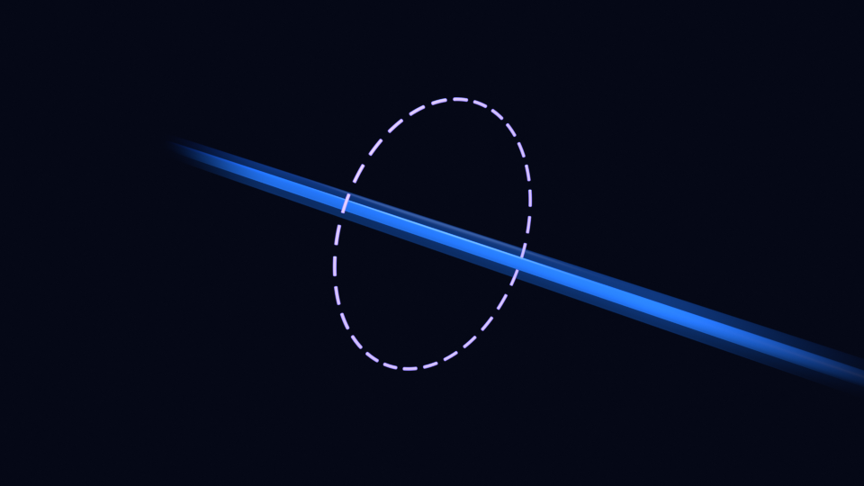

**Como se lê:** Círculo tracejado violeta em torno do fio azul. Tracejado = construção; contínuo (`continua=1`) = circulação calculada.

**Usar quando**
- campo B de um fio infinito (circulação em torno do fio, B tangente ao círculo)
- campo B dentro/fora de um toroide (círculo concêntrico)
- delimitar regiões por raio (dentro/fora do condutor)

**Não usar quando**
- o contorno atravessa a parede de um solenoide (use amperiano_retangular)
- superfície fechada de fluxo (use as gaussianas)

**Limitações**
- construção matemática (violeta, tracejada ou contínua), nunca preenchimento sólido: as faces opcionais são vidro violeta muito translúcido
- com_fonte=1 desenha uma fonte de referência só para contexto e teste de leitura; em vídeo use com_fonte=0 e componha com a fonte da cena
- o contorno é uma curva fechada (sem preenchimento); o sentido de percurso não é indicado: usar seta/rótulo no Manim

| Parâmetro | Padrão | Unid. | Descrição |
|---|---|---|---|
| `raio` | 1.4 | u | raio do círculo |
| `continua` | 0 | 0/1 | 0 = tracejado (construção); 1 = contínuo (circulação) |
| `faces` | 0 | 0/1 | 1 = disco de vidro violeta translúcido dentro do contorno |
| `com_fonte` | 1 | 0/1 | 1 = desenha um fio infinito de referência |
| `comprimento_fonte` | 10.0 | u | comprimento do fio de referência |
| `raio_fonte` | 0.06 | u | raio do fio de referência |

**Integração:** `png_seq_alpha` · custo 0.71 s/frame (1080p, Eevee)

```powershell
& "C:\Program Files\Blender Foundation\Blender 5.2\blender.exe" -b -P experimentos\blender\arsenal\renderizar.py -- amperiano_circular --res 1920x1080 --alpha
```

**No Manim:**

```python
from manim_solido3d import Solido3D   # sys.path: experimentos/blender/arsenal
img = Solido3D("amperiano_circular").mobject(altura=5)   # estático: um quadro PNG com alpha
```

Ficha: `solidos/amperiano_circular.json`

### `amperiano_retangular` — Contorno amperiano retangular

**Status:** aprovado · Aparência aprovada pelo usuário em 2026-10-07 (padrão visual de estilo.json); validado em 960x540 e 1080p.

Retângulo violeta (#9C8CFF), tracejado por padrão, no plano XY (contém o eixo X): lados `comprimento` (em X) e `altura` (em Y), centrado na parede do solenoide de referência.

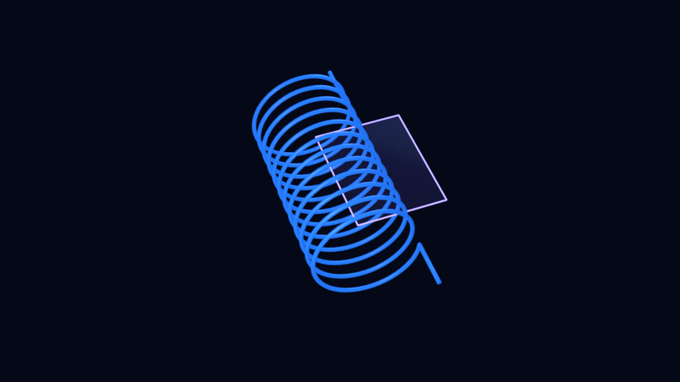

**Como se lê:** Retângulo tracejado violeta atravessando a parede do solenoide: metade dentro, metade fora. Lê-se como 'só o lado de dentro contribui'.

**Usar quando**
- campo B no interior de um solenoide longo (retângulo amperiano atravessando a parede)
- mostrar a corrente envolvida (n·l·I) pelos fios que o retângulo atravessa
- mostrar que os lados transversais e o lado de fora não contribuem

**Não usar quando**
- fio ou toroide (use amperiano_circular)
- contorno que deve ficar inteiramente fora do solenoide

**Limitações**
- construção matemática (violeta, tracejada ou contínua), nunca preenchimento sólido: as faces opcionais são vidro violeta muito translúcido
- com_fonte=1 desenha uma fonte de referência só para contexto e teste de leitura; em vídeo use com_fonte=0 e componha com a fonte da cena
- plano fixo XY e centrado em y = raio da fonte: outro posicionamento exige alterar `centro_y` no código
- o sentido de percurso não é indicado: usar seta/rótulo no Manim

| Parâmetro | Padrão | Unid. | Descrição |
|---|---|---|---|
| `comprimento` | 2.4 | u | lado do retângulo ao longo de X |
| `altura` | 1.8 | u | lado do retângulo ao longo de Y |
| `continua` | 0 | 0/1 | 0 = tracejado; 1 = contínuo |
| `faces` | 0 | 0/1 | 1 = face de vidro violeta translúcido |
| `com_fonte` | 1 | 0/1 | 1 = desenha um solenoide de referência |
| `raio_fonte` | 1.0 | u | raio do solenoide de referência (o retângulo é centrado na parede, em y = raio) |
| `comprimento_fonte` | 4.0 | u | comprimento do solenoide de referência |
| `n_espiras_fonte` | 12 | n | número de espiras do solenoide de referência |

**Integração:** `png_seq_alpha` · custo 0.45 s/frame (1080p, Eevee)

```powershell
& "C:\Program Files\Blender Foundation\Blender 5.2\blender.exe" -b -P experimentos\blender\arsenal\renderizar.py -- amperiano_retangular --res 1920x1080 --alpha
```

**No Manim:**

```python
from manim_solido3d import Solido3D   # sys.path: experimentos/blender/arsenal
img = Solido3D("amperiano_retangular").mobject(altura=5)   # estático: um quadro PNG com alpha
```

Ficha: `solidos/amperiano_retangular.json`

### `anel_carregado` — Anel carregado (aro)

**Status:** aprovado · Aparência aprovada pelo usuário em 2026-10-07 (padrão visual de estilo.json); validado em 960x540 e 1080p.

Anel fino de vidro azulado no plano YZ, com eixo de simetria em X, e cargas espaçadas ao longo do aro (espaçamento regular com pequeno jitter). Eixo de simetria opcional (tracejado neutro).

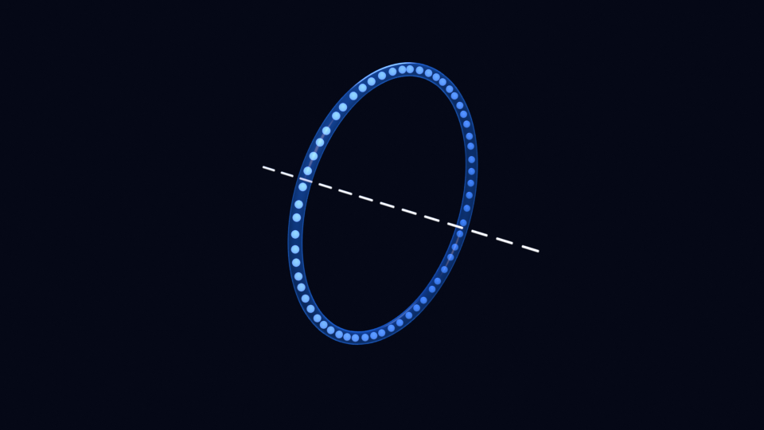

**Como se lê:** Aro de vidro fino com pontos azuis alinhados e, opcionalmente, o eixo tracejado atravessando o centro. Lê-se como 'carga distribuída numa linha circular; o campo no eixo se calcula somando dq'.

**Usar quando**
- campo elétrico no eixo de um anel carregado (integração de elementos de carga dq, simetria, análise de máximo e limites)
- momento de inércia de um aro (com_cargas=0), com o eixo de simetria desenhado
- contraste com o disco (superfície) e com a haste (linha reta)
- espira com corrente: cargas circulando pelo aro (cargas_moveis=1)

**Não usar quando**
- a carga está numa superfície (use disco_carregado) ou numa linha reta (use haste_carregada)
- a espessura real do anel importa para o problema (o tubo aqui é só visual)

**Limitações**
- o campo e a gaussiana não são desenhados: o ciano é reservado ao campo (animação 2D/Manim)
- em contexto de mecânica (com_cargas=0) o azul de 'fonte física' vem da gramática de Eletromagnetismo; a gramática de cor da Mecânica não foi verificada aqui
- espessura/raio do corpo exagerados em relação ao ideal (o corpo de vidro é visível); as cargas ficam dentro dele
- as cargas têm espaçamento quase regular (jitter 0,12): uma distribuição contínua é aproximada por pontos
- o movimento não codifica a corrente: a convenção (corrente convencional ou elétrons, que vão ao contrário) e o sinal vão por seta e rótulo no Manim; o movimento é didático, não em escala
- com cargas_moveis=1 as cargas estáticas (com_cargas) são substituídas pelas móveis

| Parâmetro | Padrão | Unid. | Descrição |
|---|---|---|---|
| `raio` | 1.5 | u | raio do anel |
| `raio_tubo` | 0.07 | u | raio do tubo do anel (visual) |
| `n_cargas` | 60 | n | número de cargas ao longo do aro |
| `com_cargas` | 1 | 0/1 | 1 = cargas pontuais (campo elétrico); 0 = só o corpo de vidro (ex.: momento de inércia) |
| `eixo` | 0 | 0/1 | 1 = eixo de simetria tracejado em cor neutra |
| `comprimento_eixo` | 4.0 | u | comprimento do eixo de simetria, se desenhado |
| `semente` | 7 | n | semente do sorteio/jitter (mesma semente = mesma distribuição) |
| `cargas_moveis` | 0 | 0/1 | 1 = cargas em movimento (animação em loop); use com animar.py ou a ponte com o Manim |
| `fase` | 0.0 | 0-1 | fase do movimento; fase=1 repete o quadro da fase 0 (loop perfeito) |
| `espaco_cargas` | 0.4 | u | distância entre cargas ao longo do aro (ajustada para fechar a volta) |
| `tamanho_carga_movel` | 0.07 | u | raio de cada carga móvel |

**Integração:** `png_seq_alpha` · custo 0.63 s/frame (1080p, Eevee)

**Animação (cargas em movimento):** `circulacao` · loop sem emenda (`fase` de 0 a 1) · 60 quadros sugeridos · custo 0.62 s/frame (1080p, com alpha)

```powershell
& "C:\Program Files\Blender Foundation\Blender 5.2\blender.exe" -b -P experimentos\blender\arsenal\renderizar.py -- anel_carregado --res 1920x1080 --alpha
```

**No Manim:**

```python
from manim_solido3d import Solido3D   # sys.path: experimentos/blender/arsenal
img = Solido3D("anel_carregado").mobject(cena=self, altura=5)   # cargas em loop; img.pausar() / img.retomar()
```

Ficha: `solidos/anel_carregado.json`

### `anteparo_fenda_dupla` — Anteparo de fenda dupla

**Status:** aprovado · Aparência aprovada pelo usuário em 2026-10-07 (padrão visual de estilo.json); validado em 960x540 e 1080p.

Anteparo opaco azul (normal X) com duas fendas verticais (ao longo de Z) de largura `fenda`, separadas de `separacao` entre centros; as bordas das fendas em azul-claro. Nada atrás dele: a onda, as frentes e a figura de interferência são do Manim.

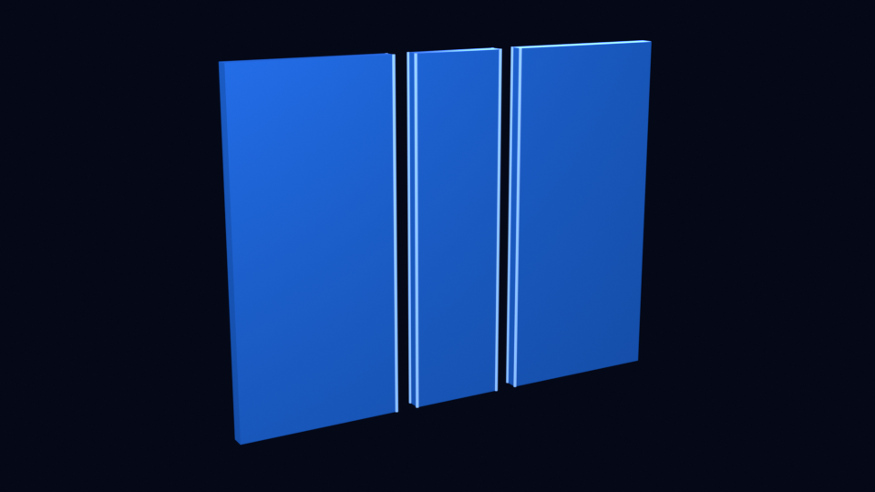

**Como se lê:** Placa azul com duas frestas escuras e bordas claras: lê-se como 'duas fontes coerentes'.

**Usar quando**
- experimento de Young: interferência em fenda dupla, d sen θ = mλ
- difração por fenda simples (com separacao grande ou uma só fenda no Manim)
- mostrar a geometria (a, d) antes das frentes de onda

**Não usar quando**
- redes de difração com muitas fendas
- fenda simples: este sólido sempre tem duas

**Limitações**
- só o objeto: raios, frentes de onda, ângulos e a figura de interferência são do Manim
- vidro translúcido azul-claro (padrão do arsenal): não representa cor, dispersão nem índice de refração
- as fendas se leem como frestas escuras: sem fundo, o espaço atrás aparece vazio (preto)

| Parâmetro | Padrão | Unid. | Descrição |
|---|---|---|---|
| `largura` | 4.0 | u | largura do anteparo (eixo Y) |
| `altura` | 3.0 | u | altura do anteparo (eixo Z) |
| `espessura` | 0.12 | u | espessura (eixo X) |
| `fenda` | 0.2 | u | largura a de cada fenda |
| `separacao` | 1.0 | u | distância d entre os centros das fendas |

**Integração:** `png_seq_alpha` · custo 0.6 s/frame (1080p, Eevee)

```powershell
& "C:\Program Files\Blender Foundation\Blender 5.2\blender.exe" -b -P experimentos\blender\arsenal\renderizar.py -- anteparo_fenda_dupla --res 1920x1080 --alpha
```

**No Manim:**

```python
from manim_solido3d import Solido3D   # sys.path: experimentos/blender/arsenal
img = Solido3D("anteparo_fenda_dupla").mobject(altura=5)   # estático: um quadro PNG com alpha
```

Ficha: `solidos/anteparo_fenda_dupla.json`

### `aro_rolando` — Aro rolando sem deslizar

**Status:** aprovado · Aparência aprovada pelo usuário em 2026-10-07 (padrão visual de estilo.json); validado em 960x540 e 1080p.

Aro (toro fino de vidro azulado, eixo ao longo de Y) com 3 marcas a 120° e a do centro de massa, sobre o chão que corre. Eixo instantâneo violeta tracejado no contato.

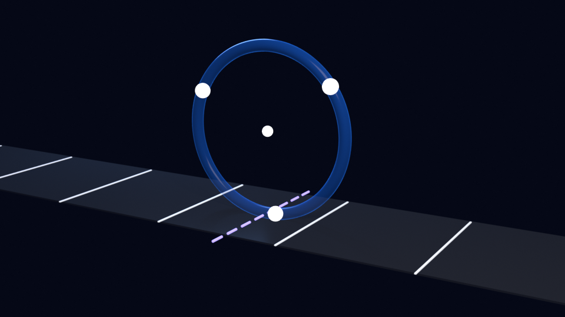

**Como se lê:** Aro girando parado no centro, com 3 marcas que mostram a rotação sem rótulo; o chão corre. Lê-se como 'aro rolando sem deslizar'.

**Usar quando**
- rolamento sem deslizar: v_cm = ωR, energia cinética de translação + rotação
- mostrar o eixo instantâneo de rotação (no ponto de contato) como construção violeta
- comparar corpos de momentos de inércia diferentes (esfera, cilindro, aro) pela forma, em vídeos separados ou composição no Manim
- aro ou argola rolando (I = M R²)

**Não usar quando**
- o corpo desliza (rolamento com escorregamento): as marcas do chão não acompanham o giro
- problemas com rampa e corrida de corpos: aqui só chão plano
- disco ou cilindro cheio: use cilindro_rolando

**Limitações**
- câmera acompanha o corpo: ele gira parado no centro do quadro e é o chão que corre (é o que torna o loop perfeito); para mostrar o corpo avançando no quadro, ou corridas entre corpos, é preciso compor no Manim
- chão horizontal: não há rampa nem inclinação
- só a cinemática visual: velocidades (v_cm = ωR), energia, atrito e o sentido de rotação em vetores/rótulos ficam para o Manim
- a gramática de cor de Mecânica segue o padrão do arsenal (estilo.json): azul para o corpo, branco neutro para as marcas, violeta tracejado para a construção (eixo instantâneo)
- o aro é um toro fino: a espessura é só visual (0,07)
- o loop fecha com ruído de amostragem: 95% dos pixels diferem em até 2/255 entre a fase 0 e a fase 1 (só 2 a 301 pixels chegam a 3-7), invisível a olho nu

| Parâmetro | Padrão | Unid. | Descrição |
|---|---|---|---|
| `raio` | 1.0 | u | raio do corpo |
| `voltas` | 1 | n | voltas completas por loop (o chão avança 2πR por volta) |
| `eixo_instantaneo` | 1 | 0/1 | 1 = eixo instantâneo de rotação tracejado violeta no ponto de contato |
| `marca_centro` | 1 | 0/1 | 1 = marca do centro de massa |
| `movimento` | 0 | 0/1 | 1 = animação do rolamento (use animar.py ou a ponte com o Manim) |
| `fase` | 0.0 | 0-1 | fase do rolamento; fase=1 repete o quadro da fase 0 (loop perfeito) |

**Integração:** `png_seq_alpha` · custo 0.88 s/frame (1080p, Eevee)

**Animação (cargas em movimento):** `rolamento` · loop sem emenda (`fase` de 0 a 1) · 60 quadros sugeridos · custo 0.88 s/frame (1080p, com alpha)

```powershell
& "C:\Program Files\Blender Foundation\Blender 5.2\blender.exe" -b -P experimentos\blender\arsenal\renderizar.py -- aro_rolando --res 1920x1080 --alpha
```

**No Manim:**

```python
from manim_solido3d import Solido3D   # sys.path: experimentos/blender/arsenal
img = Solido3D("aro_rolando").mobject(cena=self, altura=5)   # cargas em loop; img.pausar() / img.retomar()
```

Ficha: `solidos/aro_rolando.json`

### `atomo_bohr` — Átomo de Bohr: salto e fóton

**Status:** aprovado · Aparência aprovada pelo usuário em 2026-10-07 (padrão visual de estilo.json); validado em 960x540 e 1080p.

Núcleo (esfera), órbitas tracejadas (violeta) de raio ∝ n² e um elétron. No instante `instante` o elétron salta de n_inicial para n_final (com uma transição suave) e emite um fóton (esfera com uma onda atrás) que se afasta na direção do salto. Ciclo único.

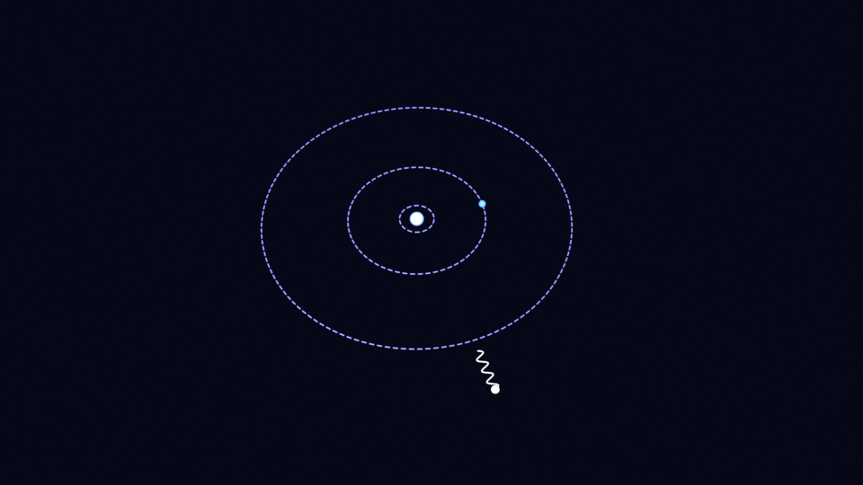

**Como se lê:** Órbitas concêntricas tracejadas, um ponto que muda de órbita e um pequeno pulso ondulado que sai: lê-se como salto quântico com emissão de fóton.

**Usar quando**
- modelo de Bohr e os níveis de energia
- emissão e absorção de fótons: E_fóton = E_ni − E_nf
- série de Balmer (nf = 2)

**Não usar quando**
- orbitais e a nuvem de probabilidade (use orbital_atomico)
- mais de um elétron

**Limitações**
- só o objeto geométrico: valores, fórmulas, rótulos (n, θ, λ, ...) e o padrão de franjas/difração são do Manim
- a gramática de cor segue o padrão do arsenal (estilo.json): raios de luz = branco, campo E = ciano, objetos transparentes = vidro azul-claro, construções = violeta tracejado
- as órbitas são de raio ∝ n² (a mesma lei do modelo de Bohr), mas o tamanho é visual
- o elétron gira com velocidade angular constante (sem a lei de v ∝ 1/n)
- a energia, os valores e as séries são do Manim

| Parâmetro | Padrão | Unid. | Descrição |
|---|---|---|---|
| `n_inicial` | 3 | n | órbita inicial |
| `n_final` | 2 | n | órbita final |
| `escala` | 0.55 | u | raio da primeira órbita |
| `instante` | 0.5 | 0-1 | fase em que ocorre o salto |
| `voltas` | 2 | n | voltas do elétron no ciclo |
| `movimento` | 0 | 0/1 | 1 = animação (use animar.py ou a ponte com o Manim) |
| `fase` | 0.0 | 0-1 | fase da animação |

**Integração:** `png_seq_alpha` · custo não medido

**Animação (cargas em movimento):** `salto` · loop sem emenda (`fase` de 0 a 1) · 60 quadros sugeridos · custo 0.4 s/frame (1080p, com alpha)

```powershell
& "C:\Program Files\Blender Foundation\Blender 5.2\blender.exe" -b -P experimentos\blender\arsenal\renderizar.py -- atomo_bohr --res 1920x1080 --alpha
```

**No Manim:**

```python
from manim_solido3d import Solido3D   # sys.path: experimentos/blender/arsenal
img = Solido3D("atomo_bohr").mobject(cena=self, altura=5)   # cargas em loop; img.pausar() / img.retomar()
```

Ficha: `solidos/atomo_bohr.json`

### `autovetores_elipsoide` — Autovetores e elipsoide de uma matriz simétrica

**Status:** aprovado · Aparência aprovada pelo usuário em 2026-10-07 (padrão visual de estilo.json); validado em 960x540 e 1080p.

Esfera unitária (três círculos máximos violeta, parados) e a sua imagem por uma matriz simétrica A = Q Λ Qᵀ: um elipsoide (vidro azul) cujos semi-eixos têm comprimento |λ| e estão ao longo dos autovetores (setas brancas e eixos tracejados). Com movimento o elipsoide sai da esfera, chega a A e volta (loop).

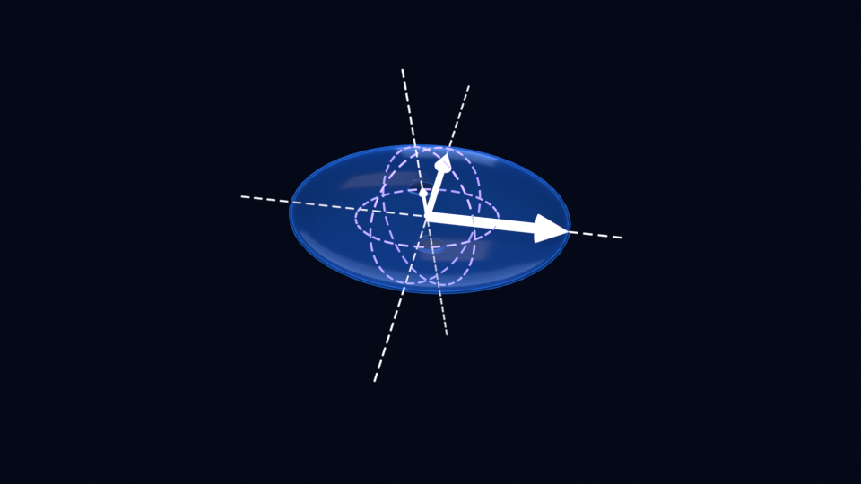

**Como se lê:** Uma esfera tracejada que se estica num elipsoide inclinado, com três setas brancas ao longo dos eixos: lê-se como autovalores e autovetores.

**Usar quando**
- autovetores como direções que só são esticadas
- teorema espectral: eixos ortogonais da matriz simétrica
- formas quadráticas e quádricas (superficie_quadrica)

**Não usar quando**
- matrizes não simétricas (eixos oblíquos ou complexos)
- autovalores negativos (o elipsoide ignora o sinal)

**Limitações**
- só o objeto geométrico: valores, fórmulas, matrizes, resultados e rótulos são do Manim
- a gramática de cor segue o padrão do arsenal (estilo.json): superfícies = vidro azul, curvas = azul-claro, construções = violeta, vetores = branco, normal e ∇g = azul, campo = ciano
- só matrizes simétricas definidas por (λ1, λ2, λ3) e os ângulos de Q
- os semi-eixos são |λ|: o sinal do autovalor não aparece (as setas de comprimento λ inverteriam)
- a escala é visual

| Parâmetro | Padrão | Unid. | Descrição |
|---|---|---|---|
| `lambda1` | 2.0 | n | autovalor 1 |
| `lambda2` | 1.25 | n | autovalor 2 |
| `lambda3` | 0.6 | n | autovalor 3 |
| `angulo_z` | 35.0 | graus | rotação de Q em torno de Z |
| `angulo_x` | 25.0 | graus | rotação de Q em torno de X |
| `escala` | 1.0 | x | escala do desenho |
| `intensidade` | 1.0 | 0-1 | fração da esfera ao elipsoide (sem movimento) |
| `movimento` | 0 | 0/1 | 1 = animação (use animar.py ou a ponte com o Manim) |
| `fase` | 0.0 | 0-1 | fase da animação |

**Integração:** `png_seq_alpha` · custo não medido

**Animação (cargas em movimento):** `deformacao` · loop sem emenda (`fase` de 0 a 1) · 60 quadros sugeridos · custo 0.74 s/frame (1080p, com alpha)

```powershell
& "C:\Program Files\Blender Foundation\Blender 5.2\blender.exe" -b -P experimentos\blender\arsenal\renderizar.py -- autovetores_elipsoide --res 1920x1080 --alpha
```

**No Manim:**

```python
from manim_solido3d import Solido3D   # sys.path: experimentos/blender/arsenal
img = Solido3D("autovetores_elipsoide").mobject(cena=self, altura=5)   # cargas em loop; img.pausar() / img.retomar()
```

Ficha: `solidos/autovetores_elipsoide.json`

### `barra_trilhos_fem_movimento` — Barra em trilhos num campo B (fem de movimento)

**Status:** aprovado · Aparência aprovada pelo usuário em 2026-10-07 (padrão visual de estilo.json); validado em 960x540 e 1080p.

Duas trilhas paralelas fechadas à esquerda e uma barra que desliza num B uniforme (+Z, setas magenta). A área do circuito (violeta translúcido) é o fluxo e as setas brancas são a corrente induzida (sentido de Lenz, módulo ∝ v). Com movimento a barra oscila: o sentido da corrente inverte com a velocidade.

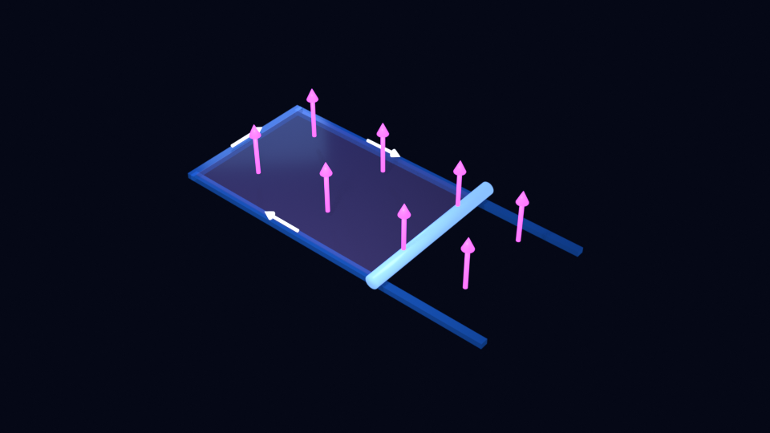

**Como se lê:** Um retângulo violeta que cresce e encolhe com uma barra, e setinhas que giram e invertem: lê-se como 'fem de movimento = B L v'.

**Usar quando**
- fem de movimento (ε = B L v) e o fluxo que varia pela área
- lei de Lenz num circuito deslizante
- corrente induzida e potência dissipada (no Manim)

**Não usar quando**
- campos não uniformes ou barras que giram
- circuitos com resistências desenhadas

**Limitações**
- só o objeto geométrico: fórmulas, valores, gráficos e rótulos (inclusive N/S, +/−, nomes de vetores) são do Manim
- a gramática de cor segue o padrão do arsenal (estilo.json): E = ciano, B = magenta, vetores físicos = branco, normal = azul, construções = violeta
- a velocidade da barra é senoidal (prescrita), a fem acompanha sem atraso
- o módulo das setas de corrente é ∝ |v| numa escala visual

| Parâmetro | Padrão | Unid. | Descrição |
|---|---|---|---|
| `largura` | 1.3 | u | meia distância entre os trilhos |
| `comprimento` | 6.2 | u | comprimento dos trilhos |
| `centro` | 3.2 | u | posição central da barra |
| `amplitude` | 1.5 | u | amplitude do movimento (com movimento) |
| `posicao` | 3.6 | u | posição da barra (sem movimento) |
| `campo` | 1 | 0/1 | setas de B |
| `movimento` | 0 | 0/1 | 1 = animação (use animar.py ou a ponte com o Manim) |
| `fase` | 0.0 | 0-1 | fase da animação |

**Integração:** `png_seq_alpha` · custo 0.64 s/frame (1080p, Eevee)

**Animação (cargas em movimento):** `oscilacao` · loop sem emenda (`fase` de 0 a 1) · 60 quadros sugeridos · custo 0.64 s/frame (1080p, com alpha)

```powershell
& "C:\Program Files\Blender Foundation\Blender 5.2\blender.exe" -b -P experimentos\blender\arsenal\renderizar.py -- barra_trilhos_fem_movimento --res 1920x1080 --alpha
```

**No Manim:**

```python
from manim_solido3d import Solido3D   # sys.path: experimentos/blender/arsenal
img = Solido3D("barra_trilhos_fem_movimento").mobject(cena=self, altura=5)   # cargas em loop; img.pausar() / img.retomar()
```

Ficha: `solidos/barra_trilhos_fem_movimento.json`

### `biot_savart_espira` — Biot–Savart numa espira

**Status:** aprovado · Aparência aprovada pelo usuário em 2026-10-07 (padrão visual de estilo.json); validado em 960x540 e 1080p.

Espira de fio azul no plano YZ, ponto P no eixo, o elemento dl (seta branca), o vetor r de dl até P (violeta tracejado) e a contribuição dB em P (seta magenta, direção dl × r). Com movimento o elemento percorre a espira.

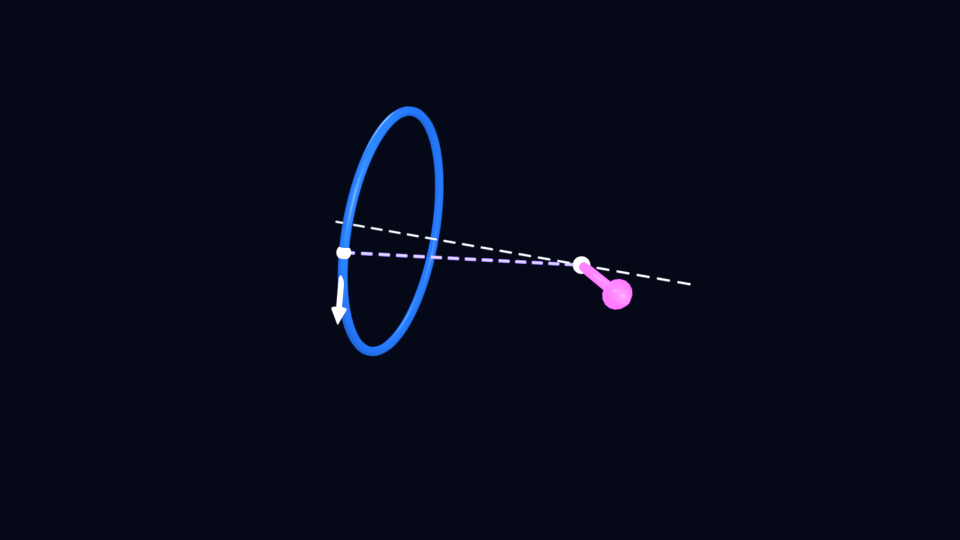

**Como se lê:** Anel com uma seta branca no fio e uma seta magenta em P: lê-se como 'cada elemento de corrente contribui com um dB'.

**Usar quando**
- campo no eixo de uma espira por Biot–Savart (soma dos dB, componentes que se cancelam)
- mostrar a geometria dl, r e dB antes da integral
- contraste com Ampère (simetria) e com o solenoide

**Não usar quando**
- campos de fios retos ou arcos (a geometria é outra)
- campo fora do eixo

**Limitações**
- só o objeto geométrico: fórmulas, valores, gráficos e rótulos (inclusive N/S, +/−, nomes de vetores) são do Manim
- a gramática de cor segue o padrão do arsenal (estilo.json): E = ciano, B = magenta, vetores físicos = branco, normal = azul, construções = violeta
- só um elemento dl por vez; a soma sobre a espira é do Manim

| Parâmetro | Padrão | Unid. | Descrição |
|---|---|---|---|
| `raio` | 1.5 | u | raio da espira |
| `distancia` | 2.4 | u | distância do ponto P ao plano da espira |
| `theta0` | 2.2 | rad | posição angular do elemento (sem movimento) |
| `movimento` | 0 | 0/1 | 1 = animação (use animar.py ou a ponte com o Manim) |
| `fase` | 0.0 | 0-1 | fase da animação |

**Integração:** `png_seq_alpha` · custo 0.4 s/frame (1080p, Eevee)

**Animação (cargas em movimento):** `percurso` · loop sem emenda (`fase` de 0 a 1) · 60 quadros sugeridos · custo 0.4 s/frame (1080p, com alpha)

```powershell
& "C:\Program Files\Blender Foundation\Blender 5.2\blender.exe" -b -P experimentos\blender\arsenal\renderizar.py -- biot_savart_espira --res 1920x1080 --alpha
```

**No Manim:**

```python
from manim_solido3d import Solido3D   # sys.path: experimentos/blender/arsenal
img = Solido3D("biot_savart_espira").mobject(cena=self, altura=5)   # cargas em loop; img.pausar() / img.retomar()
```

Ficha: `solidos/biot_savart_espira.json`

### `caixa_gas_cinetica` — Gás ideal em recipiente com êmbolo (teoria cinética)

**Status:** aprovado · Aparência aprovada pelo usuário em 2026-10-07 (padrão visual de estilo.json); validado em 960x540 e 1080p.

Recipiente de vidro (arestas azul-claro) com um êmbolo e moléculas neutras (brancas perto, azul-claro longe) ricocheteando nas paredes e no êmbolo. `pistao` = fração do comprimento ocupada pelo gás; `temperatura` multiplica a velocidade das moléculas; `amplitude_pistao` faz o êmbolo oscilar (compressão e expansão) ao longo do loop.

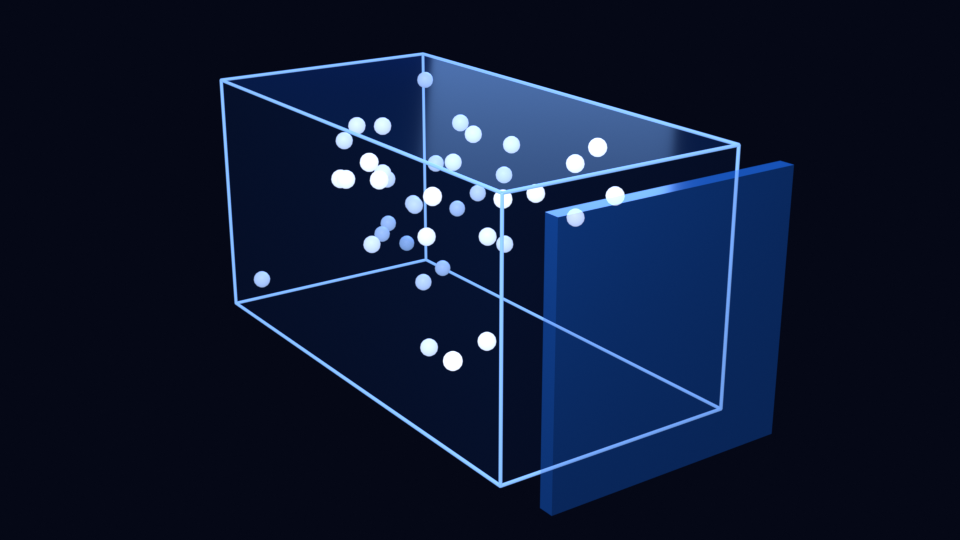

**Como se lê:** Caixa de vidro com um êmbolo e pontos brancos em movimento; com o êmbolo oscilando, o volume muda e as moléculas ficam mais densas. Lê-se como 'gás ideal: pressão = colisões, T = velocidade média'.

**Usar quando**
- teoria cinética: pressão como colisões com as paredes, temperatura como energia cinética média
- processos em gases ideais: compressão e expansão pelo êmbolo (isotérmica, adiabática no Manim)
- primeira lei: trabalho realizado pelo êmbolo

**Não usar quando**
- o ponto é o gráfico P×V (é do Manim; este sólido dá a imagem microscópica)
- gás real ou interações entre moléculas (as moléculas não colidem entre si)

**Limitações**
- as moléculas não colidem entre si e a velocidade de cada uma é fixa (ciclos inteiros por loop): não há distribuição de Maxwell nem troca de energia
- ao oscilar o êmbolo, as posições são escaladas com o volume (aproximação visual): a velocidade não muda como numa compressão adiabática real; temperatura/pressão ficam para o Manim
- moléculas e cargas têm aspectos parecidos (pontos): moléculas são brancas, cargas azuis
- a velocidade é o número de ciclos por loop: o loop precisa ser longo o bastante (60 quadros) para as mais rápidas não parecerem tremer

| Parâmetro | Padrão | Unid. | Descrição |
|---|---|---|---|
| `comprimento` | 4.0 | u | comprimento do recipiente (eixo X) |
| `largura` | 2.0 | u | lado da seção quadrada |
| `n_moleculas` | 40 | n | número de moléculas |
| `temperatura` | 1.0 | x | fator de velocidade das moléculas (inteiro de ciclos por loop) |
| `pistao` | 0.8 | 0-1 | fração do comprimento ocupada pelo gás |
| `amplitude_pistao` | 0.0 | 0-1 | oscilação do êmbolo (fração do comprimento); 0 = fixo |
| `semente` | 7 | n | semente do sorteio |
| `movimento` | 0 | 0/1 | 1 = animação em loop (use animar.py ou a ponte com o Manim) |
| `fase` | 0.0 | 0-1 | fase do loop; fase=1 repete o quadro da fase 0 (loop perfeito) |

**Integração:** `png_seq_alpha` · custo 1.12 s/frame (1080p, Eevee)

**Animação (cargas em movimento):** `colisoes` · loop sem emenda (`fase` de 0 a 1) · 60 quadros sugeridos · custo 1.12 s/frame (1080p, com alpha)

```powershell
& "C:\Program Files\Blender Foundation\Blender 5.2\blender.exe" -b -P experimentos\blender\arsenal\renderizar.py -- caixa_gas_cinetica --res 1920x1080 --alpha
```

**No Manim:**

```python
from manim_solido3d import Solido3D   # sys.path: experimentos/blender/arsenal
img = Solido3D("caixa_gas_cinetica").mobject(cena=self, altura=5)   # cargas em loop; img.pausar() / img.retomar()
```

Ficha: `solidos/caixa_gas_cinetica.json`

### `campo_vetorial` — Campo vetorial (setas)

**Status:** aprovado · Aparência aprovada pelo usuário em 2026-10-07 (padrão visual de estilo.json); validado em 960x540 e 1080p.

Campo vetorial como setas ciano numa grade (plano z = 0 com `dim=2`; cubo com `dim=3`). `tipo`: radial (fonte), rotacional (circulação), sela ou espiral (fonte + circulação). O comprimento da seta cresce com o módulo do campo.

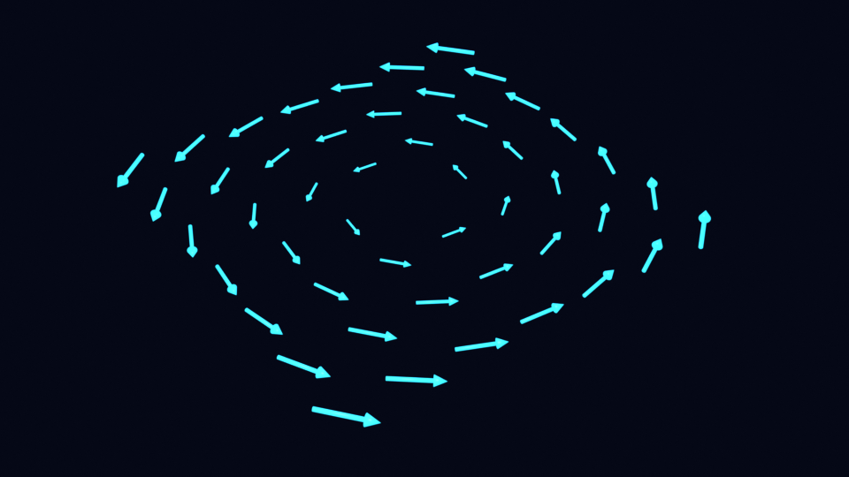

**Como se lê:** Grade de setas ciano: para fora (radial), em círculos (rotacional), ao longo de eixos (sela) ou em espiral. Lê-se como 'campo de vetores'; a divergência e o rotacional se leem na forma.

**Usar quando**
- visualizar campos escalares e vetoriais, linhas e padrões (Cálculo IV 11.1)
- divergência (fonte/sumidouro) e rotacional (circulação) pela forma do campo
- campo elétrico ou de velocidades de fluido como setas (o ciano é reservado ao campo)

**Não usar quando**
- campos que variam no tempo ou com singularidades (o preview não evita o centro)
- linhas de campo contínuas (as setas são amostras)

**Limitações**
- a gramática de cor segue o padrão do arsenal: campo vetorial = ciano (reservado ao campo), normal n̂ = azul, tangentes = branco, construções (remendo, contorno) = violeta, nunca sólidas
- só o objeto geométrico: integrais, fórmulas e o sinal da circulação/fluxo são do Manim
- campo amostrado numa grade de n×n (ou n×n×4 em 3D); o comprimento é normalizado entre 28% e 100% do máximo, então não é proporcional ao módulo absoluto
- só 4 campos prontos (radial, rotacional, sela, espiral); outro exige alterar CAMPOS em calc_vetorial.py

| Parâmetro | Padrão | Unid. | Descrição |
|---|---|---|---|
| `tipo` | rotacional | texto | radial, rotacional, sela ou espiral |
| `dim` | 2 | n | 2 = plano; 3 = cubo (mais setas) |
| `n` | 7 | n | setas por lado da grade |
| `extensao` | 3.0 | u | meia largura da região |

**Integração:** `png_seq_alpha` · custo 0.41 s/frame (1080p, Eevee)

```powershell
& "C:\Program Files\Blender Foundation\Blender 5.2\blender.exe" -b -P experimentos\blender\arsenal\renderizar.py -- campo_vetorial --res 1920x1080 --alpha
```

**No Manim:**

```python
from manim_solido3d import Solido3D   # sys.path: experimentos/blender/arsenal
img = Solido3D("campo_vetorial").mobject(altura=5)   # estático: um quadro PNG com alpha
```

Ficha: `solidos/campo_vetorial.json`

### `capacitor_esferico` — Capacitor esférico (esferas concêntricas, em corte)

**Status:** aprovado · Aparência aprovada pelo usuário em 2026-10-07 (padrão visual de estilo.json); validado em 960x540 e 1080p.

Esfera condutora interna de raio `raio_a` (vidro, cargas na superfície) dentro de uma casca esférica externa de raio `raio_b`, com um octante removido voltado para a câmera (como a casca esférica do arsenal). O mesmo número de cargas nas duas superfícies.

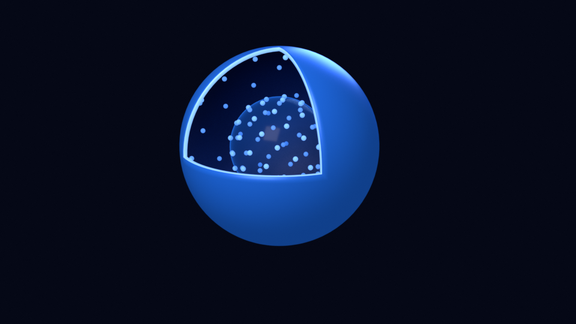

**Como se lê:** Esfera de vidro com pontos azuis dentro de uma casca azul aberta em corte, também com pontos na face interna: lê-se como 'duas superfícies esféricas concêntricas carregadas, com um vão entre elas'.

**Usar quando**
- capacitor esférico: C = 4πε₀ ab/(b−a), campo ∝ 1/r² no vão
- Gauss em simetria esférica com condutores
- contraste com placas paralelas e com o coaxial

**Não usar quando**
- isolante com carga em volume (use esfera_macica_isolante)
- casca única (use casca_esferica_oca)

**Limitações**
- o sinal da carga não é codificado em cor: +Q e −Q vão por rótulo no Manim; o campo (ciano) também
- o mesmo número de cargas em cada armadura (carga igual e oposta)
- o corte em octante é convenção de leitura; as cargas da região removida não são desenhadas
- o corte aponta para a câmera padrão (azimute -23, elevação 17)

| Parâmetro | Padrão | Unid. | Descrição |
|---|---|---|---|
| `raio_a` | 0.8 | u | raio da esfera interna |
| `raio_b` | 1.6 | u | raio externo da casca |
| `espessura` | 0.06 | u | espessura da parede da casca |
| `n_cargas` | 70 | n | cargas por superfície |
| `corte` | 1 | 0/1 | 1 = remove o octante voltado para a câmera |

**Integração:** `png_seq_alpha` · custo 0.81 s/frame (1080p, Eevee)

```powershell
& "C:\Program Files\Blender Foundation\Blender 5.2\blender.exe" -b -P experimentos\blender\arsenal\renderizar.py -- capacitor_esferico --res 1920x1080 --alpha
```

**No Manim:**

```python
from manim_solido3d import Solido3D   # sys.path: experimentos/blender/arsenal
img = Solido3D("capacitor_esferico").mobject(altura=5)   # estático: um quadro PNG com alpha
```

Ficha: `solidos/capacitor_esferico.json`

### `capacitor_placas_paralelas` — Capacitor de placas paralelas

**Status:** aprovado · Aparência aprovada pelo usuário em 2026-10-07 (padrão visual de estilo.json); validado em 960x540 e 1080p.

Duas placas de vidro azulado quadradas e paralelas (normal X) separadas por `distancia`, com o mesmo número de cargas pontuais nas faces internas. Dielétrico opcional (vidro azul-claro enchendo o vão).

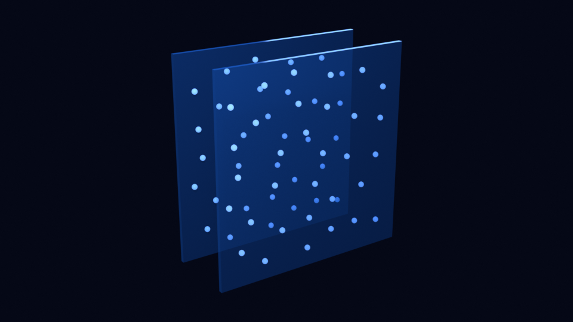

**Como se lê:** Duas folhas de vidro paralelas com pontos azuis voltados um para o outro: lê-se como 'duas armaduras com cargas iguais e opostas e um vão entre elas'.

**Usar quando**
- capacitor de placas paralelas: C = ε₀A/d, campo uniforme no vão, energia armazenada
- inserir um dielétrico (dieletrico=1) e comparar com o vão vazio
- contraste com o capacitor cilíndrico (cilindro_coaxial) e o esférico

**Não usar quando**
- o ponto é o plano infinito sem borda (use placa_infinita_carregada)
- efeitos de borda do campo: aqui as placas são desenhadas sem campo

**Limitações**
- o sinal da carga não é codificado em cor: +Q e −Q vão por rótulo no Manim; o campo (ciano) também
- o mesmo número de cargas em cada armadura (carga igual e oposta)
- as placas são quadradas e finitas; o campo uniforme 'ideal' é uma aproximação feita no Manim

| Parâmetro | Padrão | Unid. | Descrição |
|---|---|---|---|
| `lado` | 3.0 | u | lado das placas quadradas |
| `distancia` | 1.0 | u | distância d entre as placas |
| `espessura` | 0.06 | u | espessura das placas (visual) |
| `n_cargas` | 36 | n | cargas por placa |
| `dist_min` | 0.42 | u | distância mínima entre cargas |
| `dieletrico` | 0 | 0/1 | 1 = dielétrico (vidro claro) no vão |
| `semente` | 7 | n | semente do sorteio |

**Integração:** `png_seq_alpha` · custo 0.92 s/frame (1080p, Eevee)

```powershell
& "C:\Program Files\Blender Foundation\Blender 5.2\blender.exe" -b -P experimentos\blender\arsenal\renderizar.py -- capacitor_placas_paralelas --res 1920x1080 --alpha
```

**No Manim:**

```python
from manim_solido3d import Solido3D   # sys.path: experimentos/blender/arsenal
img = Solido3D("capacitor_placas_paralelas").mobject(altura=5)   # estático: um quadro PNG com alpha
```

Ficha: `solidos/capacitor_placas_paralelas.json`

### `cargas_pontuais` — Cargas pontuais e forças de Coulomb

**Status:** aprovado · Aparência aprovada pelo usuário em 2026-10-07 (padrão visual de estilo.json); validado em 960x540 e 1080p.

Duas ou três cargas de sinal esculpido (+ ou −) e as forças de Coulomb sobre cada uma (setas brancas, módulo visual ∝ |F|·d²). Com movimento a carga 2 vai e volta ao longo de X e a força varia com 1/r² (o loop fecha).

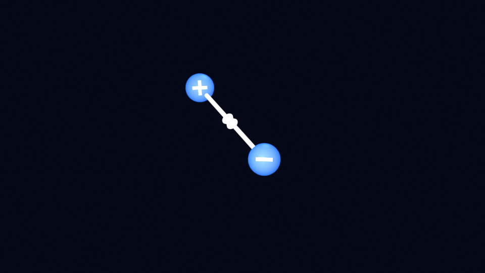

**Como se lê:** Esferas com + e −, com setas entre as cargas de sinais opostos (atração) ou afastando as de sinais iguais (repulsão).

**Usar quando**
- lei de Coulomb, atração e repulsão
- superposição das forças com três cargas
- dependência da força com 1/r²

**Não usar quando**
- campos e potenciais de distribuições contínuas
- mais de três cargas

**Limitações**
- só o objeto geométrico: valores, fórmulas, gráficos e os nomes dos vetores são do Manim
- a gramática de cor segue o padrão do arsenal (estilo.json): E = ciano, vetores físicos = branco, construções = violeta, sinal da carga esculpido
- o módulo das setas é limitado a 2,8 u: forças muito grandes são mostradas truncadas
- as cargas estão num plano (z = 0) e o `sinais` por parâmetro vale para até 3 cargas
- q e k são do Manim

| Parâmetro | Padrão | Unid. | Descrição |
|---|---|---|---|
| `config` | duas | texto | duas ou tres |
| `sinal1` | 1 | ±1 | sinal da carga 1 |
| `sinal2` | -1 | ±1 | sinal da carga 2 |
| `sinal3` | 1 | ±1 | sinal da carga 3 (só em tres) |
| `distancia` | 2.6 | u | distância (ou lado do triângulo) |
| `raio` | 0.3 | u | raio de cada carga |
| `forcas` | 1 | 0/1 | setas de força |
| `movimento` | 0 | 0/1 | 1 = animação (use animar.py ou a ponte com o Manim) |
| `fase` | 0.0 | 0-1 | fase da animação |

**Integração:** `png_seq_alpha` · custo não medido

**Animação (cargas em movimento):** `oscilacao` · loop sem emenda (`fase` de 0 a 1) · 60 quadros sugeridos · custo 0.42 s/frame (1080p, com alpha)

```powershell
& "C:\Program Files\Blender Foundation\Blender 5.2\blender.exe" -b -P experimentos\blender\arsenal\renderizar.py -- cargas_pontuais --res 1920x1080 --alpha
```

**No Manim:**

```python
from manim_solido3d import Solido3D   # sys.path: experimentos/blender/arsenal
img = Solido3D("cargas_pontuais").mobject(cena=self, altura=5)   # cargas em loop; img.pausar() / img.retomar()
```

Ficha: `solidos/cargas_pontuais.json`

### `casca_cilindrica_oca` — Casca cilíndrica oca

**Status:** aprovado · Aparência aprovada pelo usuário em 2026-10-07 (padrão visual de estilo.json); validado em 960x540 e 1080p.

Tubo oco de parede fina, aberto nas duas pontas, com eixo ao longo de X. O raio externo é `raio`; a espessura cresce para dentro.

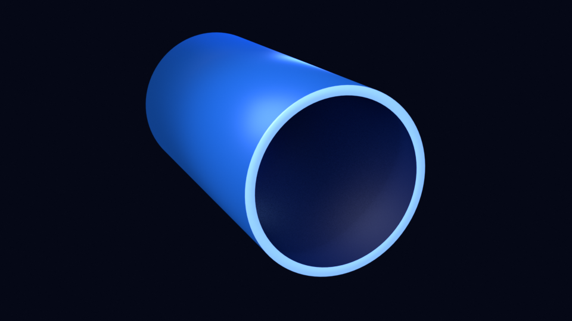

**Como se lê:** Aro claro (#7FB2FF) marca a parede fina; interior escuro e vazio; exterior azul (#267BFF). Lê-se como 'só há material na superfície'.

**Usar quando**
- a carga ou o material está só na superfície de um cilindro (casca cilíndrica, condutor oco)
- contraste casca x maciço (par com cilindro_macico_isolante)
- mostrar que o interior é vazio, por exemplo campo nulo dentro via Lei de Gauss

**Não usar quando**
- precisa mostrar cargas individuais no volume (use cilindro_macico_isolante)
- é preciso um cilindro finito com tampas fechadas: esta casca é aberta nas pontas

**Limitações**
- não desenha cargas individuais sobre a superfície
- eixo fixo em X; para outra orientação, girar a câmera/pivô na cena
- espessura de parede exagerada em relação a uma casca ideal (padrão 0,10)

| Parâmetro | Padrão | Unid. | Descrição |
|---|---|---|---|
| `raio` | 1.0 | u | raio externo |
| `comprimento` | 4.0 | u | comprimento ao longo do eixo X |
| `espessura` | 0.1 | u | espessura da parede (cresce para dentro) |
| `lados` | 96 | n | segmentos da circunferência |

**Integração:** `png_seq_alpha` · custo 0.56 s/frame (1080p, Eevee)

```powershell
& "C:\Program Files\Blender Foundation\Blender 5.2\blender.exe" -b -P experimentos\blender\arsenal\renderizar.py -- casca_cilindrica_oca --res 1920x1080 --alpha
```

**No Manim:**

```python
from manim_solido3d import Solido3D   # sys.path: experimentos/blender/arsenal
img = Solido3D("casca_cilindrica_oca").mobject(altura=5)   # estático: um quadro PNG com alpha
```

Ficha: `solidos/casca_cilindrica_oca.json`

### `casca_esferica_oca` — Casca esférica oca (com corte em octante)

**Status:** aprovado · Aparência aprovada pelo usuário em 2026-10-07 (padrão visual de estilo.json); validado em 960x540 e 1080p.

Esfera oca de parede fina com um octante removido (x>0, y<0, z>0), voltado para a câmera padrão, que expõe a parede e o interior vazio. O raio externo é `raio`; a espessura cresce para dentro. Com `corte=0` a esfera fica fechada.

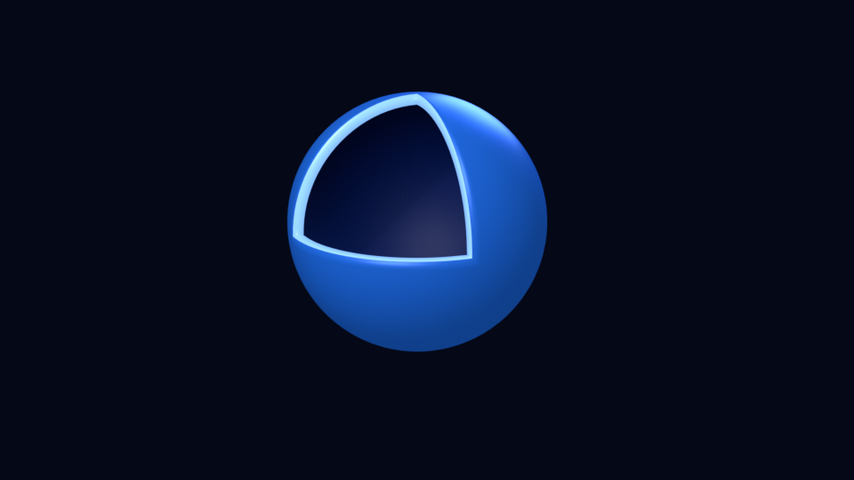

**Como se lê:** Exterior azul (#267BFF) opaco; o contorno do corte tem um aro claro (#7FB2FF) que mostra a parede fina; dentro, escuro e vazio. Lê-se como 'só há material na superfície; o interior é vazio'.

**Usar quando**
- a carga ou o material está só na superfície de uma esfera (casca esférica, condutor oco)
- contraste casca x maciço (par com esfera_macica_isolante)
- mostrar que o interior é vazio, por exemplo campo nulo dentro via Lei de Gauss

**Não usar quando**
- precisa mostrar cargas individuais no volume (use esfera_macica_isolante)
- o ponto do vídeo é a esfera inteira e fechada: o corte em octante existe só para mostrar o interior
- densidade de carga não uniforme em volume (ex.: rho(r)): este sólido não representa perfil radial

**Limitações**
- o octante removido é uma convenção de leitura, não parte da física: a casca real é fechada
- o corte aponta para a câmera padrão (azimute -23, elevação 17); com outro ângulo de câmera o corte pode ficar de costas
- não desenha cargas individuais sobre a superfície
- espessura de parede exagerada em relação a uma casca ideal (padrão 0,08)

| Parâmetro | Padrão | Unid. | Descrição |
|---|---|---|---|
| `raio` | 1.0 | u | raio externo |
| `espessura` | 0.08 | u | espessura da parede (cresce para dentro) |
| `segmentos` | 96 | n | segmentos de longitude (múltiplo de 4, para o corte cair sobre linhas da malha) |
| `aneis` | 48 | n | anéis de latitude (par, pelo mesmo motivo) |
| `corte` | 1 | 0/1 | 1 = remove o octante voltado para a câmera; 0 = esfera fechada |

**Integração:** `png_seq_alpha` · custo 0.45 s/frame (1080p, Eevee)

```powershell
& "C:\Program Files\Blender Foundation\Blender 5.2\blender.exe" -b -P experimentos\blender\arsenal\renderizar.py -- casca_esferica_oca --res 1920x1080 --alpha
```

**No Manim:**

```python
from manim_solido3d import Solido3D   # sys.path: experimentos/blender/arsenal
img = Solido3D("casca_esferica_oca").mobject(altura=5)   # estático: um quadro PNG com alpha
```

Ficha: `solidos/casca_esferica_oca.json`

### `cilindro_coaxial` — Cilindro coaxial (condutor maciço + casca externa, em corte)

**Status:** aprovado · Aparência aprovada pelo usuário em 2026-10-07 (padrão visual de estilo.json); validado em 960x540 e 1080p.

Modelo do capacitor coaxial (yt_0002, A4): condutor interno maciço de raio `raio_a` (vidro translúcido) dentro de uma casca externa delgada de raio `raio_b` > `raio_a`, coaxiais, com eixo ao longo de X. A casca tem uma faixa longitudinal removida (voltada para a câmera) para o condutor aparecer. O condutor tem cargas só na superfície; a casca tem o MESMO número de cargas na face interna (lambda igual e oposto), logo mais esparsas.


**Como se lê:** Casca azul opaca aberta, com aro claro (#7FB2FF) marcando a parede e o corte; dentro, um cilindro de vidro com pontos azuis só na superfície. O vão entre os dois é vazio. Lê-se como 'duas superfícies carregadas, coaxiais, com um vão entre elas'.

**Usar quando**
- capacitor coaxial / cabo coaxial: condutor interno maciço e condutor externo em casca delgada, em equilíbrio eletrostático
- mostrar que a carga do condutor interno fica na sua superfície (e não no volume) e que as cargas por comprimento são iguais e opostas
- delimitar as regiões r < a, a < r < b e r > b para a superfície gaussiana coaxial

**Não usar quando**
- o interno é isolante com carga em volume (use cilindro_macico_isolante)
- o condutor externo é espesso com três raios públicos (a, b, c): este sólido tem casca delgada de propósito
- o ponto do vídeo exige distinguir o sinal das cargas (+ e −) em cor: aqui o sinal não é codificado (use rótulos no Manim)
- um cilindro isolado sem condutor externo (use casca_cilindrica_oca ou cilindro_macico_isolante)

**Limitações**
- o sinal da carga não é codificado em cor (o padrão visual não define cores de polaridade); +λ e −λ têm de ser indicados por rótulos no Manim
- o corte longitudinal é convenção de leitura: a casca real é fechada; as cargas da faixa removida não são desenhadas, então aparecem menos cargas visíveis na casca do que o número nominal
- o condutor interno usa o mesmo vidro do isolante maciço: o que o distingue é a carga só na superfície
- espessura de parede exagerada em relação a uma casca ideal delgada (padrão 0,08)
- o corte aponta para a câmera padrão (azimute -23, elevação 17); com outro ângulo pode ficar de costas

| Parâmetro | Padrão | Unid. | Descrição |
|---|---|---|---|
| `raio_a` | 0.5 | u | raio do condutor interno |
| `raio_b` | 1.5 | u | raio externo da casca (deve ser maior que raio_a) |
| `comprimento` | 5.0 | u | comprimento ao longo do eixo X (igual nos dois cilindros) |
| `espessura` | 0.08 | u | espessura da parede da casca (cresce para dentro) |
| `n_cargas` | 70 | n | cargas por superfície, iguais nas duas (lambda igual e oposto) |
| `dist_min` | 0.35 | u | distância mínima entre cargas |
| `tamanho_carga` | 0.04 | u | raio de cada esfera de carga |
| `semente` | 7 | n | semente do sorteio (mesma semente = mesma distribuição) |
| `corte` | 1 | 0/1 | 1 = remove a faixa da casca voltada para a câmera; 0 = casca inteira (o condutor só aparece pela ponta aberta) |

**Integração:** `png_seq_alpha` · custo 0.95 s/frame (1080p, Eevee)

```powershell
& "C:\Program Files\Blender Foundation\Blender 5.2\blender.exe" -b -P experimentos\blender\arsenal\renderizar.py -- cilindro_coaxial --res 1920x1080 --alpha
```

**No Manim:**

```python
from manim_solido3d import Solido3D   # sys.path: experimentos/blender/arsenal
img = Solido3D("cilindro_coaxial").mobject(altura=5)   # estático: um quadro PNG com alpha
```

Ficha: `solidos/cilindro_coaxial.json`

### `cilindro_macico_isolante` — Cilindro maciço isolante com cargas no volume

**Status:** aprovado · Aparência aprovada pelo usuário em 2026-10-07 (padrão visual de estilo.json); validado em 960x540 e 1080p.

Cilindro preenchido, de vidro azulado translúcido, com tampas, eixo ao longo de X e cargas pontuais distribuídas uniformemente no volume (distância mínima entre elas, semente fixa).

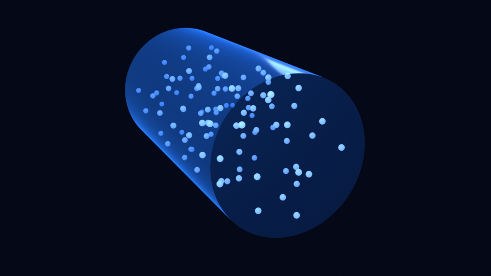

**Como se lê:** Vidro translúcido de borda luminosa cheio de pontos. Cargas próximas da câmera são azul-claro (#7FB2FF) e brilhantes; as distantes, azul (#267BFF) e fracas (pista de profundidade). O ciano fica livre para o campo E⃗. Lê-se como 'há material e carga em todo o volume'.

**Usar quando**
- a carga está distribuída no volume de um cilindro isolante (densidade volumétrica)
- contraste casca x maciço (par com casca_cilindrica_oca)
- mostrar que existe carga no interior, por exemplo campo crescendo com r dentro do cilindro

**Não usar quando**
- o material só existe na superfície (use casca_cilindrica_oca)
- a densidade de carga é não uniforme e isso é o ponto do vídeo: as cargas aqui são distribuídas uniformemente

**Limitações**
- distribuição uniforme apenas; não há perfil radial rho(r)
- material translúcido exige culling de faces de trás (já embutido); ângulos muito rasantes não foram testados
- eixo fixo em X

| Parâmetro | Padrão | Unid. | Descrição |
|---|---|---|---|
| `raio` | 1.0 | u | raio do cilindro |
| `comprimento` | 4.0 | u | comprimento ao longo do eixo X |
| `n_cargas` | 110 | n | número de cargas desejado (pode sair menos se a distância mínima não couber) |
| `dist_min` | 0.26 | u | distância mínima entre cargas |
| `tamanho_carga` | 0.04 | u | raio de cada esfera de carga |
| `semente` | 7 | n | semente do sorteio (mesma semente = mesma distribuição) |

**Integração:** `png_seq_alpha` · custo não medido

```powershell
& "C:\Program Files\Blender Foundation\Blender 5.2\blender.exe" -b -P experimentos\blender\arsenal\renderizar.py -- cilindro_macico_isolante --res 1920x1080 --alpha
```

**No Manim:**

```python
from manim_solido3d import Solido3D   # sys.path: experimentos/blender/arsenal
img = Solido3D("cilindro_macico_isolante").mobject(altura=5)   # estático: um quadro PNG com alpha
```

Ficha: `solidos/cilindro_macico_isolante.json`

### `cilindro_rolando` — Cilindro rolando sem deslizar

**Status:** aprovado · Aparência aprovada pelo usuário em 2026-10-07 (padrão visual de estilo.json); validado em 960x540 e 1080p.

Cilindro de vidro azulado (eixo ao longo de Y) com bordas circulares e 4 geratrizes em azul-claro, uma marca na borda e a do centro de massa, sobre o chão que corre. Eixo instantâneo violeta tracejado no contato.

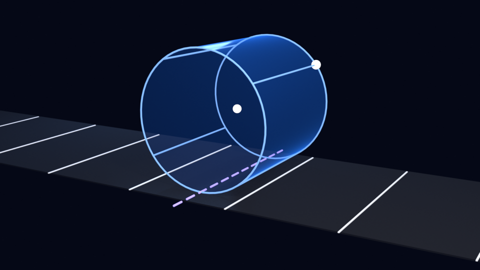

**Como se lê:** Tambor de vidro girando parado no centro, com geratrizes e uma marca na borda que mostram a rotação; o chão corre. Lê-se como 'cilindro rolando sem deslizar'.

**Usar quando**
- rolamento sem deslizar: v_cm = ωR, energia cinética de translação + rotação
- mostrar o eixo instantâneo de rotação (no ponto de contato) como construção violeta
- comparar corpos de momentos de inércia diferentes (esfera, cilindro, aro) pela forma, em vídeos separados ou composição no Manim
- cilindro maciço rolando (I = 1/2 M R²)

**Não usar quando**
- o corpo desliza (rolamento com escorregamento): as marcas do chão não acompanham o giro
- problemas com rampa e corrida de corpos: aqui só chão plano
- casca cilíndrica oca (I = M R²): este cilindro é de vidro cheio

**Limitações**
- câmera acompanha o corpo: ele gira parado no centro do quadro e é o chão que corre (é o que torna o loop perfeito); para mostrar o corpo avançando no quadro, ou corridas entre corpos, é preciso compor no Manim
- chão horizontal: não há rampa nem inclinação
- só a cinemática visual: velocidades (v_cm = ωR), energia, atrito e o sentido de rotação em vetores/rótulos ficam para o Manim
- a gramática de cor de Mecânica segue o padrão do arsenal (estilo.json): azul para o corpo, branco neutro para as marcas, violeta tracejado para a construção (eixo instantâneo)
- a distribuição de massa (maciço ou oco) não é codificada visualmente: dizer por rótulo
- o loop fecha com ruído de amostragem: 95% dos pixels diferem em até 2/255 entre a fase 0 e a fase 1 (só 2 a 301 pixels chegam a 3-7), invisível a olho nu

| Parâmetro | Padrão | Unid. | Descrição |
|---|---|---|---|
| `largura` | 2.0 | u | comprimento do cilindro ao longo do eixo Y |
| `raio` | 1.0 | u | raio do corpo |
| `voltas` | 1 | n | voltas completas por loop (o chão avança 2πR por volta) |
| `eixo_instantaneo` | 1 | 0/1 | 1 = eixo instantâneo de rotação tracejado violeta no ponto de contato |
| `marca_centro` | 1 | 0/1 | 1 = marca do centro de massa |
| `movimento` | 0 | 0/1 | 1 = animação do rolamento (use animar.py ou a ponte com o Manim) |
| `fase` | 0.0 | 0-1 | fase do rolamento; fase=1 repete o quadro da fase 0 (loop perfeito) |

**Integração:** `png_seq_alpha` · custo 1.22 s/frame (1080p, Eevee)

**Animação (cargas em movimento):** `rolamento` · loop sem emenda (`fase` de 0 a 1) · 60 quadros sugeridos · custo 1.22 s/frame (1080p, com alpha)

```powershell
& "C:\Program Files\Blender Foundation\Blender 5.2\blender.exe" -b -P experimentos\blender\arsenal\renderizar.py -- cilindro_rolando --res 1920x1080 --alpha
```

**No Manim:**

```python
from manim_solido3d import Solido3D   # sys.path: experimentos/blender/arsenal
img = Solido3D("cilindro_rolando").mobject(cena=self, altura=5)   # cargas em loop; img.pausar() / img.retomar()
```

Ficha: `solidos/cilindro_rolando.json`

### `colisao_1d` — Colisão unidimensional entre dois blocos

**Status:** aprovado · Aparência aprovada pelo usuário em 2026-10-07 (padrão visual de estilo.json); validado em 960x540 e 1080p.

Dois blocos de vidro sobre um trilho (bloco 1 azul, bloco 2 azul-claro; o tamanho cresce com a massa) que colidem em x = 0 no instante `instante`. `restituicao` e = 1 elástica, e = 0 totalmente inelástica (grudam). Uma esfera neutra marca o centro de massa, que não muda de velocidade. Animação de CICLO ÚNICO (a fase 1 é o estado final, diferente da fase 0).

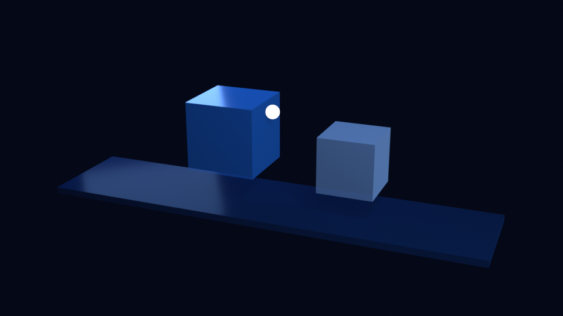

**Como se lê:** Dois blocos se aproximam, colidem e se afastam (ou seguem juntos); a marca do CM anda em linha reta o tempo todo.

**Usar quando**
- colisões elásticas e inelásticas: conservação do momento linear
- mostrar que o centro de massa não é afetado pela colisão
- comparar massas diferentes (o tamanho do bloco acompanha a massa)

**Não usar quando**
- colisões em duas dimensões
- colisão com perda de massa ou explosões

**Limitações**
- só o objeto em movimento: velocidades, energia, gráficos x(t) e as fórmulas são do Manim
- movimento didático calculado por fórmula (não é uma simulação física de verdade)
- ciclo único: não há loop (a fase 1 não repete a fase 0); a ponte renderiza quadros de 0 a 1 incluindo o final, e o Manim congela no fim
- só 1D, sem atrito (os blocos deslizam a velocidade constante); o tamanho do bloco é proporcional a m^(1/3)
- os blocos não se deformam e o contato é instantâneo

| Parâmetro | Padrão | Unid. | Descrição |
|---|---|---|---|
| `m1` | 2.0 | u | massa do bloco 1 (azul) |
| `m2` | 1.0 | u | massa do bloco 2 (azul-claro) |
| `v1` | 3.0 | u | velocidade inicial do bloco 1 (deve ser maior que v2) |
| `v2` | 0.0 | u | velocidade inicial do bloco 2 |
| `restituicao` | 1.0 | 0-1 | coeficiente de restituição e (1 elástica, 0 inelástica) |
| `instante` | 0.45 | 0-1 | instante da colisão (fração da duração) |
| `mostrar_cm` | 1 | 0/1 | 1 = marca do centro de massa |
| `movimento` | 0 | 0/1 | 1 = animação (use animar.py ou a ponte com o Manim) |
| `fase` | 0.0 | 0-1 | fase da animação |

**Integração:** `png_seq_alpha` · custo 0.75 s/frame (1080p, Eevee)

**Animação (cargas em movimento):** `colisao` · loop sem emenda (`fase` de 0 a 1) · 60 quadros sugeridos · custo 0.75 s/frame (1080p, com alpha)

```powershell
& "C:\Program Files\Blender Foundation\Blender 5.2\blender.exe" -b -P experimentos\blender\arsenal\renderizar.py -- colisao_1d --res 1920x1080 --alpha
```

**No Manim:**

```python
from manim_solido3d import Solido3D   # sys.path: experimentos/blender/arsenal
img = Solido3D("colisao_1d").mobject(cena=self, altura=5)   # cargas em loop; img.pausar() / img.retomar()
```

Ficha: `solidos/colisao_1d.json`

### `colisao_2d` — Colisão elástica em 2D

**Status:** aprovado · Aparência aprovada pelo usuário em 2026-10-07 (padrão visual de estilo.json); validado em 960x540 e 1080p.

Dois discos de vidro numa mesa de vidro: o disco 1 (azul) vem em +X e atinge o disco 2 (azul-claro, em repouso) com parâmetro de impacto b. O impulso é só ao longo da normal do contato (sem atrito). Velocidades em branco, centro de massa neutro, trajetórias em violeta tracejado. Ciclo único.

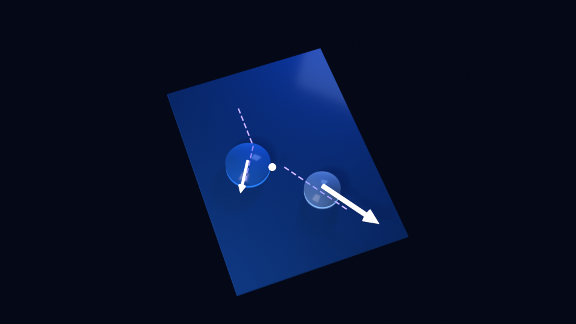

**Como se lê:** Dois discos que se afastam em ângulo depois do choque, com o centro de massa seguindo em linha reta: lê-se como conservação do momento em 2D.

**Usar quando**
- colisões em duas dimensões: o momento se conserva por componentes
- caso de massas iguais (os discos saem a 90°) e massas diferentes
- o centro de massa não é afetado pela colisão

**Não usar quando**
- colisões 1D (use colisao_1d)
- discos com rotação e atrito de contato

**Limitações**
- só o objeto geométrico: valores, fórmulas, gráficos e os nomes dos vetores são do Manim
- a gramática de cor segue o padrão do arsenal (estilo.json): vetores físicos = branco, construções = violeta tracejado, corpos = vidro azul
- o disco alvo começa em repouso e o impulso é só ao longo da normal
- a mesa é plana e sem atrito; discos sem rotação

| Parâmetro | Padrão | Unid. | Descrição |
|---|---|---|---|
| `m1` | 2.0 | u | massa do disco 1 |
| `m2` | 1.0 | u | massa do disco 2 |
| `v1` | 3.0 | u | velocidade inicial do disco 1 |
| `parametro_impacto` | 0.55 | u | parâmetro de impacto b (deslocamento lateral da linha de movimento) |
| `restituicao` | 1.0 | 0-1 | coeficiente de restituição |
| `instante` | 0.4 | 0-1 | instante da colisão |
| `mostrar_cm` | 1 | 0/1 | marca do centro de massa |
| `movimento` | 0 | 0/1 | 1 = animação (use animar.py ou a ponte com o Manim) |
| `fase` | 0.0 | 0-1 | fase da animação |

**Integração:** `png_seq_alpha` · custo não medido

**Animação (cargas em movimento):** `colisao` · loop sem emenda (`fase` de 0 a 1) · 60 quadros sugeridos · custo 0.75 s/frame (1080p, com alpha)

```powershell
& "C:\Program Files\Blender Foundation\Blender 5.2\blender.exe" -b -P experimentos\blender\arsenal\renderizar.py -- colisao_2d --res 1920x1080 --alpha
```

**No Manim:**

```python
from manim_solido3d import Solido3D   # sys.path: experimentos/blender/arsenal
img = Solido3D("colisao_2d").mobject(cena=self, altura=5)   # cargas em loop; img.pausar() / img.retomar()
```

Ficha: `solidos/colisao_2d.json`

### `condutor_com_cavidade` — Condutor com cavidade e cargas induzidas

**Status:** aprovado · Aparência aprovada pelo usuário em 2026-10-07 (padrão visual de estilo.json); validado em 960x540 e 1080p.

Casca condutora esférica (com um octante removido para ver dentro) com uma cavidade concêntrica contendo uma carga + no centro: cargas induzidas − na parede da cavidade e + na superfície externa, todas com sinal esculpido. No equilíbrio eletrostático o campo dentro do material do condutor é zero (leitura do Manim).

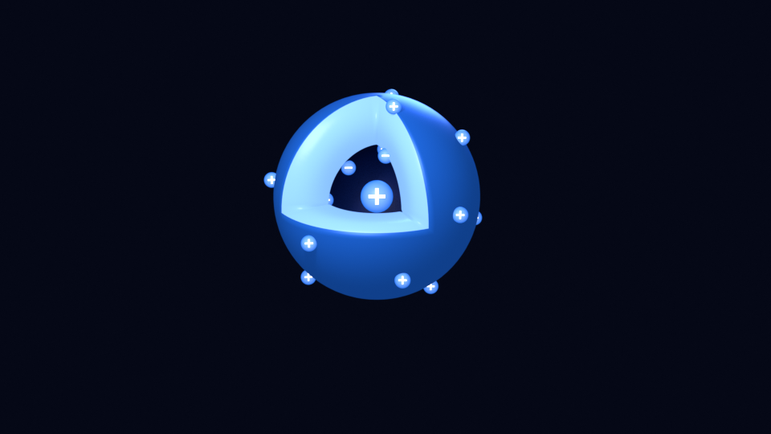

**Como se lê:** Uma esfera aberta com um + no centro, vários − dentro da parede da cavidade e vários + por fora: lê-se como indução eletrostática.

**Usar quando**
- condutores em equilíbrio, cavidades e a carga induzida (−q na cavidade, +q fora)
- blindagem e a gaiola de Faraday
- aplicação da Lei de Gauss com um condutor

**Não usar quando**
- cavidades não concêntricas (o arranjo uniforme da carga induzida seria distorcido)
- condutores sem cavidade (use casca_esferica_oca)

**Limitações**
- só o objeto geométrico: valores, fórmulas, gráficos e os nomes dos vetores são do Manim
- a gramática de cor segue o padrão do arsenal (estilo.json): E = ciano, vetores físicos = branco, construções = violeta, sinal da carga esculpido
- as cargas induzidas são pontos numa distribuição de Fibonacci: a densidade real não é pontual
- as cargas das regiões removidas pelo corte não aparecem, então a contagem visível é menor que a nominal
- só a cavidade concêntrica

| Parâmetro | Padrão | Unid. | Descrição |
|---|---|---|---|
| `raio_externo` | 1.9 | u | raio externo b |
| `raio_cavidade` | 1.0 | u | raio da cavidade a |
| `n_cargas` | 14 | n | cargas induzidas na cavidade (a externa tem n + 4) |
| `raio_carga` | 0.14 | u | raio das cargas induzidas |
| `corte` | 1 | 0/1 | remove o octante voltado para a câmera |

**Integração:** `png_seq_alpha` · custo não medido

```powershell
& "C:\Program Files\Blender Foundation\Blender 5.2\blender.exe" -b -P experimentos\blender\arsenal\renderizar.py -- condutor_com_cavidade --res 1920x1080 --alpha
```

**No Manim:**

```python
from manim_solido3d import Solido3D   # sys.path: experimentos/blender/arsenal
img = Solido3D("condutor_com_cavidade").mobject(altura=5)   # estático: um quadro PNG com alpha
```

Ficha: `solidos/condutor_com_cavidade.json`

### `cone_de_luz` — Cone de luz no espaço-tempo

**Status:** aprovado · Aparência aprovada pelo usuário em 2026-10-07 (padrão visual de estilo.json); validado em 960x540 e 1080p.

Espaço-tempo (x, y, ct): cones do futuro e do passado (vidro azul) com curvas coordenadas, o eixo ct tracejado, uma linha de universo (azul-claro) dentro do cone e um evento (branco) subindo por ela. O plano de simultaneidade (violeta) passa pelo evento e corta o cone num círculo azul-claro: a frente de luz. Com movimento (ciclo único) o evento sobe.

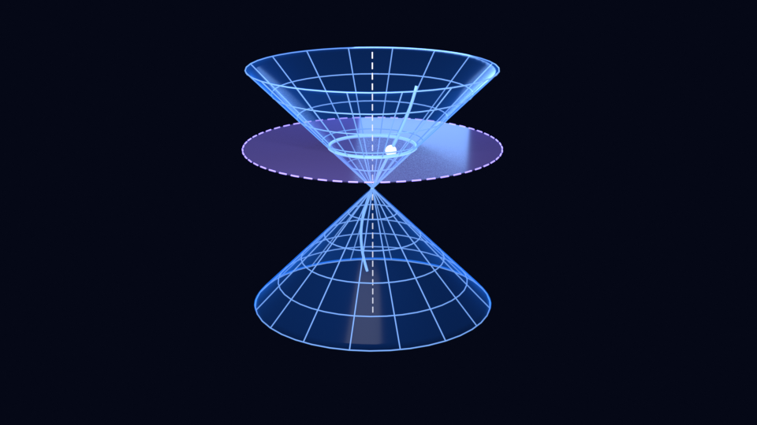

**Como se lê:** Dois cones, uma curva dentro deles e um disco violeta que corta o cone num círculo: lê-se como 'cone de luz e a frente de luz num instante'.

**Usar quando**
- cone de luz, passado, futuro e 'fora do cone' (separação do tipo espaço)
- linha de universo e a restrição v < c
- plano de simultaneidade (que não é o mesmo em outro referencial: isso é do Manim)

**Não usar quando**
- transformações de Lorentz e diagramas 1+1 (são melhores em 2D)
- efeitos de dilatação do tempo (precisam de dois referenciais)

**Limitações**
- só o objeto geométrico: fórmulas, valores, gráficos e rótulos (inclusive N/S, +/−, nomes de vetores) são do Manim
- a gramática de cor segue o padrão do arsenal (estilo.json): E = ciano, B = magenta, vetores físicos = branco, normal = azul, construções = violeta
- o eixo vertical é ct (as unidades de x e ct são iguais): o cone tem 45°
- a linha de universo é uma curva fixa; só o evento se move

| Parâmetro | Padrão | Unid. | Descrição |
|---|---|---|---|
| `raio_max` | 2.6 | u | altura e raio máximos do cone |
| `altura_plano` | 0.0 | u | ct do plano de simultaneidade (sem movimento) |
| `linhas` | 1 | 0/1 | curvas coordenadas nos cones |
| `movimento` | 0 | 0/1 | 1 = animação (use animar.py ou a ponte com o Manim) |
| `fase` | 0.0 | 0-1 | fase da animação |

**Integração:** `png_seq_alpha` · custo 1.05 s/frame (1080p, Eevee)

**Animação (cargas em movimento):** `subida` · loop sem emenda (`fase` de 0 a 1) · 60 quadros sugeridos · custo 1.05 s/frame (1080p, com alpha)

```powershell
& "C:\Program Files\Blender Foundation\Blender 5.2\blender.exe" -b -P experimentos\blender\arsenal\renderizar.py -- cone_de_luz --res 1920x1080 --alpha
```

**No Manim:**

```python
from manim_solido3d import Solido3D   # sys.path: experimentos/blender/arsenal
img = Solido3D("cone_de_luz").mobject(cena=self, altura=5)   # cargas em loop; img.pausar() / img.retomar()
```

Ficha: `solidos/cone_de_luz.json`

### `curva_inclinada` — Curva inclinada (pista com inclinação)

**Status:** aprovado · Aparência aprovada pelo usuário em 2026-10-07 (padrão visual de estilo.json); validado em 960x540 e 1080p.

Pista circular inclinada para dentro (vidro azul) com um carro de vidro, sem atrito: peso (para baixo), normal (perpendicular à pista) e resultante centrípeta (horizontal, para o centro), setas brancas, com N cos θ = P e N sen θ = P tan θ · cos θ. fase 0 a 1 = uma volta.

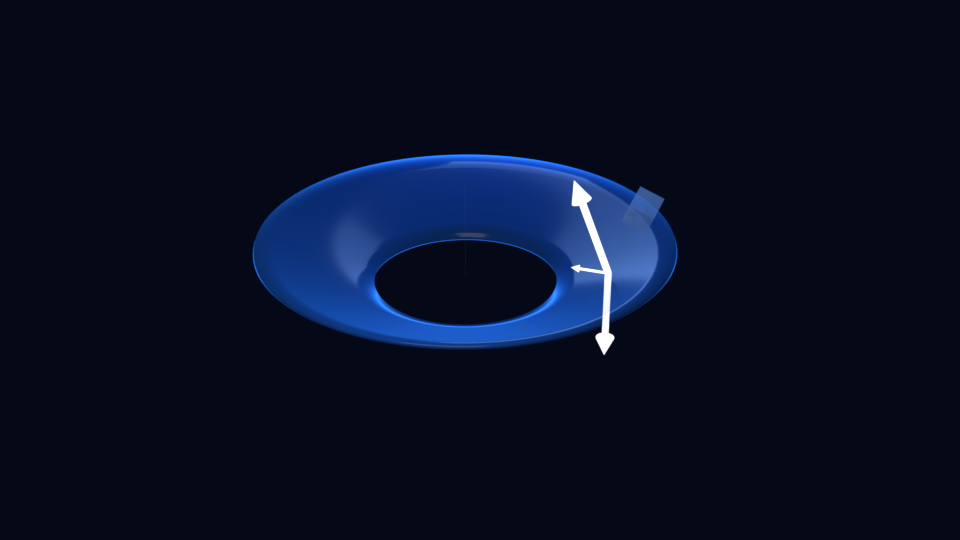

**Como se lê:** Um carro numa pista inclinada com três setas brancas: lê-se como a componente horizontal da normal sendo a força centrípeta.

**Usar quando**
- curvas inclinadas sem atrito e a velocidade ideal v² = g R tan θ
- decomposição da normal em vertical e horizontal
- contraste com a curva plana (atrito como força centrípeta)

**Não usar quando**
- curvas com atrito estático (este modelo é sem atrito)
- pistas com perfil variável

**Limitações**
- só o objeto geométrico: valores, fórmulas, gráficos e os nomes dos vetores são do Manim
- a gramática de cor segue o padrão do arsenal (estilo.json): vetores físicos = branco, construções = violeta tracejado, corpos = vidro azul
- a inclinação é fixa ao longo da volta e o carro é um bloco, sem rodas
- os módulos das setas seguem as relações geométricas (P = 1,6), não unidades físicas

| Parâmetro | Padrão | Unid. | Descrição |
|---|---|---|---|
| `raio` | 2.6 | u | raio da pista |
| `angulo_graus` | 22.0 | graus | inclinação θ |
| `semi_largura` | 1.0 | u | meia largura da pista |
| `vetores` | 1 | 0/1 | peso, normal e resultante |
| `movimento` | 0 | 0/1 | 1 = animação (use animar.py ou a ponte com o Manim) |
| `fase` | 0.0 | 0-1 | fase da animação |

**Integração:** `png_seq_alpha` · custo não medido

**Animação (cargas em movimento):** `percurso` · loop sem emenda (`fase` de 0 a 1) · 60 quadros sugeridos · custo 0.73 s/frame (1080p, com alpha)

```powershell
& "C:\Program Files\Blender Foundation\Blender 5.2\blender.exe" -b -P experimentos\blender\arsenal\renderizar.py -- curva_inclinada --res 1920x1080 --alpha
```

**No Manim:**

```python
from manim_solido3d import Solido3D   # sys.path: experimentos/blender/arsenal
img = Solido3D("curva_inclinada").mobject(cena=self, altura=5)   # cargas em loop; img.pausar() / img.retomar()
```

Ficha: `solidos/curva_inclinada.json`

### `dioptro_plano` — Dioptro plano: refração e reflexão interna total

**Status:** aprovado · Aparência aprovada pelo usuário em 2026-10-07 (padrão visual de estilo.json); validado em 960x540 e 1080p.

Bloco de vidro (n2) em contato com o meio n1 e a normal tracejada. Três raios brancos: incidente, refletido (mais fraco) e refratado, pela lei de Snell n1 sen θ1 = n2 sen θ2. Se sen θ2 > 1 só resta o refletido (reflexão interna total). `sentido`: ar_vidro ou vidro_ar. Com movimento θ1 varre de 5° a 85° e volta (loop).

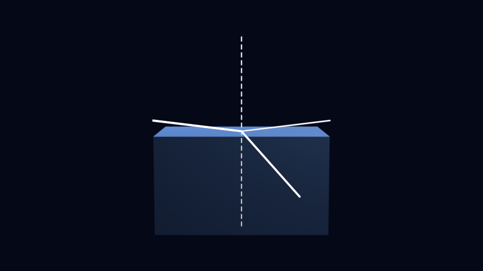

**Como se lê:** Um raio chegando numa fronteira, um refletido e outro que muda de direção ao entrar no vidro (ou some, na reflexão total).

**Usar quando**
- lei de Snell e o desvio do raio
- ângulo crítico e reflexão interna total (fibra óptica)
- reflexão e refração simultâneas

**Não usar quando**
- lentes e prismas (a geometria é uma fronteira plana)
- dispersão (n não depende da cor)

**Limitações**
- só o objeto geométrico: valores, fórmulas, rótulos (n, θ, λ, ...) e o padrão de franjas/difração são do Manim
- a gramática de cor segue o padrão do arsenal (estilo.json): raios de luz = branco, campo E = ciano, objetos transparentes = vidro azul-claro, construções = violeta tracejado
- os raios têm intensidade visual fixa (o raio refletido é só mais fino): as fórmulas de Fresnel não estão representadas
- o ângulo é medido da normal; os rótulos θ1, θ2, n1, n2 são do Manim
- meio único e uniforme

| Parâmetro | Padrão | Unid. | Descrição |
|---|---|---|---|
| `n1` | 1.0 | n | índice do meio de incidência (ar_vidro) ou do vidro (vidro_ar) |
| `n2` | 1.5 | n | índice do outro meio |
| `angulo_graus` | 40.0 | graus | ângulo de incidência (sem movimento) |
| `sentido` | ar_vidro | texto | ar_vidro ou vidro_ar |
| `comprimento_raio` | 2.3 | u | comprimento de cada raio |
| `movimento` | 0 | 0/1 | 1 = animação (use animar.py ou a ponte com o Manim) |
| `fase` | 0.0 | 0-1 | fase da animação |

**Integração:** `png_seq_alpha` · custo não medido

**Animação (cargas em movimento):** `angulo` · loop sem emenda (`fase` de 0 a 1) · 60 quadros sugeridos · custo 0.72 s/frame (1080p, com alpha)

```powershell
& "C:\Program Files\Blender Foundation\Blender 5.2\blender.exe" -b -P experimentos\blender\arsenal\renderizar.py -- dioptro_plano --res 1920x1080 --alpha
```

**No Manim:**

```python
from manim_solido3d import Solido3D   # sys.path: experimentos/blender/arsenal
img = Solido3D("dioptro_plano").mobject(cena=self, altura=5)   # cargas em loop; img.pausar() / img.retomar()
```

Ficha: `solidos/dioptro_plano.json`

### `dipolo_eletrico` — Dipolo elétrico e seu campo

**Status:** aprovado · Aparência aprovada pelo usuário em 2026-10-07 (padrão visual de estilo.json); validado em 960x540 e 1080p.

Duas cargas de sinal esculpido (+q e −q) e o campo E (setas ciano numa grade no plano da figura, calculado por superposição), com o momento de dipolo p (branco, de − para +). Com movimento o dipolo gira uma volta em torno de Z e o campo acompanha.

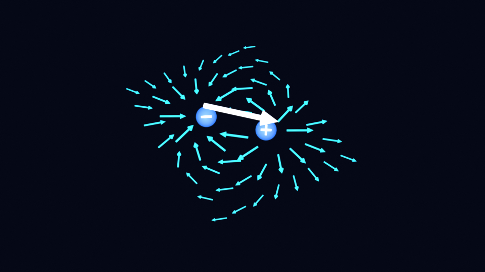

**Como se lê:** Um par + e − com setas ciano saindo de uma e chegando na outra, desenhando o padrão do dipolo: lê-se como campo de dipolo e momento p.

**Usar quando**
- campo de um dipolo (linhas saindo de + e chegando em −)
- momento de dipolo p = q d e o torque num campo uniforme (use com a espira)
- campo no eixo e na mediatriz

**Não usar quando**
- distribuições contínuas (use anel, disco e haste)
- campo tridimensional completo (a grade está num plano)

**Limitações**
- só o objeto geométrico: valores, fórmulas, gráficos e os nomes dos vetores são do Manim
- a gramática de cor segue o padrão do arsenal (estilo.json): E = ciano, vetores físicos = branco, construções = violeta, sinal da carga esculpido
- o campo é desenhado numa grade plana (z = 0) com comprimento saturante (não proporcional ao módulo)
- as setas perto das cargas (a menos de 0,65) ficam ocultas

| Parâmetro | Padrão | Unid. | Descrição |
|---|---|---|---|
| `distancia` | 1.8 | u | distância entre as cargas |
| `n_grade` | 8 | n | setas por lado da grade |
| `extensao` | 2.7 | u | meia largura da grade |
| `raio` | 0.3 | u | raio das cargas |
| `angulo_graus` | 0.0 | graus | orientação do dipolo (sem movimento) |
| `momento` | 1 | 0/1 | seta do momento p |
| `movimento` | 0 | 0/1 | 1 = animação (use animar.py ou a ponte com o Manim) |
| `fase` | 0.0 | 0-1 | fase da animação |

**Integração:** `png_seq_alpha` · custo não medido

**Animação (cargas em movimento):** `rotacao` · loop sem emenda (`fase` de 0 a 1) · 60 quadros sugeridos · custo 0.43 s/frame (1080p, com alpha)

```powershell
& "C:\Program Files\Blender Foundation\Blender 5.2\blender.exe" -b -P experimentos\blender\arsenal\renderizar.py -- dipolo_eletrico --res 1920x1080 --alpha
```

**No Manim:**

```python
from manim_solido3d import Solido3D   # sys.path: experimentos/blender/arsenal
img = Solido3D("dipolo_eletrico").mobject(cena=self, altura=5)   # cargas em loop; img.pausar() / img.retomar()
```

Ficha: `solidos/dipolo_eletrico.json`

### `disco_carregado` — Disco carregado

**Status:** aprovado · Aparência aprovada pelo usuário em 2026-10-07 (padrão visual de estilo.json); validado em 960x540 e 1080p.

Disco fino de vidro azulado no plano YZ, com eixo de simetria em X, e cargas uniformes sobre a superfície (distância mínima entre elas, semente fixa). Eixo de simetria opcional (tracejado neutro).

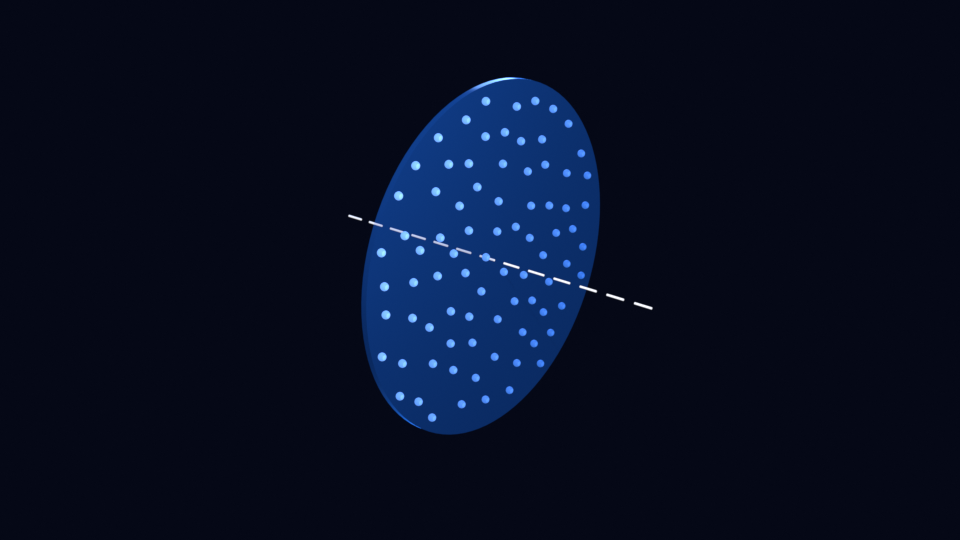

**Como se lê:** Disco translúcido de borda luminosa, cheio de pontos uniformes e, opcionalmente, o eixo tracejado atravessando o centro. Lê-se como 'carga distribuída numa superfície circular'.

**Usar quando**
- campo elétrico no eixo de um disco carregado (anéis concêntricos somados; no limite de raio grande recupera o plano infinito)
- momento de inércia de um disco (com_cargas=0), com o eixo de simetria desenhado
- contraste com o anel (linha circular) e com a placa infinita (plano ilimitado)
- disco carregado girando (corrente de rotação; cargas_moveis=1)

**Não usar quando**
- o ponto do vídeo é um plano ilimitado sem borda (use placa_infinita_carregada)
- a carga está só no aro (use anel_carregado)

**Limitações**
- o campo e a gaussiana não são desenhados: o ciano é reservado ao campo (animação 2D/Manim)
- em contexto de mecânica (com_cargas=0) o azul de 'fonte física' vem da gramática de Eletromagnetismo; a gramática de cor da Mecânica não foi verificada aqui
- espessura/raio do corpo exagerados em relação ao ideal (o corpo de vidro é visível); as cargas ficam dentro dele
- cargas apenas sobre o plano médio do disco (visíveis através do vidro): uma só camada
- a densidade é uniforme: perfil radial não uniforme não está representado
- o movimento não codifica a corrente: a convenção (corrente convencional ou elétrons, que vão ao contrário) e o sinal vão por seta e rótulo no Manim; o movimento é didático, não em escala
- rotação rígida: as cargas mantêm a distribuição e giram em torno do eixo X

| Parâmetro | Padrão | Unid. | Descrição |
|---|---|---|---|
| `raio` | 1.8 | u | raio do disco |
| `espessura` | 0.06 | u | espessura do disco (visual) |
| `n_cargas` | 110 | n | número de cargas desejado (pode sair menos se a distância mínima não couber) |
| `dist_min` | 0.28 | u | distância mínima entre cargas |
| `com_cargas` | 1 | 0/1 | 1 = cargas pontuais (campo elétrico); 0 = só o corpo de vidro (ex.: momento de inércia) |
| `eixo` | 0 | 0/1 | 1 = eixo de simetria tracejado em cor neutra |
| `comprimento_eixo` | 4.0 | u | comprimento do eixo de simetria, se desenhado |
| `semente` | 7 | n | semente do sorteio/jitter (mesma semente = mesma distribuição) |
| `cargas_moveis` | 0 | 0/1 | 1 = cargas em movimento (animação em loop); use com animar.py ou a ponte com o Manim |
| `fase` | 0.0 | 0-1 | fase do movimento; fase=1 repete o quadro da fase 0 (loop perfeito) |
| `voltas` | 1 | n | voltas completas por loop (rotação rígida em torno do eixo) |

**Integração:** `png_seq_alpha` · custo 0.71 s/frame (1080p, Eevee)

**Animação (cargas em movimento):** `rotacao` · loop sem emenda (`fase` de 0 a 1) · 60 quadros sugeridos · custo 0.72 s/frame (1080p, com alpha)

```powershell
& "C:\Program Files\Blender Foundation\Blender 5.2\blender.exe" -b -P experimentos\blender\arsenal\renderizar.py -- disco_carregado --res 1920x1080 --alpha
```

**No Manim:**

```python
from manim_solido3d import Solido3D   # sys.path: experimentos/blender/arsenal
img = Solido3D("disco_carregado").mobject(cena=self, altura=5)   # cargas em loop; img.pausar() / img.retomar()
```

Ficha: `solidos/disco_carregado.json`

### `divergencia_local` — Divergência local (cubo elementar)

**Status:** aprovado · Aparência aprovada pelo usuário em 2026-10-07 (padrão visual de estilo.json); validado em 960x540 e 1080p.

Cubo elementar (violeta, arestas tracejadas) num campo vetorial (ciano). Em cada uma das seis faces uma seta sai do centro da face com o campo ali: no campo radial as setas das faces de fora são maiores que as de dentro (divergência positiva); no rotacional elas se compensam (divergência nula). Com movimento o cubo vai e volta ao longo de X.

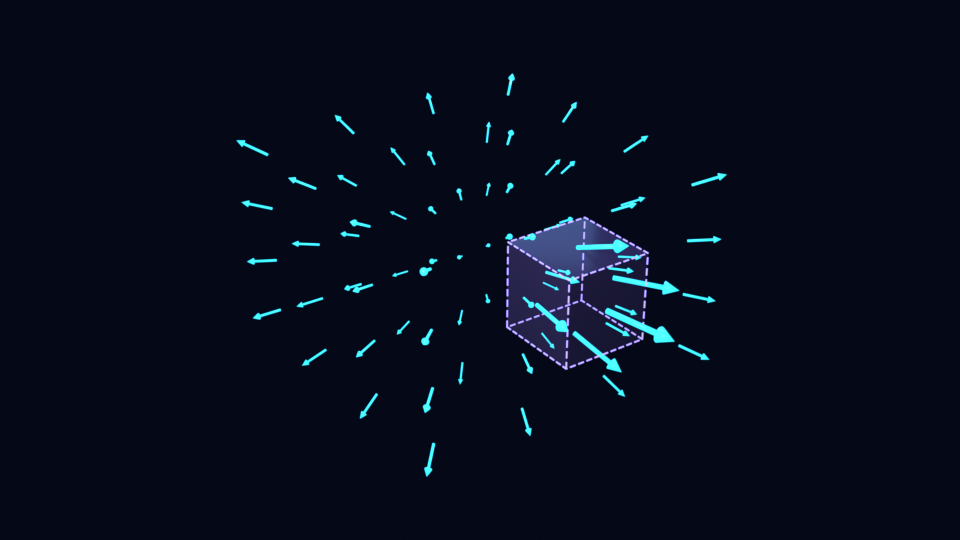

**Como se lê:** Uma caixinha violeta num campo de setas ciano, com uma seta saindo de cada face: lê-se como fluxo líquido e divergência.

**Usar quando**
- divergência como fluxo líquido por unidade de volume
- fonte, sumidouro e campo solenoidal
- ponte para o teorema de Gauss (gaussiana_caixa)

**Não usar quando**
- a definição formal de limite (o cubo é de tamanho fixo)
- campos que dependem do tempo

**Limitações**
- só o objeto geométrico: valores, fórmulas, matrizes, resultados e rótulos são do Manim
- a gramática de cor segue o padrão do arsenal (estilo.json): superfícies = vidro azul, curvas = azul-claro, construções = violeta, vetores = branco, normal e ∇g = azul, campo = ciano
- as setas das faces mostram o campo (não o fluxo F · n): a componente normal é para o Manim
- o campo de fundo é uma grade esparsa (4×4×4) e sua escala é visual
- os campos disponíveis são radial, rotacional, sela e uniforme

| Parâmetro | Padrão | Unid. | Descrição |
|---|---|---|---|
| `campo` | radial | texto | radial, rotacional, sela ou uniforme |
| `lado` | 1.5 | u | aresta do cubo elementar |
| `px` | 1.1 | u | posição do centro, x |
| `py` | 0.5 | u | posição do centro, y |
| `pz` | 0.0 | u | posição do centro, z |
| `n_fundo` | 4 | n | grade do campo de fundo (0 = sem fundo) |
| `extensao` | 2.4 | u | meia largura do campo |
| `movimento` | 0 | 0/1 | 1 = animação (use animar.py ou a ponte com o Manim) |
| `fase` | 0.0 | 0-1 | fase da animação |

**Integração:** `png_seq_alpha` · custo não medido

**Animação (cargas em movimento):** `translacao` · loop sem emenda (`fase` de 0 a 1) · 60 quadros sugeridos · custo 0.6 s/frame (1080p, com alpha)

```powershell
& "C:\Program Files\Blender Foundation\Blender 5.2\blender.exe" -b -P experimentos\blender\arsenal\renderizar.py -- divergencia_local --res 1920x1080 --alpha
```

**No Manim:**

```python
from manim_solido3d import Solido3D   # sys.path: experimentos/blender/arsenal
img = Solido3D("divergencia_local").mobject(cena=self, altura=5)   # cargas em loop; img.pausar() / img.retomar()
```

Ficha: `solidos/divergencia_local.json`

### `elemento_volume` — Elemento de volume dV (cartesiano, cilíndrico, esférico)

**Status:** aprovado · Aparência aprovada pelo usuário em 2026-10-07 (padrão visual de estilo.json); validado em 960x540 e 1080p.

Elemento de volume em violeta translúcido com arestas tracejadas: caixa dx dy dz (cartesiano), cunha r dr dθ dz (cilíndrico) ou r² sen θ dr dθ dφ (esférico), com os eixos x, y, z, o raio ao elemento e a projeção no plano xy (guias). Com movimento o elemento dá uma volta em torno de z.

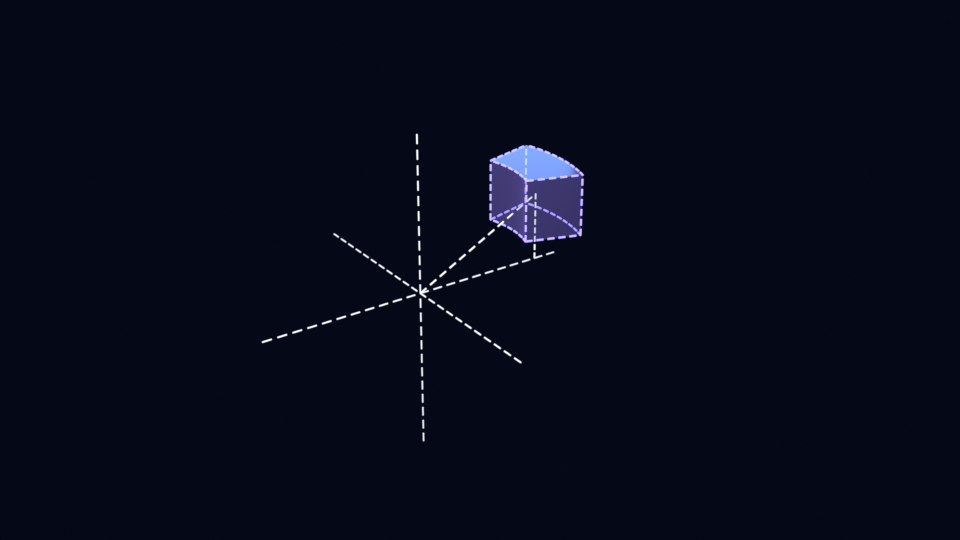

**Como se lê:** Uma pequena cunha violeta flutuando perto da origem, com as guias tracejadas até ela: lê-se como 'este é o elemento dV nesse sistema'.

**Usar quando**
- de onde vem o fator r (ou r² sen θ) nas integrais triplas
- comparar os três sistemas pela forma do elemento
- origem geométrica do Jacobiano

**Não usar quando**
- integrais de superfície (use superficie_parametrizada)
- sistemas gerais (só os três clássicos)

**Limitações**
- só o objeto geométrico: fórmulas, valores, gráficos e rótulos (inclusive N/S, +/−, nomes de vetores) são do Manim
- a gramática de cor segue o padrão do arsenal (estilo.json): E = ciano, B = magenta, vetores físicos = branco, normal = azul, construções = violeta
- o elemento é grande de propósito (dr, dθ, dz de 0,5 a 0,8), não infinitesimal
- só um elemento por vez, num ponto fixo

| Parâmetro | Padrão | Unid. | Descrição |
|---|---|---|---|
| `sistema` | cilindrico | texto | cartesiano, cilindrico ou esferico |
| `guias` | 1 | 0/1 | raio e projeção tracejados |
| `movimento` | 0 | 0/1 | 1 = animação (use animar.py ou a ponte com o Manim) |
| `fase` | 0.0 | 0-1 | fase da animação |

**Integração:** `png_seq_alpha` · custo 0.56 s/frame (1080p, Eevee)

**Animação (cargas em movimento):** `percurso` · loop sem emenda (`fase` de 0 a 1) · 60 quadros sugeridos · custo 0.56 s/frame (1080p, com alpha)

```powershell
& "C:\Program Files\Blender Foundation\Blender 5.2\blender.exe" -b -P experimentos\blender\arsenal\renderizar.py -- elemento_volume --res 1920x1080 --alpha
```

**No Manim:**

```python
from manim_solido3d import Solido3D   # sys.path: experimentos/blender/arsenal
img = Solido3D("elemento_volume").mobject(cena=self, altura=5)   # cargas em loop; img.pausar() / img.retomar()
```

Ficha: `solidos/elemento_volume.json`

### `equipotenciais` — Superfícies equipotenciais (carga pontual e dipolo)

**Status:** aprovado · Aparência aprovada pelo usuário em 2026-10-07 (padrão visual de estilo.json); validado em 960x540 e 1080p.

Superfícies equipotenciais em violeta translúcido, aninhadas: esferas concêntricas ao redor de uma carga pontual (`tipo=carga_pontual`) ou superfícies fechadas ao redor das duas cargas de um dipolo (`tipo=dipolo`, com o plano V = 0). As cargas têm o sinal esculpido (+ ou −). Cada superfície tem o seu corte no plano da carga destacado em contorno violeta nítido (um círculo na carga pontual, uma curva fechada em cada carga do dipolo), para o nível se ler mesmo com as cascas translúcidas sobrepostas.

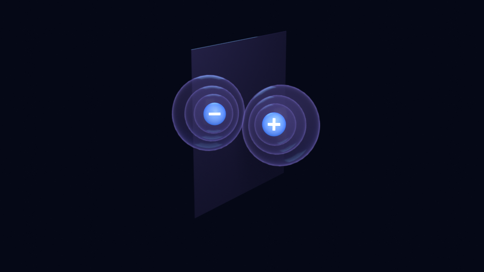

**Como se lê:** Cascas violeta aninhadas em torno de uma esfera com + ou −: lê-se como 'superfícies de mesmo potencial'. No dipolo, bolhas distintas em volta de cada carga.

**Usar quando**
- superfícies equipotenciais e a relação com o campo (E ⟂ equipotencial)
- carga pontual (esferas) e dipolo (superfícies deformadas)
- potencial em cada ponto: V = k q / r

**Não usar quando**
- potenciais de distribuições contínuas (use as fontes do arsenal e o Manim)
- mais de duas cargas

**Limitações**
- só o objeto geométrico: fórmulas, valores, gráficos e rótulos (inclusive N/S, +/−, nomes de vetores) são do Manim
- a gramática de cor segue o padrão do arsenal (estilo.json): E = ciano, B = magenta, vetores físicos = branco, normal = azul, construções = violeta
- no dipolo, só os níveis fechados em torno de cada carga (|V| ≥ nivel_min); o plano V = 0 é o plano mediador
- o sinal esculpido só aparece de frente
- as cascas são translúcidas e se sobrepõem: o contorno violeta no plano da carga é o que marca cada nível com clareza

| Parâmetro | Padrão | Unid. | Descrição |
|---|---|---|---|
| `tipo` | dipolo | texto | carga_pontual ou dipolo |
| `sinal` | 1 | ±1 | sinal da carga (no dipolo, da carga em +X) |
| `distancia` | 2.0 | u | distância entre as cargas do dipolo |
| `n_niveis` | 3 | n | superfícies por carga |
| `nivel_min` | 0.5 | u | menor |V| (a superfície mais externa) |
| `nivel_max` | 1.3 | u | maior |V| (a mais interna) |
| `plano` | 1 | 0/1 | plano V = 0 do dipolo |

**Integração:** `png_seq_alpha` · custo 0.91 s/frame (1080p, Eevee)

```powershell
& "C:\Program Files\Blender Foundation\Blender 5.2\blender.exe" -b -P experimentos\blender\arsenal\renderizar.py -- equipotenciais --res 1920x1080 --alpha
```

**No Manim:**

```python
from manim_solido3d import Solido3D   # sys.path: experimentos/blender/arsenal
img = Solido3D("equipotenciais").mobject(altura=5)   # estático: um quadro PNG com alpha
```

Ficha: `solidos/equipotenciais.json`

### `esfera_macica_isolante` — Esfera maciça isolante com cargas no volume

**Status:** aprovado · Aparência aprovada pelo usuário em 2026-10-07 (padrão visual de estilo.json); validado em 960x540 e 1080p.

Orbe de vidro azulado translúcido, preenchido, com cargas pontuais distribuídas uniformemente no volume da bola (distância mínima entre elas, semente fixa).

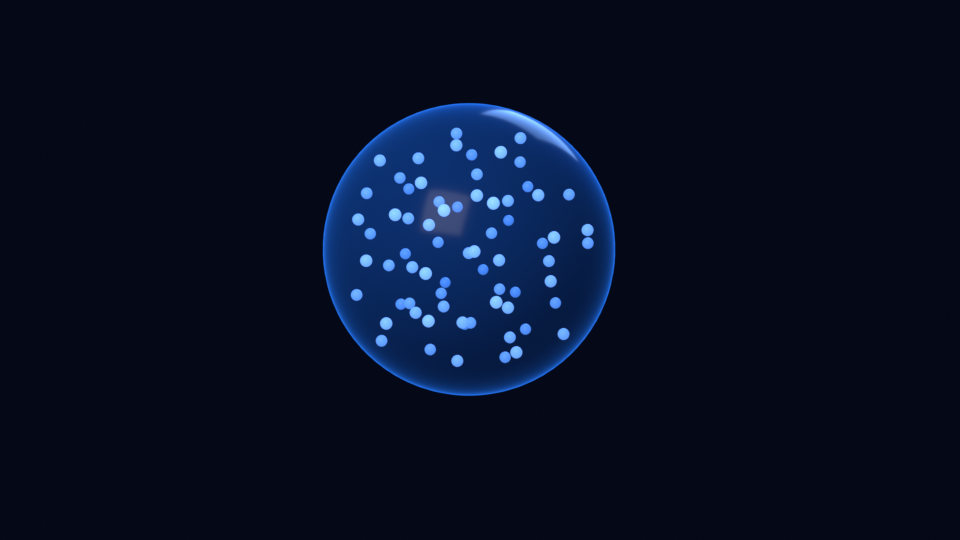

**Como se lê:** Vidro translúcido de borda luminosa cheio de pontos. Cargas próximas da câmera são azul-claro (#7FB2FF) e brilhantes; as distantes, azul (#267BFF) e fracas (pista de profundidade). O ciano fica livre para o campo E⃗. Lê-se como 'há material e carga em todo o volume'.

**Usar quando**
- a carga está distribuída no volume de uma esfera isolante com densidade uniforme
- contraste casca x maciço (par com casca_esferica_oca)
- mostrar que existe carga no interior, por exemplo campo crescendo com r dentro da esfera

**Não usar quando**
- o material só existe na superfície (use casca_esferica_oca)
- a densidade de carga é não uniforme e isso é o ponto do vídeo: as cargas aqui são uniformes (para rho(r) seria preciso outro sólido)
- é preciso um condutor: num condutor a carga fica na superfície

**Limitações**
- distribuição uniforme apenas; não há perfil radial rho(r)
- o brilho do vidro mostra um reflexo retangular suave da luz principal; é cosmético
- o número de cargas desejado pode não caber com a distância mínima escolhida (sai menos)

| Parâmetro | Padrão | Unid. | Descrição |
|---|---|---|---|
| `raio` | 1.0 | u | raio da esfera |
| `n_cargas` | 70 | n | número de cargas desejado (pode sair menos se a distância mínima não couber) |
| `dist_min` | 0.3 | u | distância mínima entre cargas |
| `tamanho_carga` | 0.04 | u | raio de cada esfera de carga |
| `semente` | 7 | n | semente do sorteio (mesma semente = mesma distribuição) |

**Integração:** `png_seq_alpha` · custo 0.71 s/frame (1080p, Eevee)

```powershell
& "C:\Program Files\Blender Foundation\Blender 5.2\blender.exe" -b -P experimentos\blender\arsenal\renderizar.py -- esfera_macica_isolante --res 1920x1080 --alpha
```

**No Manim:**

```python
from manim_solido3d import Solido3D   # sys.path: experimentos/blender/arsenal
img = Solido3D("esfera_macica_isolante").mobject(altura=5)   # estático: um quadro PNG com alpha
```

Ficha: `solidos/esfera_macica_isolante.json`

### `esfera_rolando` — Esfera rolando sem deslizar

**Status:** aprovado · Aparência aprovada pelo usuário em 2026-10-07 (padrão visual de estilo.json); validado em 960x540 e 1080p.

Esfera de vidro azulado com 3 meridianos e o equador em azul-claro, uma marca de superfície e a marca do centro de massa, sobre um chão de vidro com marcas transversais que corre sob ela (câmera acompanha). Eixo instantâneo de rotação tracejado violeta no contato.

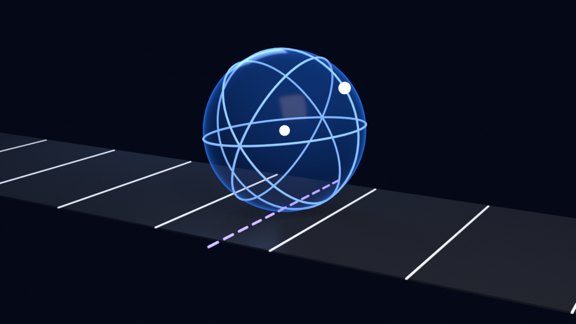

**Como se lê:** Esfera de vidro girando parada no centro, com riscos que mostram a rotação e um ponto de superfície que descreve uma ciclóide; o chão corre e o eixo violeta fica no contato. Lê-se como 'rolar sem deslizar'.

**Usar quando**
- rolamento sem deslizar: v_cm = ωR, energia cinética de translação + rotação
- mostrar o eixo instantâneo de rotação (no ponto de contato) como construção violeta
- comparar corpos de momentos de inércia diferentes (esfera, cilindro, aro) pela forma, em vídeos separados ou composição no Manim
- esfera maciça rolando (I = 2/5 M R²)

**Não usar quando**
- o corpo desliza (rolamento com escorregamento): as marcas do chão não acompanham o giro
- problemas com rampa e corrida de corpos: aqui só chão plano
- casca esférica oca (I = 2/3 M R²): esta esfera é de vidro cheio, sem distinção de distribuição de massa

**Limitações**
- câmera acompanha o corpo: ele gira parado no centro do quadro e é o chão que corre (é o que torna o loop perfeito); para mostrar o corpo avançando no quadro, ou corridas entre corpos, é preciso compor no Manim
- chão horizontal: não há rampa nem inclinação
- só a cinemática visual: velocidades (v_cm = ωR), energia, atrito e o sentido de rotação em vetores/rótulos ficam para o Manim
- a gramática de cor de Mecânica segue o padrão do arsenal (estilo.json): azul para o corpo, branco neutro para as marcas, violeta tracejado para a construção (eixo instantâneo)
- a distribuição de massa (maciça ou oca) não é codificada visualmente: dizer por rótulo
- o loop fecha com ruído de amostragem: 95% dos pixels diferem em até 2/255 entre a fase 0 e a fase 1 (só 2 a 301 pixels chegam a 3-7), invisível a olho nu

| Parâmetro | Padrão | Unid. | Descrição |
|---|---|---|---|
| `raio` | 1.0 | u | raio do corpo |
| `voltas` | 1 | n | voltas completas por loop (o chão avança 2πR por volta) |
| `eixo_instantaneo` | 1 | 0/1 | 1 = eixo instantâneo de rotação tracejado violeta no ponto de contato |
| `marca_centro` | 1 | 0/1 | 1 = marca do centro de massa |
| `movimento` | 0 | 0/1 | 1 = animação do rolamento (use animar.py ou a ponte com o Manim) |
| `fase` | 0.0 | 0-1 | fase do rolamento; fase=1 repete o quadro da fase 0 (loop perfeito) |

**Integração:** `png_seq_alpha` · custo 1.17 s/frame (1080p, Eevee)

**Animação (cargas em movimento):** `rolamento` · loop sem emenda (`fase` de 0 a 1) · 60 quadros sugeridos · custo 1.17 s/frame (1080p, com alpha)

```powershell
& "C:\Program Files\Blender Foundation\Blender 5.2\blender.exe" -b -P experimentos\blender\arsenal\renderizar.py -- esfera_rolando --res 1920x1080 --alpha
```

**No Manim:**

```python
from manim_solido3d import Solido3D   # sys.path: experimentos/blender/arsenal
img = Solido3D("esfera_rolando").mobject(cena=self, altura=5)   # cargas em loop; img.pausar() / img.retomar()
```

Ficha: `solidos/esfera_rolando.json`

### `espelho_esferico` — Espelho esférico (côncavo e convexo)

**Status:** aprovado · Aparência aprovada pelo usuário em 2026-10-07 (padrão visual de estilo.json); validado em 960x540 e 1080p.

Calota esférica de vidro (côncava ou convexa) de raio de curvatura R e diâmetro D, com a face refletora voltada para +X, o eixo óptico tracejado e três marcas brancas: vértice V, foco F = R/2 e centro de curvatura C = R (no convexo, atrás do espelho: virtuais).

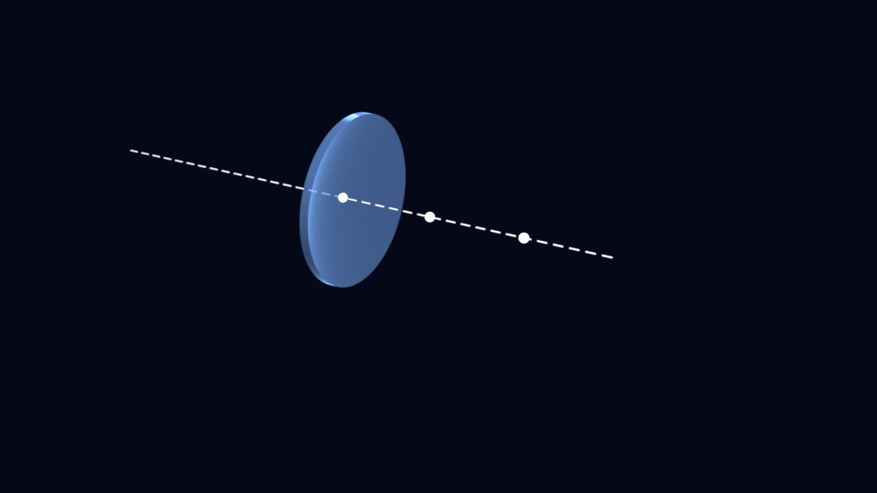

**Como se lê:** Uma calota curva com um eixo tracejado e três pontos sobre ele: lê-se como espelho esférico com V, F e C.

**Usar quando**
- espelhos côncavos e convexos, foco e centro de curvatura
- equação dos espelhos 1/f = 1/p + 1/p' (o Manim desenha os raios e a imagem)
- aberração esférica (raios paraxiais)

**Não usar quando**
- lentes (o vidro daqui não é lente)
- imagens e raios: são do Manim (2D)

**Limitações**
- só o objeto geométrico: valores, fórmulas, rótulos (n, θ, λ, ...) e o padrão de franjas/difração são do Manim
- a gramática de cor segue o padrão do arsenal (estilo.json): raios de luz = branco, campo E = ciano, objetos transparentes = vidro azul-claro, construções = violeta tracejado
- só a geometria do espelho: os raios principais e a imagem ficam por conta do Manim
- o espelho é vidro translúcido (não reflete a cena)
- o R mostrado é visual: o foco é sempre R/2 (aproximação paraxial)

| Parâmetro | Padrão | Unid. | Descrição |
|---|---|---|---|
| `tipo` | concavo | texto | concavo ou convexo |
| `raio_curvatura` | 3.0 | u | raio de curvatura R |
| `diametro` | 2.6 | u | diâmetro da calota |
| `marcas` | 1 | 0/1 | marcas V, F e C |
| `eixo` | 1 | 0/1 | eixo óptico tracejado |

**Integração:** `png_seq_alpha` · custo não medido

```powershell
& "C:\Program Files\Blender Foundation\Blender 5.2\blender.exe" -b -P experimentos\blender\arsenal\renderizar.py -- espelho_esferico --res 1920x1080 --alpha
```

**No Manim:**

```python
from manim_solido3d import Solido3D   # sys.path: experimentos/blender/arsenal
img = Solido3D("espelho_esferico").mobject(altura=5)   # estático: um quadro PNG com alpha
```

Ficha: `solidos/espelho_esferico.json`

### `espira_em_campo_magnetico` — Espira de corrente num campo magnético (torque)

**Status:** aprovado · Aparência aprovada pelo usuário em 2026-10-07 (padrão visual de estilo.json); validado em 960x540 e 1080p.

Espira de fio azul que gira em torno de Z num B uniforme (+Y, setas magenta), com o momento de dipolo μ = I A n̂ (branco, normal à espira), o torque τ = μ × B (branco, ao longo de Z, ∝ sen θ) e uma seta de corrente. Com movimento a espira oscila em torno do alinhamento (μ ∥ B).

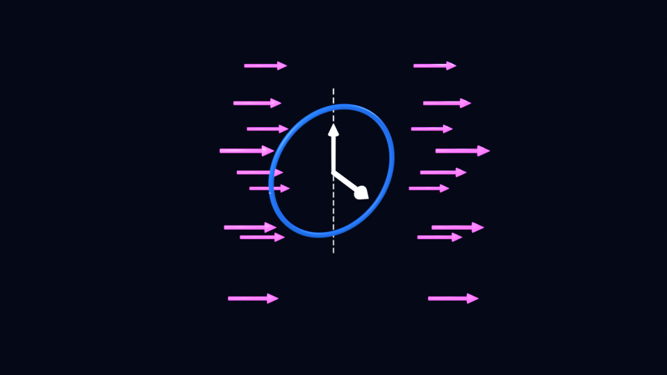

**Como se lê:** Uma espira circular inclinada em relação às setas magenta, com uma seta normal e uma seta de torque: lê-se como 'o campo gira a espira até alinhar μ com B'.

**Usar quando**
- torque numa espira, momento de dipolo magnético e alinhamento com B
- energia do dipolo (a energia é do Manim)
- base para motores elétricos

**Não usar quando**
- campos não uniformes (há força líquida)
- rotação contínua de um motor (sem comutador)

**Limitações**
- só o objeto geométrico: fórmulas, valores, gráficos e rótulos (inclusive N/S, +/−, nomes de vetores) são do Manim
- a gramática de cor segue o padrão do arsenal (estilo.json): E = ciano, B = magenta, vetores físicos = branco, normal = azul, construções = violeta
- o movimento é a oscilação de pequenas amplitudes θ = θ0 cos(2π fase), prescrita (sem atrito)
- o torque (seta branca ao longo de Z) é ∝ sen θ numa escala visual de 2,2 u: some no alinhamento (θ = 0), que é o fisicamente esperado

| Parâmetro | Padrão | Unid. | Descrição |
|---|---|---|---|
| `raio` | 1.5 | u | raio da espira |
| `amplitude_graus` | 70.0 | graus | amplitude da oscilação de θ (com movimento) |
| `angulo_graus` | 40.0 | graus | ângulo entre μ e B (sem movimento) |
| `movimento` | 0 | 0/1 | 1 = animação (use animar.py ou a ponte com o Manim) |
| `fase` | 0.0 | 0-1 | fase da animação |

**Integração:** `png_seq_alpha` · custo 0.42 s/frame (1080p, Eevee)

**Animação (cargas em movimento):** `oscilacao` · loop sem emenda (`fase` de 0 a 1) · 60 quadros sugeridos · custo 0.42 s/frame (1080p, com alpha)

```powershell
& "C:\Program Files\Blender Foundation\Blender 5.2\blender.exe" -b -P experimentos\blender\arsenal\renderizar.py -- espira_em_campo_magnetico --res 1920x1080 --alpha
```

**No Manim:**

```python
from manim_solido3d import Solido3D   # sys.path: experimentos/blender/arsenal
img = Solido3D("espira_em_campo_magnetico").mobject(cena=self, altura=5)   # cargas em loop; img.pausar() / img.retomar()
```

Ficha: `solidos/espira_em_campo_magnetico.json`

### `explosao` — Explosão em três fragmentos

**Status:** aprovado · Aparência aprovada pelo usuário em 2026-10-07 (padrão visual de estilo.json); validado em 960x540 e 1080p.

Uma esfera se parte em três fragmentos (massas m1, m2, m3) que saem a 120° conservando o momento linear: no referencial do centro de massa Σ m v = 0. Velocidades em branco, centro de massa neutro (anda a v0 constante). Ciclo único.

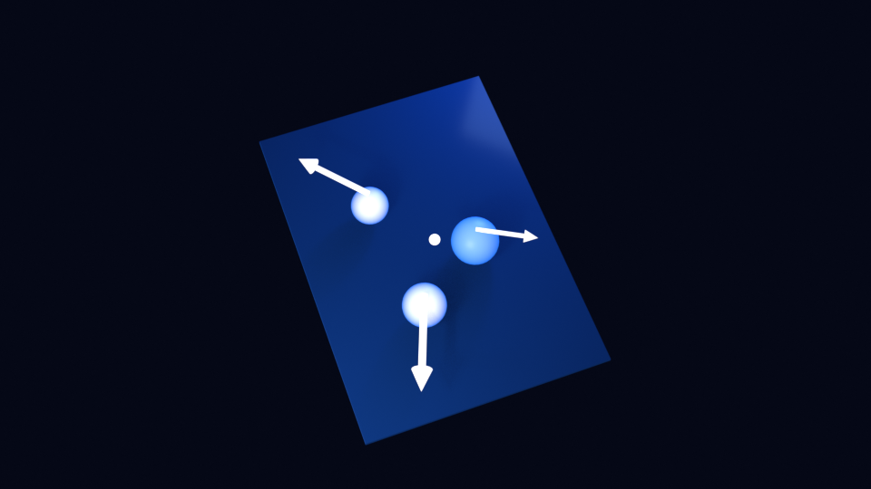

**Como se lê:** Uma esfera que vira três esferas se afastando em direções opostas, com o centro de massa seguindo reto: lê-se como a explosão não mudando o movimento do CM.

**Usar quando**
- explosões e a conservação do momento linear
- o CM não é afetado por forças internas
- energia cinética liberada por forças internas (a conta é do Manim)

**Não usar quando**
- fragmentos com direções arbitrárias (aqui são três, a 120°)
- movimento em 3D

**Limitações**
- só o objeto geométrico: valores, fórmulas, gráficos e os nomes dos vetores são do Manim
- a gramática de cor segue o padrão do arsenal (estilo.json): vetores físicos = branco, construções = violeta tracejado, corpos = vidro azul
- os fragmentos saem exatamente a 120° (as velocidades se ajustam às massas), é uma escolha de simetria
- plano XY visto de cima: não há altura

| Parâmetro | Padrão | Unid. | Descrição |
|---|---|---|---|
| `m1` | 2.0 | u | massa do fragmento 1 |
| `m2` | 1.0 | u | massa do fragmento 2 |
| `m3` | 1.5 | u | massa do fragmento 3 |
| `energia` | 14.0 | u | energia cinética liberada (no referencial do CM) |
| `v0` | 1.0 | u | velocidade do centro de massa |
| `instante` | 0.35 | 0-1 | instante da explosão |
| `movimento` | 0 | 0/1 | 1 = animação (use animar.py ou a ponte com o Manim) |
| `fase` | 0.0 | 0-1 | fase da animação |

**Integração:** `png_seq_alpha` · custo não medido

**Animação (cargas em movimento):** `explosao` · loop sem emenda (`fase` de 0 a 1) · 60 quadros sugeridos · custo 0.74 s/frame (1080p, com alpha)

```powershell
& "C:\Program Files\Blender Foundation\Blender 5.2\blender.exe" -b -P experimentos\blender\arsenal\renderizar.py -- explosao --res 1920x1080 --alpha
```

**No Manim:**

```python
from manim_solido3d import Solido3D   # sys.path: experimentos/blender/arsenal
img = Solido3D("explosao").mobject(cena=self, altura=5)   # cargas em loop; img.pausar() / img.retomar()
```

Ficha: `solidos/explosao.json`

### `filme_fino` — Filme fino e interferência

**Status:** aprovado · Aparência aprovada pelo usuário em 2026-10-07 (padrão visual de estilo.json); validado em 960x540 e 1080p.

Película de vidro (n > 1) sobre um substrato: um raio incidente produz dois raios refletidos (na face de cima e na de baixo). A esfera no alto brilha como cos²(2π · 2 n t cos θ₂ / λ): com movimento a espessura t oscila e o brilho vai e volta (construtiva e destrutiva).

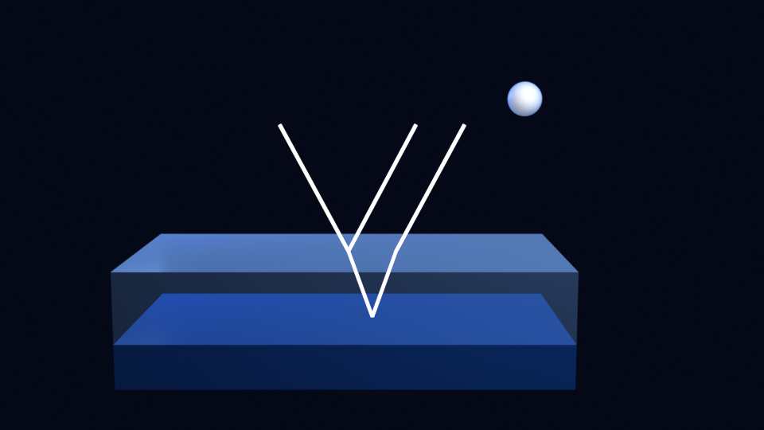

**Como se lê:** Um raio se dividindo em dois ao bater numa película, e uma esfera que acende e apaga: lê-se como interferência por reflexão.

**Usar quando**
- interferência em filmes finos (bolhas, óleo)
- condições de máximo e mínimo 2 n t cos θ = m λ
- defasagem de π na reflexão

**Não usar quando**
- interferência de fendas (use anteparo_fenda_dupla ou rede_de_difracao)
- cores reais (o brilho é monocromático)

**Limitações**
- só o objeto geométrico: valores, fórmulas, rótulos (n, θ, λ, ...) e o padrão de franjas/difração são do Manim
- a gramática de cor segue o padrão do arsenal (estilo.json): raios de luz = branco, campo E = ciano, objetos transparentes = vidro azul-claro, construções = violeta tracejado
- o brilho é monocromático (λ = 0,62 nas unidades do sólido) e a amplitude da oscilação de t é visual
- a defasagem de π da reflexão não é representada: a leitura da fase é do Manim
- dois raios apenas (sem reflexões múltiplas)

| Parâmetro | Padrão | Unid. | Descrição |
|---|---|---|---|
| `n_filme` | 1.4 | n | índice do filme |
| `espessura` | 0.55 | u | espessura t |
| `angulo_graus` | 28.0 | graus | ângulo de incidência |
| `amplitude` | 0.45 | frac | variação relativa de t com movimento |
| `movimento` | 0 | 0/1 | 1 = animação (use animar.py ou a ponte com o Manim) |
| `fase` | 0.0 | 0-1 | fase da animação |

**Integração:** `png_seq_alpha` · custo não medido

**Animação (cargas em movimento):** `interferencia` · loop sem emenda (`fase` de 0 a 1) · 60 quadros sugeridos · custo 0.92 s/frame (1080p, com alpha)

```powershell
& "C:\Program Files\Blender Foundation\Blender 5.2\blender.exe" -b -P experimentos\blender\arsenal\renderizar.py -- filme_fino --res 1920x1080 --alpha
```

**No Manim:**

```python
from manim_solido3d import Solido3D   # sys.path: experimentos/blender/arsenal
img = Solido3D("filme_fino").mobject(cena=self, altura=5)   # cargas em loop; img.pausar() / img.retomar()
```

Ficha: `solidos/filme_fino.json`

### `fio_infinito` — Fio infinito (retilíneo)

**Status:** aprovado · Aparência aprovada pelo usuário em 2026-10-07 (padrão visual de estilo.json); validado em 960x540 e 1080p.

Fio retilíneo azul (#267BFF) ao longo de X, brilhante, com um halo de vidro fino em volta, cuja opacidade se dissolve nas duas pontas para sugerir comprimento infinito. Eixo de simetria opcional.

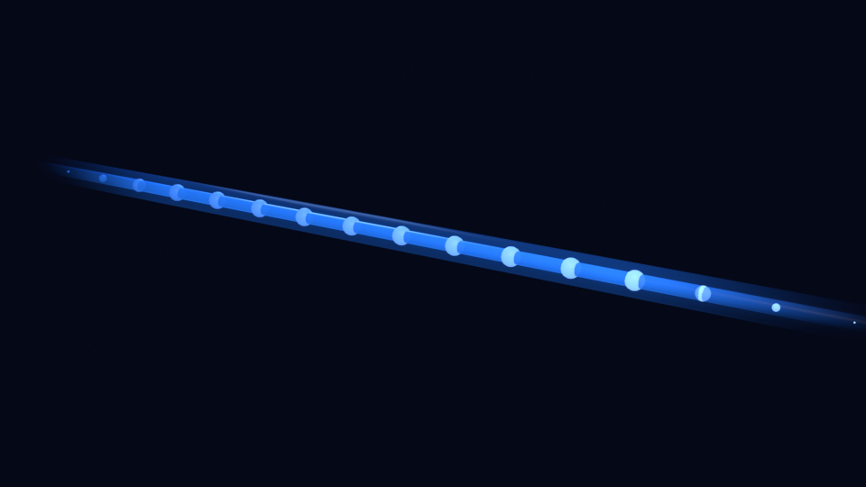

**Como se lê:** Linha azul luminosa com halo suave que some nas pontas: lê-se como 'fio muito longo, sem fim visível'.

**Usar quando**
- campo B de um fio longo (circulação amperiana circular em torno dele)
- linha de carga/corrente infinita como fonte
- contraste com solenoide e toroide (outras fontes de Ampère)
- corrente num fio: cargas em movimento ao longo dele (cargas_moveis=1, animar.py)
- corrente num fio: cargas em movimento ao longo dele (cargas_moveis=1)

**Não usar quando**
- o fio é finito e o efeito de pontas importa: aqui as pontas se dissolvem de propósito
- um condutor espesso com corrente distribuída na seção: este fio é fino

**Limitações**
- só a fonte física (fio/enrolamento, azul): o campo B (ciano) e o sentido da corrente são desenhados no 2D/Manim
- sem noção de sentido: a hélice tem um sentido de enrolamento, mas ele não representa a corrente de forma legível; indicar I por rótulo/seta no Manim
- fisicamente finito (10 por padrão): o 'infinito' é só visual; se o enquadramento incluir as pontas, o efeito se perde
- é um cilindro opaco-translúcido fino; não representa a densidade de corrente na seção
- o sentido do movimento não codifica a corrente: a convenção (corrente convencional ou elétrons, que vão ao contrário) e o sinal vão por seta e rótulo no Manim
- o movimento não codifica a corrente: a convenção (corrente convencional ou elétrons, que vão ao contrário) e o sinal vão por seta e rótulo no Manim; o movimento é didático, não em escala

| Parâmetro | Padrão | Unid. | Descrição |
|---|---|---|---|
| `comprimento` | 10.0 | u | comprimento do fio (eixo X) |
| `raio` | 0.06 | u | raio do fio (visual) |
| `eixo` | 0 | 0/1 | 1 = eixo tracejado neutro (coincide com o fio; útil só como guia) |
| `comprimento_eixo` | 6.0 | u | comprimento do eixo, se desenhado |
| `cargas_moveis` | 0 | 0/1 | 1 = cargas azul-claro deslizando ao longo do fio (corrente); o movimento é didático, não em escala |
| `fase` | 0.0 | 0-1 | fase do movimento: desloca as cargas de 0 a 1 espaçamento; fase=1 repete o quadro da fase 0 (loop perfeito) |
| `espaco_cargas` | 0.6 | u | distância entre cargas consecutivas ao longo do fio |
| `tamanho_carga_movel` | 0.09 | u | raio de cada carga móvel |

**Integração:** `png_seq_alpha` · custo 0.5 s/frame (1080p, Eevee)

**Animação (cargas em movimento):** `deslizamento` · loop sem emenda (`fase` de 0 a 1) · 60 quadros sugeridos · custo 0.67 s/frame (1080p, com alpha)

```powershell
& "C:\Program Files\Blender Foundation\Blender 5.2\blender.exe" -b -P experimentos\blender\arsenal\renderizar.py -- fio_infinito --res 1920x1080 --alpha
```

**No Manim:**

```python
from manim_solido3d import Solido3D   # sys.path: experimentos/blender/arsenal
img = Solido3D("fio_infinito").mobject(cena=self, altura=5)   # cargas em loop; img.pausar() / img.retomar()
```

Ficha: `solidos/fio_infinito.json`

### `gaussiana_caixa` — Superfície gaussiana em caixa (pillbox)

**Status:** aprovado · Aparência aprovada pelo usuário em 2026-10-07 (padrão visual de estilo.json); validado em 960x540 e 1080p.

Caixa gaussiana curta (pillbox) de arestas violeta (#9C8CFF), com a normal do plano ao longo de X: `altura` em X e `lado` em Y e Z, centrada no plano. Faces de vidro violeta muito translúcido. Por padrão atravessa uma placa carregada de referência.

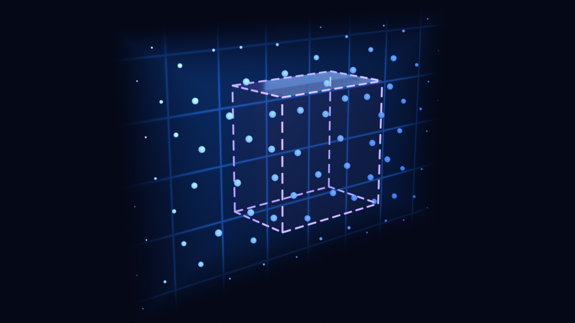

**Como se lê:** Caixa de arestas violeta tracejadas atravessando o plano azul: metade de cada lado. Lê-se como 'a gaussiana envolve um pedaço do plano'; o fluxo sai pelas duas faces paralelas ao plano.

**Usar quando**
- simetria planar: plano infinito carregado, placa não condutora
- mostrar a caixa curta atravessando o plano e que só as faces paralelas ao plano contribuem
- contraste com as gaussianas esférica e cilíndrica na mesma unidade

**Não usar quando**
- simetria esférica ou cilíndrica (use gaussiana_esferica ou gaussiana_cilindrica)
- placa condutora com a caixa de um lado só: esta caixa é simétrica em torno do plano

**Limitações**
- a gaussiana é uma construção matemática, não um objeto físico: nunca preenchimento sólido (as faces são vidro violeta muito translúcido, só para dar volume)
- com_fonte=1 desenha também uma fonte de referência (aprovada do arsenal) só para contexto e teste de leitura; em vídeo use com_fonte=0 e componha com a fonte da cena
- a caixa é centrada no plano x=0 e simétrica; caixa assimétrica não é suportada
- no preview a placa de referência é menor (8 x 5) que a do sólido placa_infinita_carregada, para a caixa ficar legível
- o enquadramento padrão (azimute -40, elevação 16) segue o da placa

| Parâmetro | Padrão | Unid. | Descrição |
|---|---|---|---|
| `lado` | 2.4 | u | lado das faces paralelas ao plano (Y e Z) |
| `altura` | 1.4 | u | espessura da caixa ao longo de X (a normal do plano) |
| `continua` | 0 | 0/1 | 0 = arestas tracejadas; 1 = contínuas |
| `faces` | 1 | 0/1 | 1 = vidro violeta translúcido; 0 = só as arestas |
| `com_fonte` | 1 | 0/1 | 1 = desenha uma placa carregada de referência |

**Integração:** `png_seq_alpha` · custo 1.38 s/frame (1080p, Eevee)

```powershell
& "C:\Program Files\Blender Foundation\Blender 5.2\blender.exe" -b -P experimentos\blender\arsenal\renderizar.py -- gaussiana_caixa --res 1920x1080 --alpha
```

**No Manim:**

```python
from manim_solido3d import Solido3D   # sys.path: experimentos/blender/arsenal
img = Solido3D("gaussiana_caixa").mobject(altura=5)   # estático: um quadro PNG com alpha
```

Ficha: `solidos/gaussiana_caixa.json`

### `gaussiana_cilindrica` — Superfície gaussiana cilíndrica (fechada)

**Status:** aprovado · Aparência aprovada pelo usuário em 2026-10-07 (padrão visual de estilo.json); validado em 960x540 e 1080p.

Cilindro gaussiano fechado (eixo X) de raio `raio` e comprimento `comprimento`: duas tampas circulares e linhas longitudinais em violeta (#9C8CFF), sobre vidro violeta muito translúcido. Lateral e tampas têm estilo independente (tracejado ou contínuo). Por padrão envolve um cilindro maciço de referência.

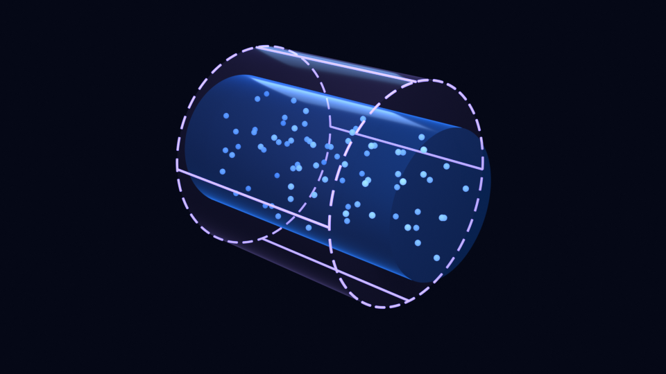

**Como se lê:** Cilindro de traços violeta sobre a fonte azul. Na gramática da série: lateral contínua = parte que contribui ao fluxo; tampas tracejadas = fluxo nulo (campo radial). O preview mostra esse estado (lateral contínua).

**Usar quando**
- simetria cilíndrica: linha infinita, cilindro maciço, casca cilíndrica, cabo coaxial
- mostrar que o fluxo vem só da lateral (2πrL) e as tampas não contribuem
- delimitar r < a, a < r < b e r > b com raios diferentes de gaussiana

**Não usar quando**
- simetria esférica ou planar (use gaussiana_esferica ou gaussiana_caixa)
- o campo não é radial ao eixo: o argumento das tampas nulas deixa de valer

**Limitações**
- a gaussiana é uma construção matemática, não um objeto físico: nunca preenchimento sólido (as faces são vidro violeta muito translúcido, só para dar volume)
- com_fonte=1 desenha também uma fonte de referência (aprovada do arsenal) só para contexto e teste de leitura; em vídeo use com_fonte=0 e componha com a fonte da cena
- comprimento finito: a gaussiana tem tampas, a fonte é idealmente infinita
- as linhas longitudinais (4 por padrão) são só guias de leitura da superfície
- eixo fixo em X; o enquadramento padrão (azimute -45, elevação 20) foi escolhido para a lateral ler bem

| Parâmetro | Padrão | Unid. | Descrição |
|---|---|---|---|
| `raio` | 1.5 | u | raio do cilindro gaussiano |
| `comprimento` | 3.0 | u | comprimento ao longo do eixo X |
| `lateral_continua` | 0 | 0/1 | 0 = lateral tracejada; 1 = contínua (contribui) |
| `tampas_continuas` | 0 | 0/1 | 0 = tampas tracejadas; 1 = contínuas |
| `n_linhas` | 4 | n | linhas longitudinais de guia |
| `faces` | 1 | 0/1 | 1 = vidro violeta translúcido; 0 = só os traços |
| `com_fonte` | 1 | 0/1 | 1 = desenha um cilindro maciço de referência dentro |
| `raio_fonte` | 1.0 | u | raio do cilindro de referência |
| `comprimento_fonte` | 4.0 | u | comprimento do cilindro de referência |

**Integração:** `png_seq_alpha` · custo 1.21 s/frame (1080p, Eevee)

```powershell
& "C:\Program Files\Blender Foundation\Blender 5.2\blender.exe" -b -P experimentos\blender\arsenal\renderizar.py -- gaussiana_cilindrica --res 1920x1080 --alpha
```

**No Manim:**

```python
from manim_solido3d import Solido3D   # sys.path: experimentos/blender/arsenal
img = Solido3D("gaussiana_cilindrica").mobject(altura=5)   # estático: um quadro PNG com alpha
```

Ficha: `solidos/gaussiana_cilindrica.json`

### `gaussiana_esferica` — Superfície gaussiana esférica

**Status:** aprovado · Aparência aprovada pelo usuário em 2026-10-07 (padrão visual de estilo.json); validado em 960x540 e 1080p.

Esfera gaussiana de raio `raio`: equador e dois meridianos em violeta (#9C8CFF), tracejados por padrão, sobre um orbe de vidro violeta muito translúcido. Por padrão envolve uma esfera maciça de referência (`com_fonte`).

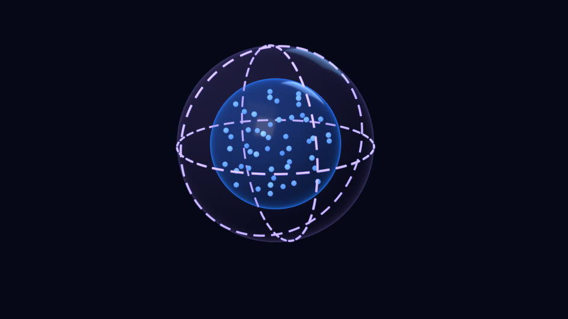

**Como se lê:** Três círculos violeta tracejados sobre uma esfera quase transparente, envolvendo a fonte azul. Tracejado = construção; contínuo (`continua=1`) = a superfície inteira contribui ao fluxo.

**Usar quando**
- simetria esférica: carga pontual, esfera maciça, casca esférica (campo radial)
- delimitar as regiões r < R e r > R ao escolher o raio da gaussiana
- mostrar o estado de construção (tracejada) e o de cálculo do fluxo (contínua)

**Não usar quando**
- simetria cilíndrica ou planar (use gaussiana_cilindrica ou gaussiana_caixa)
- qualquer superfície não fechada: esta é fechada por construção

**Limitações**
- a gaussiana é uma construção matemática, não um objeto físico: nunca preenchimento sólido (as faces são vidro violeta muito translúcido, só para dar volume)
- com_fonte=1 desenha também uma fonte de referência (aprovada do arsenal) só para contexto e teste de leitura; em vídeo use com_fonte=0 e componha com a fonte da cena
- a esfera inteira contribui: não há parte tracejada e parte contínua dentro de uma mesma esfera
- representada por três círculos (equador e dois meridianos), não por malha completa

| Parâmetro | Padrão | Unid. | Descrição |
|---|---|---|---|
| `raio` | 1.5 | u | raio da esfera gaussiana |
| `continua` | 0 | 0/1 | 0 = tracejada (construção); 1 = contínua (contribui ao fluxo) |
| `faces` | 1 | 0/1 | 1 = orbe de vidro violeta translúcido; 0 = só os traços |
| `com_fonte` | 1 | 0/1 | 1 = desenha uma esfera maciça de referência dentro |
| `raio_fonte` | 1.0 | u | raio da esfera de referência (menor que `raio`) |

**Integração:** `png_seq_alpha` · custo 1.01 s/frame (1080p, Eevee)

```powershell
& "C:\Program Files\Blender Foundation\Blender 5.2\blender.exe" -b -P experimentos\blender\arsenal\renderizar.py -- gaussiana_esferica --res 1920x1080 --alpha
```

**No Manim:**

```python
from manim_solido3d import Solido3D   # sys.path: experimentos/blender/arsenal
img = Solido3D("gaussiana_esferica").mobject(altura=5)   # estático: um quadro PNG com alpha
```

Ficha: `solidos/gaussiana_esferica.json`

### `giroscopio_precessao` — Giroscópio e precessão

**Status:** aprovado · Aparência aprovada pelo usuário em 2026-10-07 (padrão visual de estilo.json); validado em 960x540 e 1080p.

Rotor de vidro com quatro raios claros, preso a um eixo que gira em torno de z (precessão, rastro violeta tracejado) enquanto o rotor gira em torno do próprio eixo (`voltas_spin` por volta de precessão). O momento angular L ao longo do eixo, o peso e o torque (tangente ao cone) são brancos.

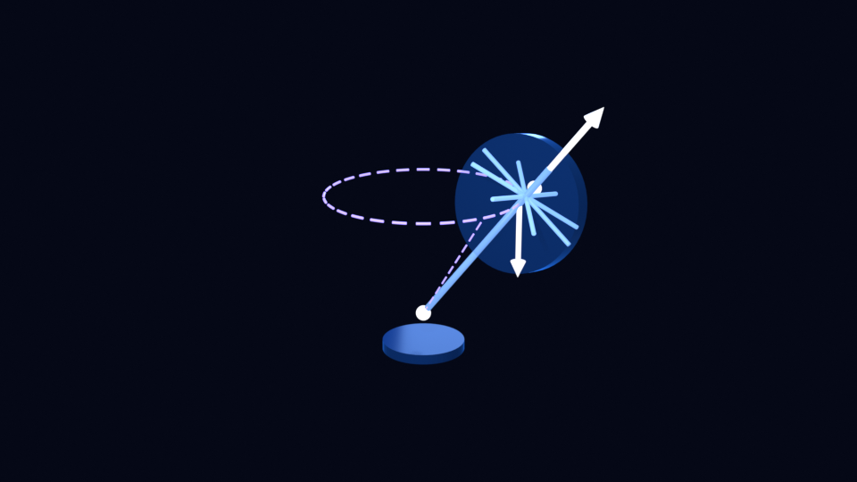

**Como se lê:** Pião inclinado com um rastro circular tracejado e três setas brancas: lê-se como 'torque horizontal faz o eixo precessionar'.

**Usar quando**
- momento angular L, torque τ = r × F e a precessão (dL/dt = τ)
- por que o pião não cai: o torque muda a direção de L, não o módulo
- comparar rotação e precessão

**Não usar quando**
- nutação e movimento geral do pião (só precessão estacionária)
- o giroscópio de três anéis

**Limitações**
- só o objeto geométrico: fórmulas, valores, gráficos e rótulos (inclusive N/S, +/−, nomes de vetores) são do Manim
- a gramática de cor segue o padrão do arsenal (estilo.json): E = ciano, B = magenta, vetores físicos = branco, normal = azul, construções = violeta
- a precessão é prescrita (velocidade angular fixa), não calculada pela física; a taxa real é do Manim
- a gramática de cor de Mecânica segue o arsenal (vetores em branco)

| Parâmetro | Padrão | Unid. | Descrição |
|---|---|---|---|
| `inclinacao_graus` | 38.0 | graus | ângulo do eixo com a vertical |
| `comprimento_eixo` | 1.9 | u | distância do pivô ao rotor |
| `raio_rotor` | 0.8 | u | raio do rotor |
| `voltas_spin` | 7 | n | voltas do rotor por volta de precessão (inteiro) |
| `vetores` | 1 | 0/1 | L, peso e torque |
| `rastro` | 1 | 0/1 | rastro do rotor |
| `movimento` | 0 | 0/1 | 1 = animação (use animar.py ou a ponte com o Manim) |
| `fase` | 0.0 | 0-1 | fase da animação |

**Integração:** `png_seq_alpha` · custo 0.62 s/frame (1080p, Eevee)

**Animação (cargas em movimento):** `precessao` · loop sem emenda (`fase` de 0 a 1) · 60 quadros sugeridos · custo 0.62 s/frame (1080p, com alpha)

```powershell
& "C:\Program Files\Blender Foundation\Blender 5.2\blender.exe" -b -P experimentos\blender\arsenal\renderizar.py -- giroscopio_precessao --res 1920x1080 --alpha
```

**No Manim:**

```python
from manim_solido3d import Solido3D   # sys.path: experimentos/blender/arsenal
img = Solido3D("giroscopio_precessao").mobject(cena=self, altura=5)   # cargas em loop; img.pausar() / img.retomar()
```

Ficha: `solidos/giroscopio_precessao.json`

### `gradiente_colina` — Gradiente numa colina (curvas de nível)

**Status:** aprovado · Aparência aprovada pelo usuário em 2026-10-07 (padrão visual de estilo.json); validado em 960x540 e 1080p.

Colina gaussiana f(x, y) = h e^(−r²/2σ²) (vidro azul) com curvas de nível em azul-claro, um ponto P (branco) sobre a superfície, o vetor gradiente ∇f (ciano, horizontal, apontando para o topo) e a projeção vertical de P no plano (violeta tracejada). Com `movimento=1` o ponto circunda a colina e o gradiente gira com ele.

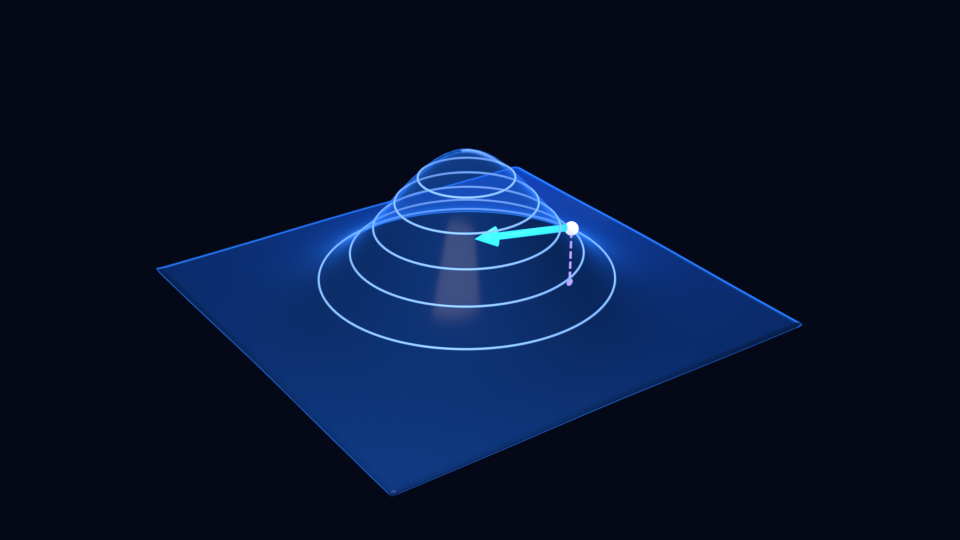

**Como se lê:** Colina de vidro com anéis e um ponto com uma seta ciano perpendicular ao anel, apontando para o topo. Lê-se como 'o gradiente é perpendicular às curvas de nível e aponta para a maior subida'.

**Usar quando**
- gradiente e derivada direcional (Cálculo III 10.5): ∇f ⟂ curvas de nível
- extremos em várias variáveis (o topo da colina)
- relação do gradiente com o campo conservativo (potencial)

**Não usar quando**
- funções com pontos de sela (use superficie_parametrizada, tipo sela)
- mais de uma colina

**Limitações**
- a gramática de cor segue o padrão do arsenal: campo vetorial = ciano (reservado ao campo), normal n̂ = azul, tangentes = branco, construções (remendo, contorno) = violeta, nunca sólidas
- só o objeto geométrico: integrais, fórmulas e o sinal da circulação/fluxo são do Manim
- a seta do gradiente é horizontal (no plano xy) e normalizada em comprimento (0,35 + 0,9|∇f|, no máximo 1,6)
- a colina é fixa (gaussiana), só altura e abertura mudam

| Parâmetro | Padrão | Unid. | Descrição |
|---|---|---|---|
| `altura` | 2.0 | u | altura h do topo |
| `abertura` | 1.0 | u | largura σ da colina |
| `extensao` | 3.0 | u | meia largura da região |
| `n_niveis` | 5 | n | curvas de nível |
| `raio_ponto` | 1.4 | u | distância de P ao eixo da colina |
| `movimento` | 0 | 0/1 | 1 = animação em loop (use animar.py ou a ponte com o Manim) |
| `fase` | 0.0 | 0-1 | fase do loop; fase=1 repete o quadro da fase 0 (loop perfeito) |

**Integração:** `png_seq_alpha` · custo 1.03 s/frame (1080p, Eevee)

**Animação (cargas em movimento):** `percurso` · loop sem emenda (`fase` de 0 a 1) · 60 quadros sugeridos · custo 1.03 s/frame (1080p, com alpha)

```powershell
& "C:\Program Files\Blender Foundation\Blender 5.2\blender.exe" -b -P experimentos\blender\arsenal\renderizar.py -- gradiente_colina --res 1920x1080 --alpha
```

**No Manim:**

```python
from manim_solido3d import Solido3D   # sys.path: experimentos/blender/arsenal
img = Solido3D("gradiente_colina").mobject(cena=self, altura=5)   # cargas em loop; img.pausar() / img.retomar()
```

Ficha: `solidos/gradiente_colina.json`

### `haste_carregada` — Haste carregada

**Status:** aprovado · Aparência aprovada pelo usuário em 2026-10-07 (padrão visual de estilo.json); validado em 960x540 e 1080p.

Haste fina de vidro azulado ao longo de Y, com eixo de simetria (mediatriz) em X, e cargas espaçadas ao longo dela. Eixo de simetria opcional (tracejado neutro).

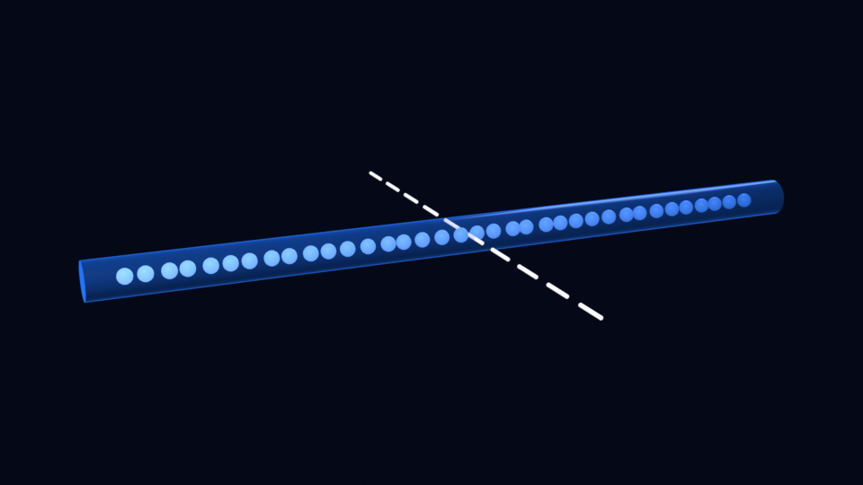

**Como se lê:** Bastão de vidro fino com uma fileira de pontos azuis e, opcionalmente, o eixo tracejado cruzando-o ao meio. Lê-se como 'carga distribuída numa linha reta finita'.

**Usar quando**
- campo elétrico de uma haste finita carregada (integração de dq, ponto na mediatriz, limite de haste longa)
- momento de inércia de uma haste (com_cargas=0), com o eixo de simetria desenhado
- contraste com o anel (linha curva) e com o disco (superfície)
- corrente numa haste: cargas deslizando ao longo dela (cargas_moveis=1)

**Não usar quando**
- a haste deve ser infinita: o objeto é finito (para linha infinita use gaussiana_cilindrica com a fonte da cena)
- a espessura da haste importa para o problema

**Limitações**
- o campo e a gaussiana não são desenhados: o ciano é reservado ao campo (animação 2D/Manim)
- em contexto de mecânica (com_cargas=0) o azul de 'fonte física' vem da gramática de Eletromagnetismo; a gramática de cor da Mecânica não foi verificada aqui
- espessura/raio do corpo exagerados em relação ao ideal (o corpo de vidro é visível); as cargas ficam dentro dele
- haste ao longo de Y fixa; em outra orientação, girar a câmera
- as cargas têm espaçamento quase regular (jitter 0,12)
- o movimento não codifica a corrente: a convenção (corrente convencional ou elétrons, que vão ao contrário) e o sinal vão por seta e rótulo no Manim; o movimento é didático, não em escala
- com cargas_moveis=1 as cargas estáticas (com_cargas) são substituídas pelas móveis

| Parâmetro | Padrão | Unid. | Descrição |
|---|---|---|---|
| `comprimento` | 4.0 | u | comprimento da haste (eixo Y) |
| `raio` | 0.1 | u | raio da haste (visual) |
| `n_cargas` | 36 | n | número de cargas ao longo da haste |
| `com_cargas` | 1 | 0/1 | 1 = cargas pontuais (campo elétrico); 0 = só o corpo de vidro (ex.: momento de inércia) |
| `eixo` | 0 | 0/1 | 1 = eixo de simetria tracejado em cor neutra |
| `comprimento_eixo` | 3.0 | u | comprimento do eixo de simetria, se desenhado |
| `semente` | 7 | n | semente do sorteio/jitter (mesma semente = mesma distribuição) |
| `cargas_moveis` | 0 | 0/1 | 1 = cargas em movimento (animação em loop); use com animar.py ou a ponte com o Manim |
| `fase` | 0.0 | 0-1 | fase do movimento; fase=1 repete o quadro da fase 0 (loop perfeito) |
| `espaco_cargas` | 0.45 | u | distância entre cargas ao longo da haste |
| `tamanho_carga_movel` | 0.07 | u | raio de cada carga móvel |

**Integração:** `png_seq_alpha` · custo 0.62 s/frame (1080p, Eevee)

**Animação (cargas em movimento):** `deslizamento` · loop sem emenda (`fase` de 0 a 1) · 60 quadros sugeridos · custo 0.62 s/frame (1080p, com alpha)

```powershell
& "C:\Program Files\Blender Foundation\Blender 5.2\blender.exe" -b -P experimentos\blender\arsenal\renderizar.py -- haste_carregada --res 1920x1080 --alpha
```

**No Manim:**

```python
from manim_solido3d import Solido3D   # sys.path: experimentos/blender/arsenal
img = Solido3D("haste_carregada").mobject(cena=self, altura=5)   # cargas em loop; img.pausar() / img.retomar()
```

Ficha: `solidos/haste_carregada.json`

### `ima_espira_inducao` — Ímã atravessando uma espira (Faraday e Lenz)

**Status:** aprovado · Aparência aprovada pelo usuário em 2026-10-07 (padrão visual de estilo.json); validado em 960x540 e 1080p.

Ímã de barra sólido (polo N em azul, polo S em magenta, o N na frente) que atravessa uma espira fixa de fio azul com um disco violeta (a superfície do fluxo). Setas brancas na espira mostram a corrente induzida, calculada pelo fluxo de dois polos magnéticos de face finita: ε = −dΦ/dt é pequena ao aproximar, tem um PICO quando o polo N cruza o plano da espira (anti-horário visto de +X), é ~0 com o ímã centrado, tem um pico oposto (horário) quando o S cruza e é pequena ao afastar. Ciclo único.

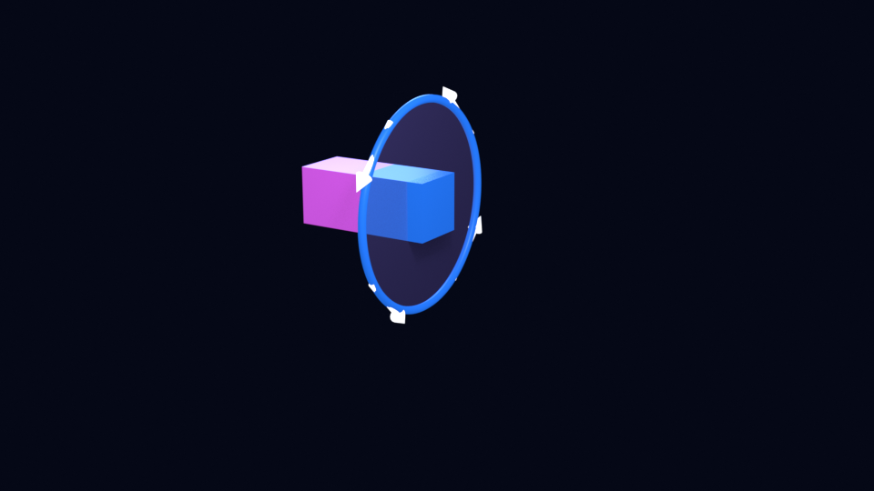

**Como se lê:** Uma barra bicolor passando por um anel: as setinhas brancas crescem e invertem de sentido quando cada polo cruza o plano do anel e somem com o ímã centrado.

**Usar quando**
- lei de Faraday e lei de Lenz
- fluxo magnético por uma espira
- por que a corrente inverte de sentido a cada vez que um polo cruza o plano da espira, e é ~0 com o ímã centrado

**Não usar quando**
- ímã que gira ou espiras que se movem (use barra_trilhos_fem_movimento)
- campos não axiais

**Limitações**
- só o objeto geométrico: fórmulas, valores, gráficos e rótulos (inclusive N/S, +/−, nomes de vetores) são do Manim
- a gramática de cor segue o padrão do arsenal (estilo.json): E = ciano, B = magenta, vetores físicos = branco, normal = azul, construções = violeta
- as linhas do campo B do ímã não são desenhadas (o magenta fica só no polo S)
- N e S são distinguidos só pela cor: os nomes vão por rótulo no Manim
- o módulo da corrente vem do fluxo de dois polos de face finita (suavizados pela largura do ímã), não de um modelo de dipolo pontual: o formato bipolar de dois picos é o de um ímã real atravessando uma bobina; a altura relativa dos picos é qualitativa
- o sentido e a altura dos picos dependem do comprimento e da largura do ímã e do raio da espira (parâmetros)

| Parâmetro | Padrão | Unid. | Descrição |
|---|---|---|---|
| `raio` | 1.6 | u | raio da espira |
| `comprimento_ima` | 1.1 | u | comprimento de cada polo |
| `lado_ima` | 0.9 | u | lado da seção do ímã |
| `posicao` | -1.2 | u | posição do centro do ímã (sem movimento) |
| `setas` | 1 | 0/1 | correntes induzidas |
| `movimento` | 0 | 0/1 | 1 = animação (use animar.py ou a ponte com o Manim) |
| `fase` | 0.0 | 0-1 | fase da animação |

**Integração:** `png_seq_alpha` · custo 0.66 s/frame (1080p, Eevee)

**Animação (cargas em movimento):** `travessia` · loop sem emenda (`fase` de 0 a 1) · 60 quadros sugeridos · custo 0.66 s/frame (1080p, com alpha)

```powershell
& "C:\Program Files\Blender Foundation\Blender 5.2\blender.exe" -b -P experimentos\blender\arsenal\renderizar.py -- ima_espira_inducao --res 1920x1080 --alpha
```

**No Manim:**

```python
from manim_solido3d import Solido3D   # sys.path: experimentos/blender/arsenal
img = Solido3D("ima_espira_inducao").mobject(cena=self, altura=5)   # cargas em loop; img.pausar() / img.retomar()
```

Ficha: `solidos/ima_espira_inducao.json`

### `integral_de_linha` — Integral de linha (trabalho)

**Status:** aprovado · Aparência aprovada pelo usuário em 2026-10-07 (padrão visual de estilo.json); validado em 960x540 e 1080p.

Campo vetorial (setas ciano no plano z = 0) e uma curva C em hélice (azul-claro). Um ponto (branco) percorre a curva com a tangente dr (branca) e o campo F ali (ciano); o trecho já percorrido fica em destaque (branco espesso). Ciclo único: a fase 1 é o fim da curva.

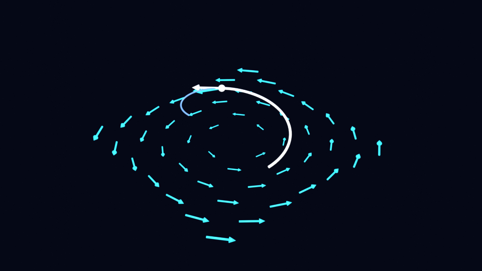

**Como se lê:** Um redemoinho de setas ciano com uma espiral que sobe, um ponto que a percorre e duas setas (dr e F) sobre ele: lê-se como trabalho ∫ F · dr.

**Usar quando**
- integral de linha de um campo vetorial (trabalho)
- o produto escalar F · dr (tangente contra campo)
- campos conservativos e dependência do caminho (compare dois trajetos no Manim)

**Não usar quando**
- integrais de linha de funções escalares
- curvas fechadas (a hélice é aberta)

**Limitações**
- só o objeto geométrico: valores, fórmulas, matrizes, resultados e rótulos são do Manim
- a gramática de cor segue o padrão do arsenal (estilo.json): superfícies = vidro azul, curvas = azul-claro, construções = violeta, vetores = branco, normal e ∇g = azul, campo = ciano
- o campo é plano (z = 0) e é avaliado nas coordenadas (x, y) do ponto: a componente z da curva só afeta a altura
- o comprimento das setas é visual (limitado a 1,4 u)
- o valor da integral e o gráfico F · dr são do Manim

| Parâmetro | Padrão | Unid. | Descrição |
|---|---|---|---|
| `campo` | rotacional | texto | radial, rotacional, sela ou espiral |
| `raio` | 1.5 | u | raio da hélice |
| `passo_z` | 0.3 | u/rad | subida por radiano |
| `extensao` | 2.8 | u | meia largura do campo |
| `n_campo` | 7 | n | setas por lado do campo |
| `arco` | 1.5 | π rad | comprimento do arco em múltiplos de π |
| `movimento` | 0 | 0/1 | 1 = animação (use animar.py ou a ponte com o Manim) |
| `fase` | 0.0 | 0-1 | fase da animação |

**Integração:** `png_seq_alpha` · custo não medido

**Animação (cargas em movimento):** `percurso` · loop sem emenda (`fase` de 0 a 1) · 60 quadros sugeridos · custo 0.41 s/frame (1080p, com alpha)

```powershell
& "C:\Program Files\Blender Foundation\Blender 5.2\blender.exe" -b -P experimentos\blender\arsenal\renderizar.py -- integral_de_linha --res 1920x1080 --alpha
```

**No Manim:**

```python
from manim_solido3d import Solido3D   # sys.path: experimentos/blender/arsenal
img = Solido3D("integral_de_linha").mobject(cena=self, altura=5)   # cargas em loop; img.pausar() / img.retomar()
```

Ficha: `solidos/integral_de_linha.json`

### `integral_dupla_colunas` — Soma de Riemann dupla (colunas)

**Status:** aprovado · Aparência aprovada pelo usuário em 2026-10-07 (padrão visual de estilo.json); validado em 960x540 e 1080p.

Colunas de vidro azul de altura f(centro) sobre uma grade n×n do quadrado [−E, E]², com a superfície z = f em azul-claro por cima e o quadrado da base tracejado em violeta. Com movimento (ciclo único) n cresce de 2 a `n_max` e as colunas passam a preencher o volume.

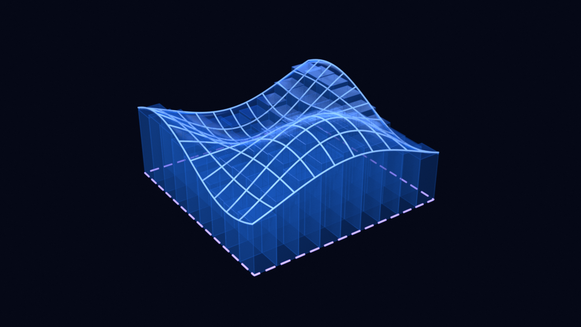

**Como se lê:** Um bloco de colunas que fica cada vez mais fino e se ajusta à superfície: lê-se como 'a soma de Riemann converge ao volume'.

**Usar quando**
- definição da integral dupla como soma de volumes de colunas
- refinar a partição e ver a convergência
- volume sob uma superfície

**Não usar quando**
- regiões não retangulares
- colunas com altura no ponto extremo (aqui é o centro da célula)

**Limitações**
- só o objeto geométrico: fórmulas, valores, gráficos e rótulos (inclusive N/S, +/−, nomes de vetores) são do Manim
- a gramática de cor segue o padrão do arsenal (estilo.json): E = ciano, B = magenta, vetores físicos = branco, normal = azul, construções = violeta
- a altura é f no centro de cada célula (ponto médio), não o máximo nem o mínimo
- n sobe de 1 em 1, de 2 até `n_max` (15 passos por padrão): cada passo é um salto de grade, não uma mudança contínua
- a superfície é fixa: f = 1,2 + 0,7 sen(1,3x) cos(1,1y)

| Parâmetro | Padrão | Unid. | Descrição |
|---|---|---|---|
| `extensao` | 2.0 | u | meia largura do quadrado |
| `n_max` | 16 | n | maior número de divisões por lado |
| `n_unico` | 0 | n | se maior que 0, fixa n (ignora a animação) |
| `movimento` | 0 | 0/1 | 1 = animação (use animar.py ou a ponte com o Manim) |
| `fase` | 0.0 | 0-1 | fase da animação |

**Integração:** `png_seq_alpha` · custo 1.83 s/frame (1080p, Eevee)

**Animação (cargas em movimento):** `refinamento` · loop sem emenda (`fase` de 0 a 1) · 60 quadros sugeridos · custo 1.83 s/frame (1080p, com alpha)

```powershell
& "C:\Program Files\Blender Foundation\Blender 5.2\blender.exe" -b -P experimentos\blender\arsenal\renderizar.py -- integral_dupla_colunas --res 1920x1080 --alpha
```

**No Manim:**

```python
from manim_solido3d import Solido3D   # sys.path: experimentos/blender/arsenal
img = Solido3D("integral_dupla_colunas").mobject(cena=self, altura=5)   # cargas em loop; img.pausar() / img.retomar()
```

Ficha: `solidos/integral_dupla_colunas.json`

### `interferometro_michelson` — Interferômetro de Michelson

**Status:** aprovado · Aparência aprovada pelo usuário em 2026-10-07 (padrão visual de estilo.json); validado em 960x540 e 1080p.

Fonte (esfera branca), divisor de feixe a 45° (vidro), dois espelhos (um deles móvel) e um detector (disco) cujo brilho segue cos²(2π · 2Δ/λ), Δ = diferença dos braços. Os feixes são brancos. Com movimento o espelho 2 vai e volta e o detector pisca (franjas).

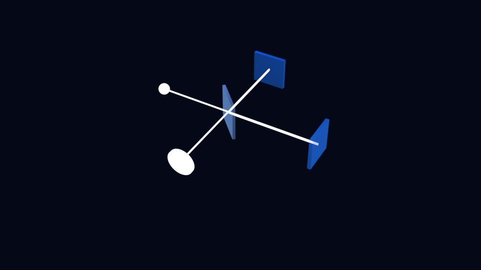

**Como se lê:** Uma cruz de feixes com um espelho em cada ponta e um disco no fim que acende e apaga: lê-se como interferômetro de Michelson.

**Usar quando**
- interferência por divisão de amplitude
- medida de comprimentos de onda e do comprimento de coerência
- experimento de Michelson-Morley (relatividade)

**Não usar quando**
- difração e fendas
- franjas circulares (o detector é um ponto)

**Limitações**
- só o objeto geométrico: valores, fórmulas, rótulos (n, θ, λ, ...) e o padrão de franjas/difração são do Manim
- a gramática de cor segue o padrão do arsenal (estilo.json): raios de luz = branco, campo E = ciano, objetos transparentes = vidro azul-claro, construções = violeta tracejado
- o detector pisca no centro: o padrão de franjas circulares é do Manim
- o amplitude do espelho (0,34) é uma fração visual do comprimento de onda λ = 0,32
- feixes sem espessura física

| Parâmetro | Padrão | Unid. | Descrição |
|---|---|---|---|
| `braco` | 2.4 | u | comprimento dos braços |
| `lambda` | 0.32 | u | comprimento de onda visual |
| `amplitude` | 0.34 | u | curso do espelho 2 com movimento |
| `movimento` | 0 | 0/1 | 1 = animação (use animar.py ou a ponte com o Manim) |
| `fase` | 0.0 | 0-1 | fase da animação |

**Integração:** `png_seq_alpha` · custo não medido

**Animação (cargas em movimento):** `interferencia` · loop sem emenda (`fase` de 0 a 1) · 60 quadros sugeridos · custo 0.57 s/frame (1080p, com alpha)

```powershell
& "C:\Program Files\Blender Foundation\Blender 5.2\blender.exe" -b -P experimentos\blender\arsenal\renderizar.py -- interferometro_michelson --res 1920x1080 --alpha
```

**No Manim:**

```python
from manim_solido3d import Solido3D   # sys.path: experimentos/blender/arsenal
img = Solido3D("interferometro_michelson").mobject(cena=self, altura=5)   # cargas em loop; img.pausar() / img.retomar()
```

Ficha: `solidos/interferometro_michelson.json`

### `lagrange_restricao` — Multiplicadores de Lagrange

**Status:** aprovado · Aparência aprovada pelo usuário em 2026-10-07 (padrão visual de estilo.json); validado em 960x540 e 1080p.

Superfície z = f(x, y) (vidro azul), a restrição g = x² + y² − r² = 0 (círculo violeta tracejado no piso e a curva correspondente sobre a superfície) e um ponto que a percorre, com ∇f (branco) e ∇g (azul) no piso, ligados à superfície por um fio tracejado. Os pontos de extremo restrito (∇f ∥ ∇g) ficam marcados. Com movimento o ponto dá uma volta e as duas setas ficam paralelas nos extremos.

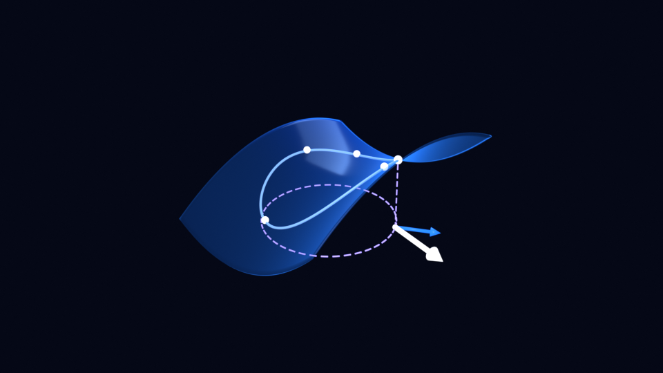

**Como se lê:** Uma superfície ondulada, um círculo tracejado no piso e a curva na superfície, com um ponto que gira e duas setas que ora divergem ora se alinham: lê-se como Lagrange.

**Usar quando**
- extremos com restrição: ∇f = λ ∇g
- a curva de nível tangente à restrição no extremo
- contraste com os pontos críticos livres (pontos_criticos)

**Não usar quando**
- restrições múltiplas
- mais de duas variáveis

**Limitações**
- só o objeto geométrico: valores, fórmulas, matrizes, resultados e rótulos são do Manim
- a gramática de cor segue o padrão do arsenal (estilo.json): superfícies = vidro azul, curvas = azul-claro, construções = violeta, vetores = branco, normal e ∇g = azul, campo = ciano
- f(x, y) = 1 + 0,3x + 0,2y + 0,15(x² − y²) é fixa nesta ficha: troque no Manim só a leitura (os valores são do Manim)
- o comprimento de ∇f é visual (escala `escala_grad`) e o de ∇g é fixo em 1 u
- só a restrição circular

| Parâmetro | Padrão | Unid. | Descrição |
|---|---|---|---|
| `raio` | 1.5 | u | raio da restrição |
| `angulo_graus` | 40.0 | graus | posição do ponto (sem movimento) |
| `extensao` | 2.4 | u | meia largura da superfície |
| `escala_grad` | 2.4 | x | escala visual de ∇f |
| `movimento` | 0 | 0/1 | 1 = animação (use animar.py ou a ponte com o Manim) |
| `fase` | 0.0 | 0-1 | fase da animação |

**Integração:** `png_seq_alpha` · custo não medido

**Animação (cargas em movimento):** `percurso` · loop sem emenda (`fase` de 0 a 1) · 60 quadros sugeridos · custo 0.76 s/frame (1080p, com alpha)

```powershell
& "C:\Program Files\Blender Foundation\Blender 5.2\blender.exe" -b -P experimentos\blender\arsenal\renderizar.py -- lagrange_restricao --res 1920x1080 --alpha
```

**No Manim:**

```python
from manim_solido3d import Solido3D   # sys.path: experimentos/blender/arsenal
img = Solido3D("lagrange_restricao").mobject(cena=self, altura=5)   # cargas em loop; img.pausar() / img.retomar()
```

Ficha: `solidos/lagrange_restricao.json`

### `lente_delgada` — Lente delgada (biconvexa ou biconcava)

**Status:** aprovado · Aparência aprovada pelo usuário em 2026-10-07 (padrão visual de estilo.json); validado em 960x540 e 1080p.

Lente de vidro azul-claro de revolução em torno do eixo óptico X, com faces esféricas de raios `raio1` e `raio2`. `forma` = biconvexa (converge) ou biconcava (diverge). Eixo óptico tracejado neutro e os dois focos (marcas neutras) pela equação dos fabricantes de lentes, 1/f = (n−1)(1/R₁+1/R₂).

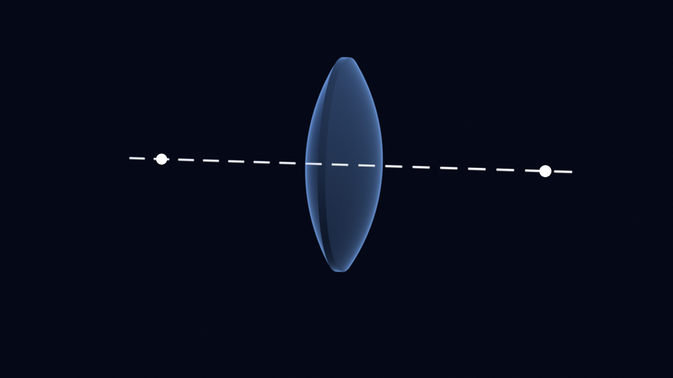

**Como se lê:** Lente de vidro com o eixo tracejado e duas marcas nos focos: lê-se como 'lente delgada com seus focos'. A biconcava tem as marcas nos focos virtuais, do mesmo lado.

**Usar quando**
- lente delgada: foco, formação de imagem, equação de Gauss das lentes
- contraste converge/diverge (biconvexa × biconcava)
- ponto de partida para os raios desenhados no Manim

**Não usar quando**
- lentes espessas ou aberração (esta é delgada, de faces esféricas ideais)
- espelhos (não há espelhos no arsenal)

**Limitações**
- só o objeto: raios, frentes de onda, ângulos e a figura de interferência são do Manim
- vidro translúcido azul-claro (padrão do arsenal): não representa cor, dispersão nem índice de refração
- foco pela equação das lentes delgadas, não por traçado de raios
- o raio de curvatura deve ser maior que o semi-diâmetro
- vista lateral (azimute -78): o perfil da lente aparece de lado, com o eixo óptico na horizontal, como nos esquemas de óptica

| Parâmetro | Padrão | Unid. | Descrição |
|---|---|---|---|
| `forma` | biconvexa | texto | biconvexa ou biconcava |
| `diametro` | 2.4 | u | diâmetro da lente |
| `raio1` | 2.2 | u | raio de curvatura da face da frente |
| `raio2` | 2.2 | u | raio de curvatura da face de trás |
| `espessura_borda` | 0.08 | u | espessura na borda (convexa) ou no centro (côncava) |
| `indice` | 1.5 | n | índice de refração (só para posicionar os focos) |
| `focos` | 1 | 0/1 | 1 = marcas nos focos |
| `eixo` | 1 | 0/1 | 1 = eixo óptico tracejado |

**Integração:** `png_seq_alpha` · custo 0.65 s/frame (1080p, Eevee)

```powershell
& "C:\Program Files\Blender Foundation\Blender 5.2\blender.exe" -b -P experimentos\blender\arsenal\renderizar.py -- lente_delgada --res 1920x1080 --alpha
```

**No Manim:**

```python
from manim_solido3d import Solido3D   # sys.path: experimentos/blender/arsenal
img = Solido3D("lente_delgada").mobject(altura=5)   # estático: um quadro PNG com alpha
```

Ficha: `solidos/lente_delgada.json`

### `linhas_de_campo_3d` — Linhas de campo em 3D

**Status:** aprovado · Aparência aprovada pelo usuário em 2026-10-07 (padrão visual de estilo.json); validado em 960x540 e 1080p.

Linhas de campo (curvas ciano) saindo da carga + e chegando à carga − (`tipo=dipolo`) ou indo ao infinito (`tipo=carga_pontual`), por integração numérica do campo a partir de uma esfera em volta da carga, com setas de sentido. Com movimento contas percorrem as linhas no sentido do campo.

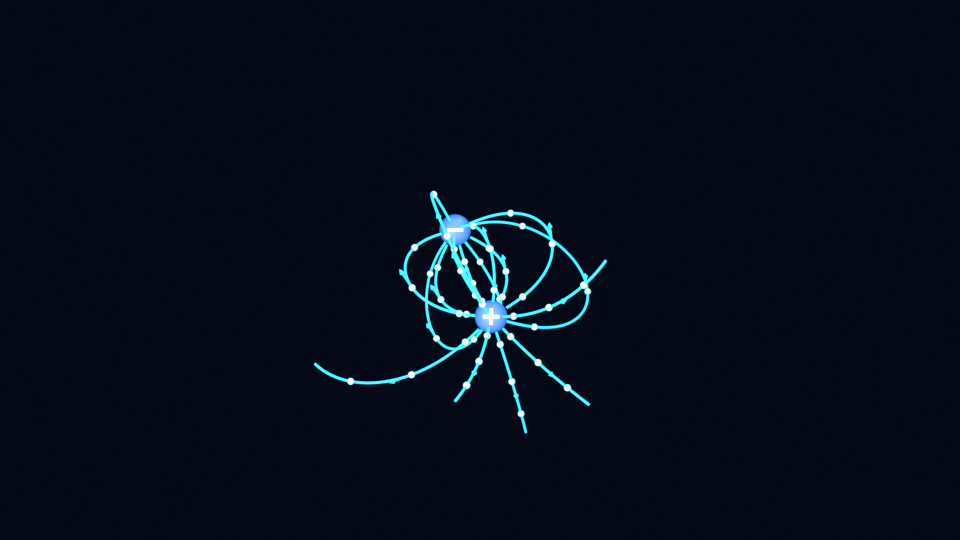

**Como se lê:** Um feixe de curvas ciano que sai de uma esfera + e se fecha na esfera −, com setinhas: lê-se como as linhas do campo de um dipolo.

**Usar quando**
- linhas de campo de uma carga pontual e de um dipolo
- o sentido do campo (de + para −) e a densidade das linhas
- relação entre linhas de campo e o fluxo

**Não usar quando**
- campos de distribuições contínuas
- densidade de linhas proporcional ao módulo (o número é fixo)

**Limitações**
- só o objeto geométrico: valores, fórmulas, gráficos e os nomes dos vetores são do Manim
- a gramática de cor segue o padrão do arsenal (estilo.json): E = ciano, vetores físicos = branco, construções = violeta, sinal da carga esculpido
- as linhas saem de uma distribuição uniforme de direções (Fibonacci), então a densidade perto da carga não é proporcional ao campo
- as linhas que se afastam do dipolo são cortadas a 3,4 u de distância, então parecem abertas
- cada linha é uma curva com muitos pontos: o render é mais pesado com muitas linhas

| Parâmetro | Padrão | Unid. | Descrição |
|---|---|---|---|
| `tipo` | dipolo | texto | dipolo ou carga_pontual |
| `n_linhas` | 16 | n | linhas saindo da carga + |
| `distancia` | 2.0 | u | distância entre as cargas (dipolo) |
| `raio_carga` | 0.3 | u | raio das cargas |
| `setas` | 1 | 0/1 | setas de sentido |
| `n_contas` | 3 | n | contas por linha (com movimento) |
| `movimento` | 0 | 0/1 | 1 = animação (use animar.py ou a ponte com o Manim) |
| `fase` | 0.0 | 0-1 | fase da animação |

**Integração:** `png_seq_alpha` · custo não medido

**Animação (cargas em movimento):** `escoamento` · loop sem emenda (`fase` de 0 a 1) · 60 quadros sugeridos · custo 0.46 s/frame (1080p, com alpha)

```powershell
& "C:\Program Files\Blender Foundation\Blender 5.2\blender.exe" -b -P experimentos\blender\arsenal\renderizar.py -- linhas_de_campo_3d --res 1920x1080 --alpha
```

**No Manim:**

```python
from manim_solido3d import Solido3D   # sys.path: experimentos/blender/arsenal
img = Solido3D("linhas_de_campo_3d").mobject(cena=self, altura=5)   # cargas em loop; img.pausar() / img.retomar()
```

Ficha: `solidos/linhas_de_campo_3d.json`

### `massa_mola` — Sistema massa-mola horizontal (MHS)

**Status:** aprovado · Aparência aprovada pelo usuário em 2026-10-07 (padrão visual de estilo.json); validado em 960x540 e 1080p.

Bloco de vidro azul preso a uma mola helicoidal (fio azul) na parede, sobre um trilho, com três marcas violeta tracejadas: equilíbrio e os extremos ±A. Com `movimento=1` o bloco oscila x = x_eq + A cos(2π fase) e a mola se comprime e se estica.

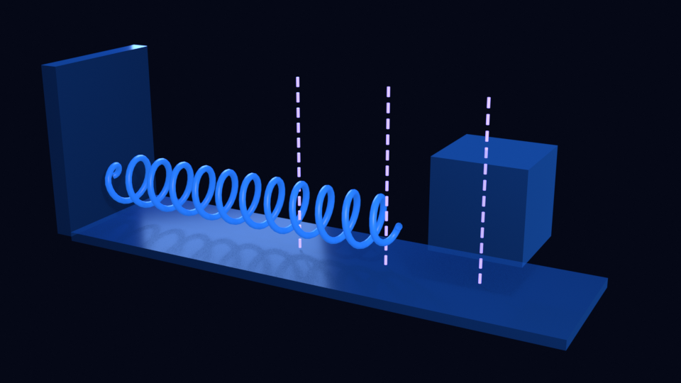

**Como se lê:** Bloco entre duas marcas pontilhadas, com a mola mudando de comprimento: lê-se como 'oscilador harmônico simples'.

**Usar quando**
- MHS: período, amplitude e a posição de equilíbrio
- energia no oscilador: a energia da mola é do Manim
- contraste com o pêndulo e com as oscilações amortecidas (o amortecimento é do Manim)

**Não usar quando**
- movimento vertical com gravidade (a mola é horizontal, sem atrito)
- oscilações amortecidas ou forçadas

**Limitações**
- só o objeto em movimento: velocidades, energia, gráficos x(t) e as fórmulas são do Manim
- movimento didático calculado por fórmula (não é uma simulação física de verdade)
- a mola é uma hélice de passo uniforme com espiras que mudam de espaçamento: a espessura do fio é visual
- sem atrito: a amplitude é constante

| Parâmetro | Padrão | Unid. | Descrição |
|---|---|---|---|
| `amplitude` | 1.0 | u | amplitude A |
| `equilibrio` | 0.5 | u | posição de equilíbrio do centro do bloco |
| `parede` | -3.0 | u | posição da parede |
| `lado` | 0.9 | u | lado do bloco |
| `n_espiras` | 12 | n | espiras da mola |
| `raio_mola` | 0.26 | u | raio da hélice |
| `marcas` | 1 | 0/1 | 1 = marcas do equilíbrio e dos extremos |
| `movimento` | 0 | 0/1 | 1 = animação (use animar.py ou a ponte com o Manim) |
| `fase` | 0.0 | 0-1 | fase da animação |

**Integração:** `png_seq_alpha` · custo 0.87 s/frame (1080p, Eevee)

**Animação (cargas em movimento):** `oscilacao` · loop sem emenda (`fase` de 0 a 1) · 60 quadros sugeridos · custo 0.87 s/frame (1080p, com alpha)

```powershell
& "C:\Program Files\Blender Foundation\Blender 5.2\blender.exe" -b -P experimentos\blender\arsenal\renderizar.py -- massa_mola --res 1920x1080 --alpha
```

**No Manim:**

```python
from manim_solido3d import Solido3D   # sys.path: experimentos/blender/arsenal
img = Solido3D("massa_mola").mobject(cena=self, altura=5)   # cargas em loop; img.pausar() / img.retomar()
```

Ficha: `solidos/massa_mola.json`

### `membrana_modos` — Modos de vibração de uma membrana

**Status:** aprovado · Aparência aprovada pelo usuário em 2026-10-07 (padrão visual de estilo.json); validado em 960x540 e 1080p.

Membrana quadrada fixa nas quatro bordas (moldura branca tracejada) vibrando no modo (m, n): z = A sen(mπx/L) sen(nπy/L) cos(2π fase). As linhas nodais (violeta tracejado) ficam paradas sobre a membrana. Com movimento dá um período completo (loop).

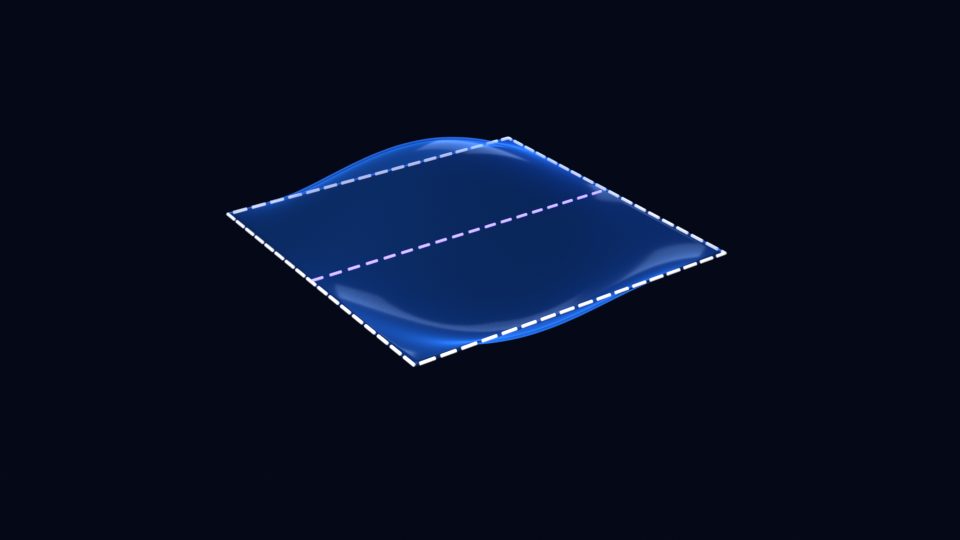

**Como se lê:** Uma folha azul presa numa moldura, ondulando em cristas e vales separados por linhas tracejadas: lê-se como modo normal de uma membrana.

**Usar quando**
- modos normais de uma membrana quadrada e as linhas nodais
- separação de variáveis na equação da onda 2D
- analogia com as ondas estacionárias na corda (onda_corda)

**Não usar quando**
- membranas circulares (modos de Bessel)
- superposição de modos (um modo por vez)

**Limitações**
- só o objeto geométrico: valores, fórmulas, matrizes, resultados e rótulos são do Manim
- a gramática de cor segue o padrão do arsenal (estilo.json): superfícies = vidro azul, curvas = azul-claro, construções = violeta, vetores = branco, normal e ∇g = azul, campo = ciano
- um modo por vez e o tempo é só cosseno (sem amortecimento)
- a amplitude vertical é exagerada para ser vista
- as frequências ω_mn são do Manim

| Parâmetro | Padrão | Unid. | Descrição |
|---|---|---|---|
| `m` | 2 | n | modo em x |
| `n` | 1 | n | modo em y |
| `lado` | 4.0 | u | lado da membrana |
| `amplitude` | 0.7 | u | amplitude |
| `instante` | 0.0 | 0-1 | instante da fase (sem movimento) |
| `nos` | 1 | 0/1 | linhas nodais |
| `movimento` | 0 | 0/1 | 1 = animação (use animar.py ou a ponte com o Manim) |
| `fase` | 0.0 | 0-1 | fase da animação |

**Integração:** `png_seq_alpha` · custo não medido

**Animação (cargas em movimento):** `oscilacao` · loop sem emenda (`fase` de 0 a 1) · 60 quadros sugeridos · custo 0.81 s/frame (1080p, com alpha)

```powershell
& "C:\Program Files\Blender Foundation\Blender 5.2\blender.exe" -b -P experimentos\blender\arsenal\renderizar.py -- membrana_modos --res 1920x1080 --alpha
```

**No Manim:**

```python
from manim_solido3d import Solido3D   # sys.path: experimentos/blender/arsenal
img = Solido3D("membrana_modos").mobject(cena=self, altura=5)   # cargas em loop; img.pausar() / img.retomar()
```

Ficha: `solidos/membrana_modos.json`

### `movimento_circular` — Movimento circular uniforme

**Status:** aprovado · Aparência aprovada pelo usuário em 2026-10-07 (padrão visual de estilo.json); validado em 960x540 e 1080p.

Bola presa por um fio a um poste central, numa mesa de vidro redonda, com a trajetória tracejada (violeta). A velocidade v (tangente) e a aceleração centrípeta a_c (para o centro) são setas brancas. fase 0 a 1 = uma volta.

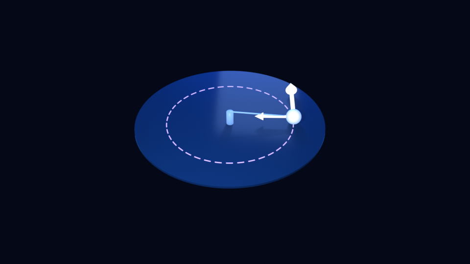

**Como se lê:** Uma bola girando com uma seta tangente e uma seta para o centro: lê-se como v tangente e a_c para o centro.

**Usar quando**
- aceleração centrípeta e a origem geométrica de a_c = v²/R
- tração do fio como força centrípeta
- velocidade angular e período

**Não usar quando**
- movimento circular não uniforme (a velocidade aqui é constante)
- movimento vertical (use trilho_looping)

**Limitações**
- só o objeto geométrico: valores, fórmulas, gráficos e os nomes dos vetores são do Manim
- a gramática de cor segue o padrão do arsenal (estilo.json): vetores físicos = branco, construções = violeta tracejado, corpos = vidro azul
- o módulo de v e de a_c é visual (1,7 e 1,1 u), sem relação numérica entre eles
- a bola gira numa mesa sem atrito: não há gravidade vertical nem fio inclinado

| Parâmetro | Padrão | Unid. | Descrição |
|---|---|---|---|
| `raio` | 1.8 | u | raio da trajetória |
| `vetores` | 1 | 0/1 | v e a_c |
| `trajetoria` | 1 | 0/1 | trajetória tracejada |
| `raio_bola` | 0.22 | u | raio da bola |
| `movimento` | 0 | 0/1 | 1 = animação (use animar.py ou a ponte com o Manim) |
| `fase` | 0.0 | 0-1 | fase da animação |

**Integração:** `png_seq_alpha` · custo não medido

**Animação (cargas em movimento):** `percurso` · loop sem emenda (`fase` de 0 a 1) · 60 quadros sugeridos · custo 0.73 s/frame (1080p, com alpha)

```powershell
& "C:\Program Files\Blender Foundation\Blender 5.2\blender.exe" -b -P experimentos\blender\arsenal\renderizar.py -- movimento_circular --res 1920x1080 --alpha
```

**No Manim:**

```python
from manim_solido3d import Solido3D   # sys.path: experimentos/blender/arsenal
img = Solido3D("movimento_circular").mobject(cena=self, altura=5)   # cargas em loop; img.pausar() / img.retomar()
```

Ficha: `solidos/movimento_circular.json`

### `onda_corda` — Onda numa corda (progressiva e estacionária)

**Status:** aprovado · Aparência aprovada pelo usuário em 2026-10-07 (padrão visual de estilo.json); validado em 960x540 e 1080p.

Corda como curva azul-claro y(x, t) com contas neutras que só sobem e descem. `tipo` = progressiva (y = A sen(kx − 2π fase), anda para +X) ou estacionaria (y = A sen(kx) cos(2π fase), extremos fixos, com nós em violeta e envoltória pontilhada violeta).

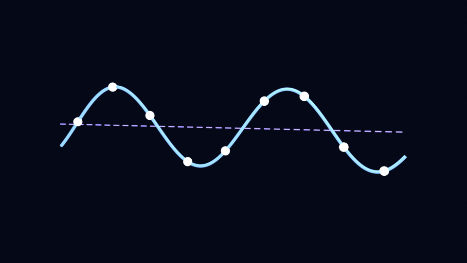

**Como se lê:** Onda com contas brancas que oscilam na vertical enquanto a forma anda (progressiva) ou fica parada com nós (estacionária).

**Usar quando**
- ondas transversais: comprimento de onda, amplitude, frequência e velocidade (v = λf, no Manim)
- partículas oscilando na vertical enquanto a onda se propaga
- ondas estacionárias: nós, ventres e harmônicos (n_ondas = número de comprimentos de onda)

**Não usar quando**
- ondas longitudinais (som): aqui só transversais
- superposição de pulsos ou reflexões: a onda é senoidal e infinita

**Limitações**
- só o objeto em movimento: velocidades, energia, gráficos x(t) e as fórmulas são do Manim
- movimento didático calculado por fórmula (não é uma simulação física de verdade)
- para a estacionária `n_ondas` deve ser inteiro (nós nas pontas)
- a onda progressiva é senoidal e preenche toda a corda: não há pulso nem reflexão

| Parâmetro | Padrão | Unid. | Descrição |
|---|---|---|---|
| `tipo` | progressiva | texto | progressiva ou estacionaria |
| `comprimento` | 8.0 | u | comprimento da corda |
| `n_ondas` | 2 | n | número de comprimentos de onda na corda |
| `amplitude` | 0.9 | u | amplitude A |
| `n_contas` | 9 | n | contas indicadoras |
| `nos` | 1 | 0/1 | 1 = nós marcados (só estacionária) |
| `movimento` | 0 | 0/1 | 1 = animação (use animar.py ou a ponte com o Manim) |
| `fase` | 0.0 | 0-1 | fase da animação |

**Integração:** `png_seq_alpha` · custo 0.39 s/frame (1080p, Eevee)

**Animação (cargas em movimento):** `onda` · loop sem emenda (`fase` de 0 a 1) · 60 quadros sugeridos · custo 0.39 s/frame (1080p, com alpha)

```powershell
& "C:\Program Files\Blender Foundation\Blender 5.2\blender.exe" -b -P experimentos\blender\arsenal\renderizar.py -- onda_corda --res 1920x1080 --alpha
```

**No Manim:**

```python
from manim_solido3d import Solido3D   # sys.path: experimentos/blender/arsenal
img = Solido3D("onda_corda").mobject(cena=self, altura=5)   # cargas em loop; img.pausar() / img.retomar()
```

Ficha: `solidos/onda_corda.json`

### `onda_eletromagnetica` — Onda eletromagnética plana

**Status:** aprovado · Aparência aprovada pelo usuário em 2026-10-07 (padrão visual de estilo.json); validado em 960x540 e 1080p.

Onda plana linearmente polarizada que se propaga em +X: E (setas ciano, ao longo de Z) e B (setas magenta, ao longo de Y), em fase, com as curvas das pontas, a direção de propagação S = E × B (seta branca) e os planos do campo E e do campo B em tom translúcido. fase 0 a 1 = um período.

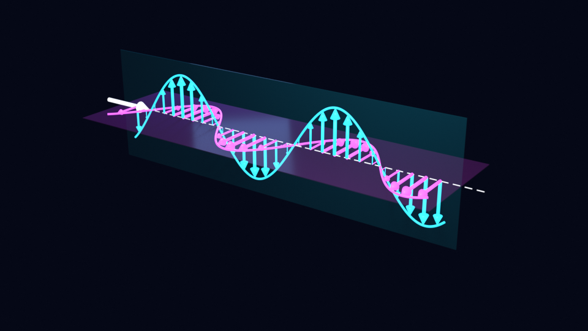

**Como se lê:** Dois campos perpendiculares oscilando juntos ao longo de um eixo: lê-se como 'E e B ⟂ entre si e ⟂ à propagação'.

**Usar quando**
- onda eletromagnética: E ⟂ B ⟂ direção de propagação, em fase
- vetor de Poynting e energia
- polarização linear (o plano do E)

**Não usar quando**
- ondas circularmente polarizadas ou com atrasos de fase
- ondas esféricas ou guiadas

**Limitações**
- só o objeto geométrico: fórmulas, valores, gráficos e rótulos (inclusive N/S, +/−, nomes de vetores) são do Manim
- a gramática de cor segue o padrão do arsenal (estilo.json): E = ciano, B = magenta, vetores físicos = branco, normal = azul, construções = violeta
- a onda é plana e infinita, mostrada num trecho
- as amplitudes de E e B são iguais por conveniência visual (a razão real é c)
- 28 setas por campo: ficam densas em ângulos rasantes

| Parâmetro | Padrão | Unid. | Descrição |
|---|---|---|---|
| `comprimento` | 9.0 | u | extensão mostrada ao longo de X |
| `n_setas` | 28 | n | setas por campo |
| `n_ondas` | 2 | n | comprimentos de onda no trecho (inteiro) |
| `amplitude` | 1.1 | u | amplitude |
| `poynting` | 1 | 0/1 | seta de propagação |
| `planos` | 1 | 0/1 | planos de E e de B |
| `movimento` | 0 | 0/1 | 1 = animação (use animar.py ou a ponte com o Manim) |
| `fase` | 0.0 | 0-1 | fase da animação |

**Integração:** `png_seq_alpha` · custo 0.93 s/frame (1080p, Eevee)

**Animação (cargas em movimento):** `onda` · loop sem emenda (`fase` de 0 a 1) · 60 quadros sugeridos · custo 0.93 s/frame (1080p, com alpha)

```powershell
& "C:\Program Files\Blender Foundation\Blender 5.2\blender.exe" -b -P experimentos\blender\arsenal\renderizar.py -- onda_eletromagnetica --res 1920x1080 --alpha
```

**No Manim:**

```python
from manim_solido3d import Solido3D   # sys.path: experimentos/blender/arsenal
img = Solido3D("onda_eletromagnetica").mobject(cena=self, altura=5)   # cargas em loop; img.pausar() / img.retomar()
```

Ficha: `solidos/onda_eletromagnetica.json`

### `ondas_duas_fontes` — Ondas na superfície com duas fontes (interferência)

**Status:** aprovado · Aparência aprovada pelo usuário em 2026-10-07 (padrão visual de estilo.json); validado em 960x540 e 1080p.

Superfície de vidro azul com malha azul-claro e duas fontes neutras (esferas brancas) que emitem ondas circulares coerentes; a altura é a soma das duas, amortecida até zero na borda. Com `movimento=1` as ondas se propagam (fase = um período).

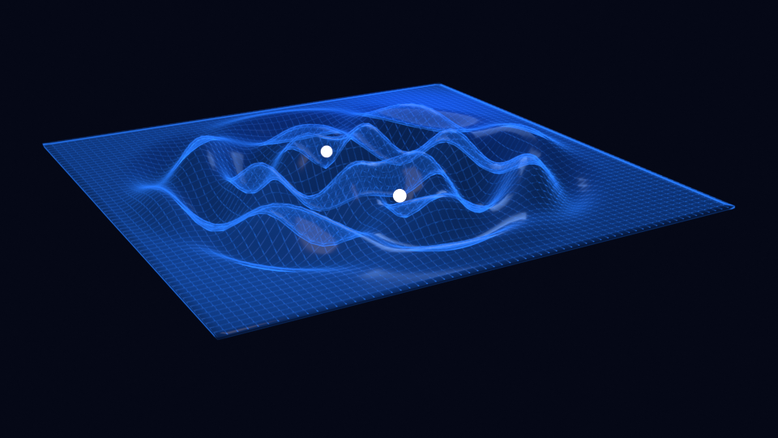

**Como se lê:** Superfície ondulada com dois pontos brancos e um padrão de cristas e vales cruzados: lê-se como 'interferência de duas fontes'.

**Usar quando**
- interferência construtiva e destrutiva de duas fontes coerentes (cuba de ondas)
- experimento de Young em ondas na água, antes da luz
- mostrar a diferença de caminho: as linhas nodais vêm da soma das ondas

**Não usar quando**
- uma única fonte ou ondas estacionárias (use onda_corda)
- fontes incoerentes

**Limitações**
- só o objeto em movimento: velocidades, energia, gráficos x(t) e as fórmulas são do Manim
- movimento didático calculado por fórmula (não é uma simulação física de verdade)
- a amplitude cai como 1/√(1 + 0,5 r) e é zerada na borda (apenas visual)
- malha de 64×64: dá um aspecto de grade fina e as cristas são lisas, mas o detalhe fino some a distância

| Parâmetro | Padrão | Unid. | Descrição |
|---|---|---|---|
| `extensao` | 5.0 | u | meia largura da superfície |
| `separacao` | 3.0 | u | distância entre as fontes |
| `comprimento_onda` | 1.8 | u | comprimento de onda |
| `amplitude` | 0.42 | u | amplitude de cada onda |
| `resolucao` | 64 | n | divisões por lado da malha |
| `movimento` | 0 | 0/1 | 1 = animação (use animar.py ou a ponte com o Manim) |
| `fase` | 0.0 | 0-1 | fase da animação |

**Integração:** `png_seq_alpha` · custo 1.65 s/frame (1080p, Eevee)

**Animação (cargas em movimento):** `onda` · loop sem emenda (`fase` de 0 a 1) · 60 quadros sugeridos · custo 1.65 s/frame (1080p, com alpha)

```powershell
& "C:\Program Files\Blender Foundation\Blender 5.2\blender.exe" -b -P experimentos\blender\arsenal\renderizar.py -- ondas_duas_fontes --res 1920x1080 --alpha
```

**No Manim:**

```python
from manim_solido3d import Solido3D   # sys.path: experimentos/blender/arsenal
img = Solido3D("ondas_duas_fontes").mobject(cena=self, altura=5)   # cargas em loop; img.pausar() / img.retomar()
```

Ficha: `solidos/ondas_duas_fontes.json`

### `orbita_kepleriana` — Órbita kepleriana com setores de áreas iguais

**Status:** aprovado · Aparência aprovada pelo usuário em 2026-10-07 (padrão visual de estilo.json); validado em 960x540 e 1080p.

Órbita elíptica num plano: corpo central branco no foco, corpo orbitante azul-claro, trajetória tracejada violeta, vetor posição e `setores` fatias violeta translúcidas varridas em intervalos de tempo iguais (fração `fracao_setor` do período). Com `movimento=1` o corpo percorre a órbita (fase = um período, velocidade de Kepler).

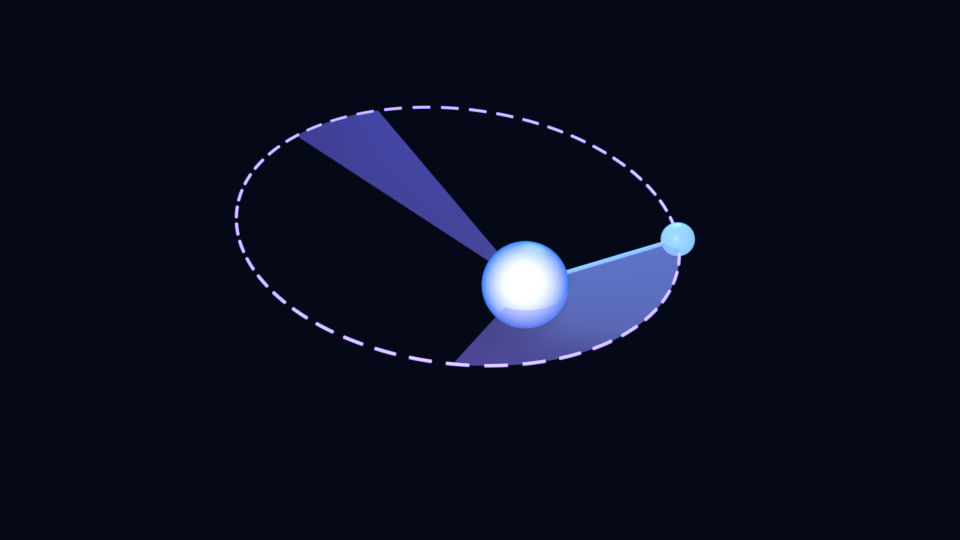

**Como se lê:** Elipse tracejada com o corpo central num foco e fatias violeta: a do periélio é larga e curta, a do afélio fina e longa, mas de mesma área. Lê-se como 'áreas iguais em tempos iguais'.

**Usar quando**
- leis de Kepler: 1ª (elipse com o Sol no foco), 2ª (áreas iguais) e 3ª (T² ∝ a³ no Manim)
- energia orbital e velocidade maior no periélio (a velocidade é do Manim)
- órbitas circulares (excentricidade 0) como caso particular

**Não usar quando**
- problemas de dois corpos com massas comparáveis (o centro é fixo)
- órbitas abertas (parábola, hipérbole): só elipses (0 ≤ e < 1)
- precessão ou perturbações

**Limitações**
- o corpo central é fixo no foco: não há movimento do centro de massa
- o plano da órbita é XY; a câmera padrão olha de cima (elevação 34)
- a equação de Kepler é resolvida por Newton para cada quadro: a velocidade é a real (variável) ao longo do loop
- o setor é uma fatia plana colorida com bordas retas, aproximando o setor elíptico com 24 pontos

| Parâmetro | Padrão | Unid. | Descrição |
|---|---|---|---|
| `semi_eixo` | 2.6 | u | semi-eixo maior a |
| `excentricidade` | 0.55 | 0-1 | excentricidade e (0 = círculo) |
| `setores` | 2 | n | número de setores de áreas iguais (distribuídos em fase) |
| `fracao_setor` | 0.125 | 0-1 | fração do período varrida por cada setor |
| `vetor` | 1 | 0/1 | 1 = vetor posição (do centro ao corpo) |
| `movimento` | 0 | 0/1 | 1 = animação em loop (use animar.py ou a ponte com o Manim) |
| `fase` | 0.0 | 0-1 | fase do loop; fase=1 repete o quadro da fase 0 (loop perfeito) |

**Integração:** `png_seq_alpha` · custo 0.67 s/frame (1080p, Eevee)

**Animação (cargas em movimento):** `orbita` · loop sem emenda (`fase` de 0 a 1) · 60 quadros sugeridos · custo 0.67 s/frame (1080p, com alpha)

```powershell
& "C:\Program Files\Blender Foundation\Blender 5.2\blender.exe" -b -P experimentos\blender\arsenal\renderizar.py -- orbita_kepleriana --res 1920x1080 --alpha
```

**No Manim:**

```python
from manim_solido3d import Solido3D   # sys.path: experimentos/blender/arsenal
img = Solido3D("orbita_kepleriana").mobject(cena=self, altura=5)   # cargas em loop; img.pausar() / img.retomar()
```

Ficha: `solidos/orbita_kepleriana.json`

### `orbital_atomico` — Orbitais atômicos (nuvens de probabilidade)

**Status:** aprovado · Aparência aprovada pelo usuário em 2026-10-07 (padrão visual de estilo.json); validado em 960x540 e 1080p.

Nuvem de pontos da densidade |ψ|² de um orbital do hidrogênio (`orbital`: 1s, 2s, 2p ou 3d), em dois tons de azul conforme o sinal de ψ, com o núcleo branco no centro e o eixo z tracejado. Com movimento a nuvem gira uma volta em torno de z.

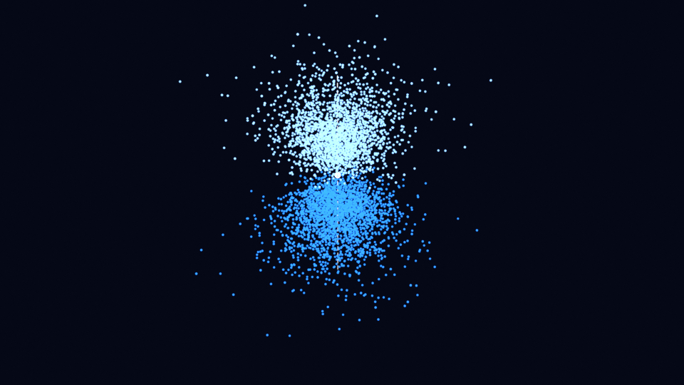

**Como se lê:** Uma nuvem de pontos com forma característica: esfera (s), dois lóbulos de tons opostos (p) ou lóbulos mais um anel (d).

**Usar quando**
- forma dos orbitais s, p e d e o sinal de ψ (fases)
- nodos (o 2s tem uma casca interna e outra externa)
- preparar a leitura de números quânticos (n, l, m)

**Não usar quando**
- energia dos níveis e espectros (são do Manim)
- orbitais com n > 3 ou m ≠ 0 (só estes quatro)

**Limitações**
- só o objeto geométrico: fórmulas, valores, gráficos e rótulos (inclusive N/S, +/−, nomes de vetores) são do Manim
- a gramática de cor segue o padrão do arsenal (estilo.json): E = ciano, B = magenta, vetores físicos = branco, normal = azul, construções = violeta
- amostragem estatística: poucos pontos deixam a forma ruidosa (5000 por padrão); a nuvem muda um pouco com a semente
- unidades atômicas arbitrárias: a escala só serve para caber no quadro
- a cor distingue o sinal de ψ, não o sinal de carga

| Parâmetro | Padrão | Unid. | Descrição |
|---|---|---|---|
| `orbital` | 2p | texto | 1s, 2s, 2p ou 3d |
| `n_pontos` | 5000 | n | pontos da nuvem |
| `escala` | 0 | x | escala (0 = automática por orbital) |
| `tamanho_ponto` | 0.034 | u | raio de cada ponto |
| `semente` | 7 | n | semente do sorteio |
| `eixo` | 1 | 0/1 | eixo z tracejado |
| `movimento` | 0 | 0/1 | 1 = animação (use animar.py ou a ponte com o Manim) |
| `fase` | 0.0 | 0-1 | fase da animação |

**Integração:** `png_seq_alpha` · custo 0.47 s/frame (1080p, Eevee)

**Animação (cargas em movimento):** `rotacao` · loop sem emenda (`fase` de 0 a 1) · 60 quadros sugeridos · custo 0.47 s/frame (1080p, com alpha)

```powershell
& "C:\Program Files\Blender Foundation\Blender 5.2\blender.exe" -b -P experimentos\blender\arsenal\renderizar.py -- orbital_atomico --res 1920x1080 --alpha
```

**No Manim:**

```python
from manim_solido3d import Solido3D   # sys.path: experimentos/blender/arsenal
img = Solido3D("orbital_atomico").mobject(cena=self, altura=5)   # cargas em loop; img.pausar() / img.retomar()
```

Ficha: `solidos/orbital_atomico.json`

### `paisagem_potencial` — Bola numa paisagem de energia potencial

**Status:** aprovado · Aparência aprovada pelo usuário em 2026-10-07 (padrão visual de estilo.json); validado em 960x540 e 1080p.

Pista de vidro azul com o perfil U(x) (`tipo`: poco_simples, poco_duplo ou barreira) e uma reta de energia E tracejada (violeta). Uma bola neutra oscila conservando E (integração numérica) e uma barra violeta mostra K = E − U. Com movimento a bola percorre um período.

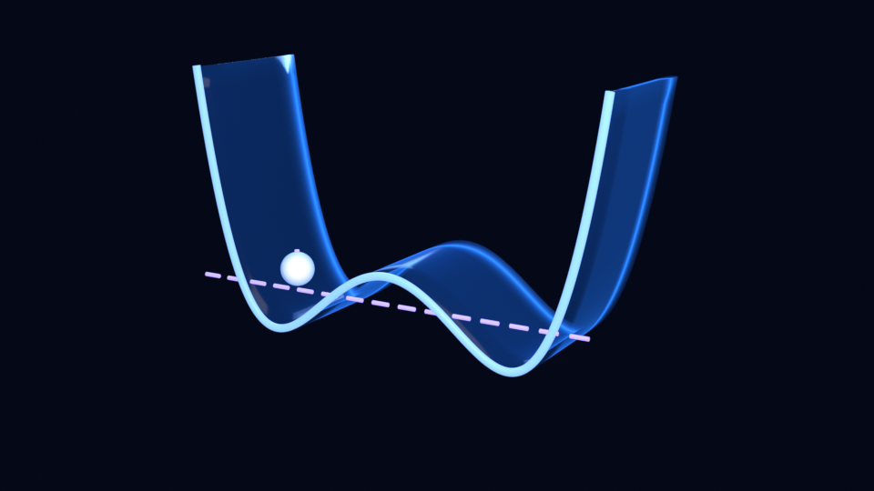

**Como se lê:** Bola descendo e subindo numa pista em forma de poço duplo, com a reta da energia total: lê-se como 'K = E − U, pontos de retorno, regiões permitidas'.

**Usar quando**
- energia potencial e a leitura qualitativa do movimento (pontos de retorno, equilíbrio, estabilidade)
- poços simples e duplos, barreiras de potencial
- escolher o poço de partida no poço duplo (parâmetro `lado`)

**Não usar quando**
- potenciais dependentes do tempo
- movimento sem energia conservada (atrito)

**Limitações**
- só o objeto geométrico: fórmulas, valores, gráficos e rótulos (inclusive N/S, +/−, nomes de vetores) são do Manim
- a gramática de cor segue o padrão do arsenal (estilo.json): E = ciano, B = magenta, vetores físicos = branco, normal = azul, construções = violeta
- a pista é uma curva U(x) com paredes de confinamento em ±`meia_largura`, só para a órbita ser periódica
- a bola desliza sem rolar e sem atrito (é uma partícula de massa 1)
- a energia E é escolhida pelo usuário e deve estar acima do mínimo de U

| Parâmetro | Padrão | Unid. | Descrição |
|---|---|---|---|
| `tipo` | poco_duplo | texto | poco_simples, poco_duplo ou barreira |
| `energia` | 0.35 | u | energia total E |
| `lado` | 0 | -1/0/1 | poço de partida do poço duplo com E abaixo da barreira: −1 esquerda, 1 direita |
| `meia_largura` | 2.6 | u | meia largura da pista |
| `largura` | 1.2 | u | largura da pista (eixo y) |
| `raio_bola` | 0.14 | u | raio da bola |
| `movimento` | 0 | 0/1 | 1 = animação (use animar.py ou a ponte com o Manim) |
| `fase` | 0.0 | 0-1 | fase da animação |

**Integração:** `png_seq_alpha` · custo 0.75 s/frame (1080p, Eevee)

**Animação (cargas em movimento):** `oscilacao` · loop sem emenda (`fase` de 0 a 1) · 60 quadros sugeridos · custo 0.75 s/frame (1080p, com alpha)

```powershell
& "C:\Program Files\Blender Foundation\Blender 5.2\blender.exe" -b -P experimentos\blender\arsenal\renderizar.py -- paisagem_potencial --res 1920x1080 --alpha
```

**No Manim:**

```python
from manim_solido3d import Solido3D   # sys.path: experimentos/blender/arsenal
img = Solido3D("paisagem_potencial").mobject(cena=self, altura=5)   # cargas em loop; img.pausar() / img.retomar()
```

Ficha: `solidos/paisagem_potencial.json`

### `particula_em_campo_magnetico` — Partícula carregada em campo magnético uniforme

**Status:** aprovado · Aparência aprovada pelo usuário em 2026-10-07 (padrão visual de estilo.json); validado em 960x540 e 1080p.

Hélice de uma carga num B uniforme (+Z, setas magenta em duas camadas). A carga tem o sinal esculpido (+ ou −), a trajetória é tracejada violeta, a velocidade v e a força F = q v × B (apontando para o eixo) são brancas. O sentido da hélice inverte com o sinal da carga. Ciclo único: a partícula percorre `voltas` voltas.

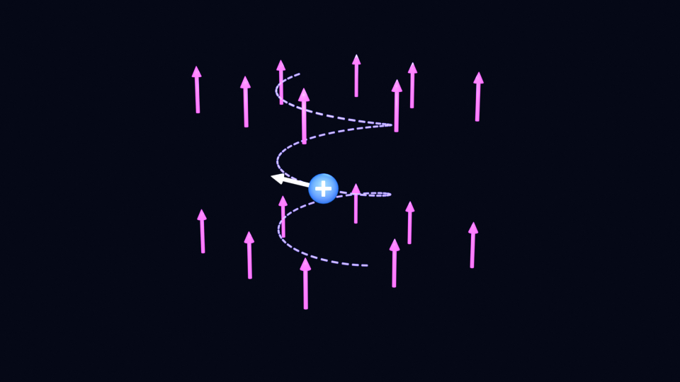

**Como se lê:** Uma esfera com + ou − girando numa hélice no meio de setas magenta: lê-se como 'movimento circular + deriva ao longo de B'.

**Usar quando**
- força de Lorentz, raio ciclotrônico e passo da hélice
- comparar cargas positivas e negativas (sentido oposto)
- movimento helicoidal com v∥ ≠ 0

**Não usar quando**
- campo elétrico junto (E × B): só B
- campos não uniformes (garrafa magnética)

**Limitações**
- só o objeto geométrico: fórmulas, valores, gráficos e rótulos (inclusive N/S, +/−, nomes de vetores) são do Manim
- a gramática de cor segue o padrão do arsenal (estilo.json): E = ciano, B = magenta, vetores físicos = branco, normal = azul, construções = violeta
- a hélice é uma curva prescrita, não calculada: R e passo são parâmetros livres
- a força é desenhada com módulo fixo (não proporcional a q v B)
- o sinal esculpido só aparece de frente: com câmeras muito rasantes ele pode ficar de lado

| Parâmetro | Padrão | Unid. | Descrição |
|---|---|---|---|
| `sinal` | 1 | ±1 | sinal da carga (1 ou −1) |
| `raio_giro` | 1.2 | u | raio da hélice |
| `passo` | 1.5 | u | avanço por volta |
| `voltas` | 2.5 | n | voltas da hélice |
| `campo` | 1 | 0/1 | setas de B |
| `trajetoria` | 1 | 0/1 | hélice tracejada |
| `movimento` | 0 | 0/1 | 1 = animação (use animar.py ou a ponte com o Manim) |
| `fase` | 0.0 | 0-1 | fase da animação |

**Integração:** `png_seq_alpha` · custo 0.42 s/frame (1080p, Eevee)

**Animação (cargas em movimento):** `helice` · loop sem emenda (`fase` de 0 a 1) · 60 quadros sugeridos · custo 0.42 s/frame (1080p, com alpha)

```powershell
& "C:\Program Files\Blender Foundation\Blender 5.2\blender.exe" -b -P experimentos\blender\arsenal\renderizar.py -- particula_em_campo_magnetico --res 1920x1080 --alpha
```

**No Manim:**

```python
from manim_solido3d import Solido3D   # sys.path: experimentos/blender/arsenal
img = Solido3D("particula_em_campo_magnetico").mobject(cena=self, altura=5)   # cargas em loop; img.pausar() / img.retomar()
```

Ficha: `solidos/particula_em_campo_magnetico.json`

### `pendulo_simples` — Pêndulo simples (pequenas oscilações)

**Status:** aprovado · Aparência aprovada pelo usuário em 2026-10-07 (padrão visual de estilo.json); validado em 960x540 e 1080p.

Pêndulo no plano XZ: suporte de vidro, fio azul-claro, massa esférica com degradê, arco tracejado violeta entre ±θ0 e a vertical de referência. Com `movimento=1` θ(t) = θ0 cos(2π fase) (aproximação de pequenas oscilações, MHS).

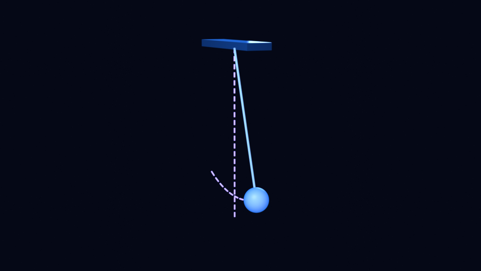

**Como se lê:** Massa balançando num fio, com o arco pontilhado do percurso e a vertical: lê-se como 'pêndulo'.

**Usar quando**
- pêndulo simples e a aproximação de pequenos ângulos (T = 2π√(L/g))
- contraste com massa-mola (também MHS)
- energia: troca entre potencial e cinética (as setas e gráficos são do Manim)

**Não usar quando**
- grandes amplitudes (o movimento real não é senoidal)
- pêndulo físico ou duplo

**Limitações**
- só o objeto em movimento: velocidades, energia, gráficos x(t) e as fórmulas são do Manim
- movimento didático calculado por fórmula (não é uma simulação física de verdade)
- θ(t) é cosseno puro (MHS): para amplitudes grandes (>30°) a diferença do pêndulo real é visível
- fio inextensível e sem atrito

| Parâmetro | Padrão | Unid. | Descrição |
|---|---|---|---|
| `comprimento` | 3.0 | u | comprimento L do fio |
| `amplitude_graus` | 24.0 | graus | amplitude angular θ0 |
| `raio_corpo` | 0.24 | u | raio da massa |
| `arco` | 1 | 0/1 | 1 = arco e vertical de referência |
| `movimento` | 0 | 0/1 | 1 = animação (use animar.py ou a ponte com o Manim) |
| `fase` | 0.0 | 0-1 | fase da animação |

**Integração:** `png_seq_alpha` · custo 0.53 s/frame (1080p, Eevee)

**Animação (cargas em movimento):** `oscilacao` · loop sem emenda (`fase` de 0 a 1) · 60 quadros sugeridos · custo 0.53 s/frame (1080p, com alpha)

```powershell
& "C:\Program Files\Blender Foundation\Blender 5.2\blender.exe" -b -P experimentos\blender\arsenal\renderizar.py -- pendulo_simples --res 1920x1080 --alpha
```

**No Manim:**

```python
from manim_solido3d import Solido3D   # sys.path: experimentos/blender/arsenal
img = Solido3D("pendulo_simples").mobject(cena=self, altura=5)   # cargas em loop; img.pausar() / img.retomar()
```

Ficha: `solidos/pendulo_simples.json`

### `placa_infinita_carregada` — Placa infinita carregada (plano com cargas na superfície)

**Status:** aprovado · Aparência aprovada pelo usuário em 2026-10-07 (padrão visual de estilo.json); validado em 960x540 e 1080p.

Folha de vidro azulado muito fina (normal ao longo de X) com grade sutil e cargas pontuais distribuídas sobre o plano. A opacidade da folha, a grade e o tamanho das cargas se dissolvem com a distância ao centro, para sugerir que o plano continua além do quadro. Fisicamente finita (14 x 6,5 por padrão).

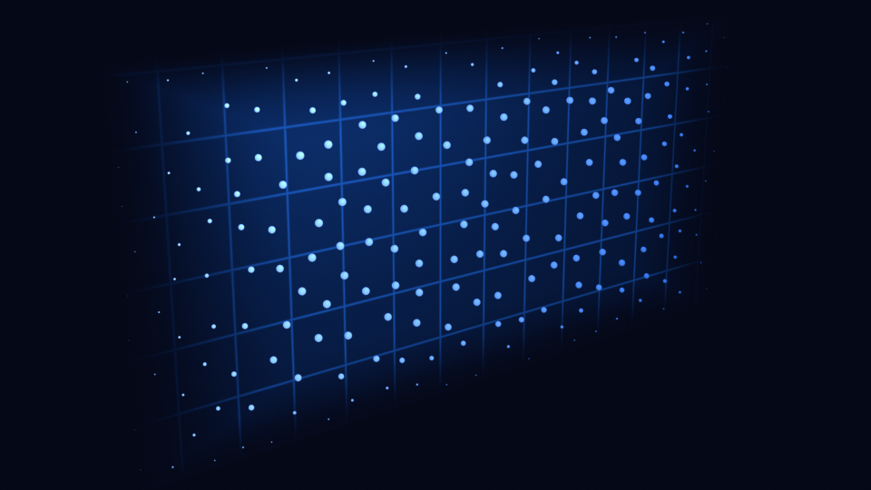

**Como se lê:** Plano azul translúcido de grade discreta, cheio de pontos e sumindo nas bordas. Cargas próximas da câmera são azul-claro (#7FB2FF); as distantes, azul (#267BFF). Lê-se como 'plano contínuo de carga, sem limites visíveis'.

**Usar quando**
- simetria planar: plano infinito com densidade superficial de carga uniforme (isolante fino ou plano de carga)
- mostrar que o plano é ilimitado e que o campo não depende da distância (par com os sólidos de simetria cilíndrica e esférica)
- contraste com as simetrias cilíndrica e esférica na mesma unidade (casca, maciço, plano)
- corrente superficial: cargas deslizando sobre o plano na direção Y (cargas_moveis=1)

**Não usar quando**
- o vídeo precisa mostrar as bordas ou efeitos de borda: a placa aqui se dissolve de propósito
- placa condutora de espessura finita (carga em duas faces) ou capacitor de duas placas: este sólido é um único plano
- placa espessa isolante com densidade volumétrica de carga: aqui as cargas estão só no plano

**Limitações**
- o plano é fisicamente finito e o 'infinito' é só visual (dissolve nas bordas); se o enquadramento incluir as bordas, o efeito se perde
- cargas só sobre o plano x=0; a normal do plano é fixa em X
- a visualização depende do ângulo: muito de frente (olhando ao longo de X) a placa vira um retângulo chapado; o padrão usa azimute -40
- não desenha campo elétrico: o ciano é reservado ao campo e fica para a animação 2D/Manim
- o movimento não codifica a corrente: a convenção (corrente convencional ou elétrons, que vão ao contrário) e o sinal vão por seta e rótulo no Manim; o movimento é didático, não em escala
- as cargas somem por escala nas bordas (como o fade da placa); a direção do deslizamento é fixa em Y

| Parâmetro | Padrão | Unid. | Descrição |
|---|---|---|---|
| `largura` | 14.0 | u | largura da folha (eixo Y) |
| `altura` | 6.5 | u | altura da folha (eixo Z) |
| `espessura` | 0.05 | u | espessura da folha (eixo X) |
| `n_cargas` | 220 | n | número de cargas desejado (pode sair menos se a distância mínima não couber) |
| `dist_min` | 0.5 | u | distância mínima entre cargas |
| `tamanho_carga` | 0.06 | u | raio de cada esfera de carga |
| `semente` | 7 | n | semente do sorteio (mesma semente = mesma distribuição) |
| `grade` | 1 | 0/1 | 1 = grade sutil sobre o plano; 0 = só o vidro |
| `fade_inicio` | 0.5 | 0-1 | fração da meia largura/altura onde a folha começa a se dissolver |
| `cargas_moveis` | 0 | 0/1 | 1 = cargas em movimento (animação em loop); use com animar.py ou a ponte com o Manim |
| `fase` | 0.0 | 0-1 | fase do movimento; fase=1 repete o quadro da fase 0 (loop perfeito) |
| `periodos` | 4 | n | o padrão de cargas se repete esta vez ao longo da largura; o loop desloca 1 período |

**Integração:** `png_seq_alpha` · custo 1.31 s/frame (1080p, Eevee)

**Animação (cargas em movimento):** `deslizamento` · loop sem emenda (`fase` de 0 a 1) · 60 quadros sugeridos · custo 1.3 s/frame (1080p, com alpha)

```powershell
& "C:\Program Files\Blender Foundation\Blender 5.2\blender.exe" -b -P experimentos\blender\arsenal\renderizar.py -- placa_infinita_carregada --res 1920x1080 --alpha
```

**No Manim:**

```python
from manim_solido3d import Solido3D   # sys.path: experimentos/blender/arsenal
img = Solido3D("placa_infinita_carregada").mobject(cena=self, altura=5)   # cargas em loop; img.pausar() / img.retomar()
```

Ficha: `solidos/placa_infinita_carregada.json`

### `plano_e_reta_r3` — Plano e reta em R³

**Status:** aprovado · Aparência aprovada pelo usuário em 2026-10-07 (padrão visual de estilo.json); validado em 960x540 e 1080p.

Plano n · x = 0 (violeta translúcido, arestas tracejadas) com a normal n (azul), uma reta (azul-claro) que o atravessa num ponto I (branco) e um ponto P a uma distância d do plano, com o pé Q da perpendicular e o segmento PQ (violeta tracejado). Com movimento P sobe e desce ao longo de n̂ e a distância varia.

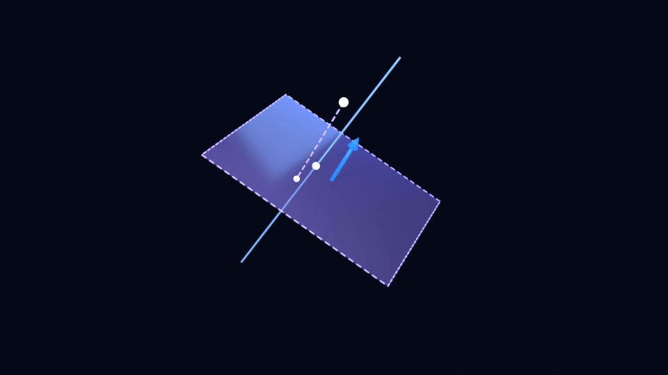

**Como se lê:** Uma folha inclinada com uma seta azul perpendicular, uma reta que a fura e um ponto com um fio tracejado até ela: lê-se como plano, normal, interseção e distância ponto-plano.

**Usar quando**
- equação do plano (n · (x − x0) = 0) e a normal
- interseção de reta e plano
- distância de ponto a plano |n · (P − x0)| / |n|

**Não usar quando**
- planos tangentes a superfícies (use plano_tangente)
- duas retas reversas ou dois planos

**Limitações**
- só o objeto geométrico: valores, fórmulas, matrizes, resultados e rótulos são do Manim
- a gramática de cor segue o padrão do arsenal (estilo.json): superfícies = vidro azul, curvas = azul-claro, construções = violeta, vetores = branco, normal e ∇g = azul, campo = ciano
- o plano passa pela origem: para um plano deslocado, desloque a cena no Manim
- o ponto P e a reta têm valores fixos de exemplo: as coordenadas e as fórmulas são do Manim
- a normal está desenhada com comprimento fixo (1,3 u)

| Parâmetro | Padrão | Unid. | Descrição |
|---|---|---|---|
| `nx` | 1.0 | n | normal, x |
| `ny` | 0.6 | n | normal, y |
| `nz` | 2.0 | n | normal, z |
| `distancia` | 1.4 | u | altura de P sobre o plano |
| `dx` | 0.55 | n | direção da reta, x |
| `dy` | 0.45 | n | direção da reta, y |
| `dz` | 1.0 | n | direção da reta, z |
| `tamanho` | 2.4 | u | meia-aresta do plano desenhado |
| `movimento` | 0 | 0/1 | 1 = animação (use animar.py ou a ponte com o Manim) |
| `fase` | 0.0 | 0-1 | fase da animação |

**Integração:** `png_seq_alpha` · custo não medido

**Animação (cargas em movimento):** `distancia` · loop sem emenda (`fase` de 0 a 1) · 60 quadros sugeridos · custo 0.81 s/frame (1080p, com alpha)

```powershell
& "C:\Program Files\Blender Foundation\Blender 5.2\blender.exe" -b -P experimentos\blender\arsenal\renderizar.py -- plano_e_reta_r3 --res 1920x1080 --alpha
```

**No Manim:**

```python
from manim_solido3d import Solido3D   # sys.path: experimentos/blender/arsenal
img = Solido3D("plano_e_reta_r3").mobject(cena=self, altura=5)   # cargas em loop; img.pausar() / img.retomar()
```

Ficha: `solidos/plano_e_reta_r3.json`

### `plano_inclinado` — Plano inclinado com forças

**Status:** aprovado · Aparência aprovada pelo usuário em 2026-10-07 (padrão visual de estilo.json); validado em 960x540 e 1080p.

Rampa de vidro (cunha) com um bloco de vidro: peso, normal e atrito (setas brancas) e as componentes do peso (violeta tracejado), com o arco do ângulo θ. Se tan θ > μ o bloco desce com aceleração constante (ciclo único); senão fica parado e o atrito é estático (f = P sen θ).

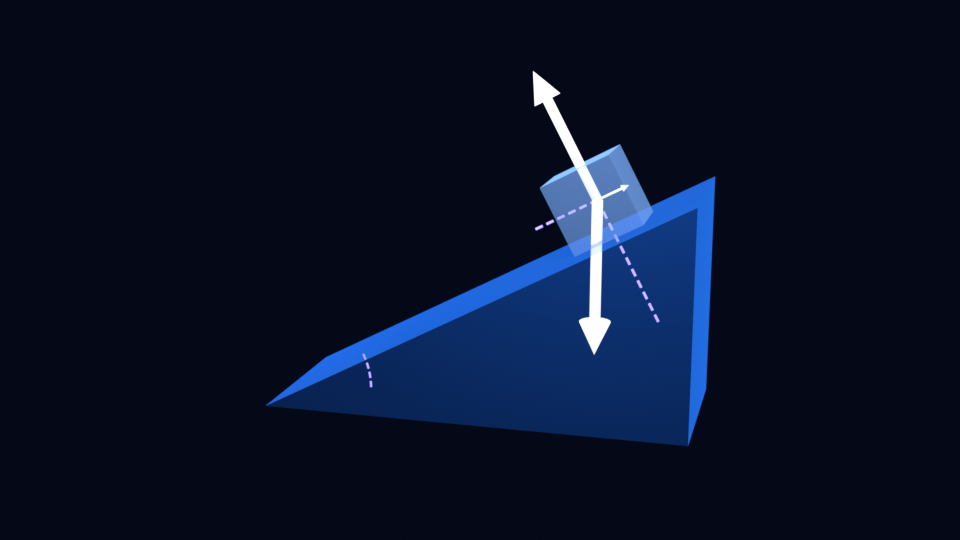

**Como se lê:** Um bloco numa rampa com três setas brancas e duas linhas tracejadas: lê-se como a decomposição do peso em P∥ e P⊥.

**Usar quando**
- diagrama de corpo livre num plano inclinado e a decomposição do peso
- atrito estático × cinético e o limite de escorregamento (tan θ = μ)
- preparar a conta da aceleração a = g (sen θ − μ cos θ) no Manim

**Não usar quando**
- polias e sistemas conectados (só um bloco)
- rampas curvas

**Limitações**
- só o objeto geométrico: valores, fórmulas, gráficos e os nomes dos vetores são do Manim
- a gramática de cor segue o padrão do arsenal (estilo.json): vetores físicos = branco, construções = violeta tracejado, corpos = vidro azul
- o bloco desliza sem rotação e as setas têm módulo visual (peso fixo em 1,7 u), proporcional entre si mas sem escala numérica
- a rampa é uma cunha (triângulo retângulo) fixa: só θ e o comprimento mudam

| Parâmetro | Padrão | Unid. | Descrição |
|---|---|---|---|
| `angulo_graus` | 28.0 | graus | ângulo θ da rampa |
| `comprimento` | 5.2 | u | comprimento da rampa |
| `mu` | 0.25 | 0-1 | coeficiente de atrito cinético |
| `lado` | 0.8 | u | lado do bloco |
| `forcas` | 1 | 0/1 | forças e componentes |
| `posicao` | 0.6 | 0-1 | posição do bloco na rampa (sem movimento) |
| `movimento` | 0 | 0/1 | 1 = animação (use animar.py ou a ponte com o Manim) |
| `fase` | 0.0 | 0-1 | fase da animação |

**Integração:** `png_seq_alpha` · custo não medido

**Animação (cargas em movimento):** `deslizamento` · loop sem emenda (`fase` de 0 a 1) · 60 quadros sugeridos · custo 0.73 s/frame (1080p, com alpha)

```powershell
& "C:\Program Files\Blender Foundation\Blender 5.2\blender.exe" -b -P experimentos\blender\arsenal\renderizar.py -- plano_inclinado --res 1920x1080 --alpha
```

**No Manim:**

```python
from manim_solido3d import Solido3D   # sys.path: experimentos/blender/arsenal
img = Solido3D("plano_inclinado").mobject(cena=self, altura=5)   # cargas em loop; img.pausar() / img.retomar()
```

Ficha: `solidos/plano_inclinado.json`

### `plano_tangente` — Plano tangente a uma superfície

**Status:** aprovado · Aparência aprovada pelo usuário em 2026-10-07 (padrão visual de estilo.json); validado em 960x540 e 1080p.

Superfície de vidro azul (`tipo`: onda, sela ou esfera) com curvas coordenadas, o ponto P (branco), o plano tangente em P (violeta translúcido, arestas tracejadas) e a normal n̂ (azul). Com movimento P percorre uma pequena volta e o plano acompanha.

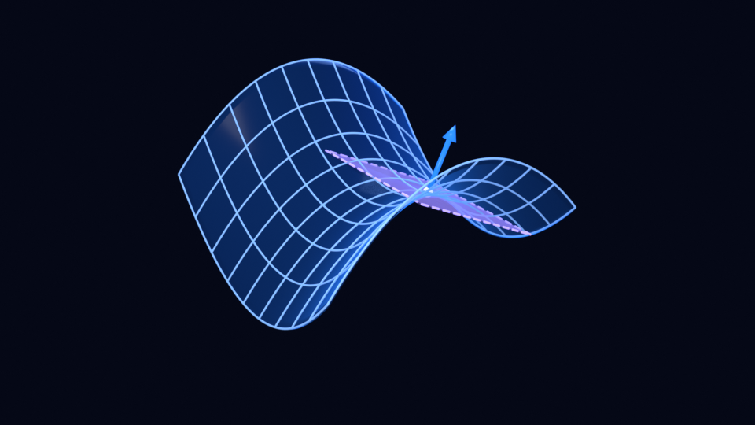

**Como se lê:** Superfície com um quadrilátero violeta encostado e uma seta azul perpendicular: lê-se como 'plano tangente e normal'.

**Usar quando**
- plano tangente e linearização de f(x, y)
- derivadas parciais como inclinações no plano tangente
- plano que corta a superfície na sela

**Não usar quando**
- tangente a curvas (use as curvas do Manim)
- superfícies fechadas na esfera inteira: o domínio é cortado perto dos polos

**Limitações**
- só o objeto geométrico: fórmulas, valores, gráficos e rótulos (inclusive N/S, +/−, nomes de vetores) são do Manim
- a gramática de cor segue o padrão do arsenal (estilo.json): E = ciano, B = magenta, vetores físicos = branco, normal = azul, construções = violeta
- o plano tangente é um quadrado de lado `tamanho` e não mostra o erro da aproximação

| Parâmetro | Padrão | Unid. | Descrição |
|---|---|---|---|
| `tipo` | sela | texto | onda, sela ou esfera |
| `u0` | 0.4 | 0-1 | posição de u no domínio |
| `v0` | 0.55 | 0-1 | posição de v no domínio |
| `tamanho` | 1.1 | u | meia largura do plano tangente |
| `linhas` | 1 | 0/1 | curvas coordenadas |
| `movimento` | 0 | 0/1 | 1 = animação (use animar.py ou a ponte com o Manim) |
| `fase` | 0.0 | 0-1 | fase da animação |

**Integração:** `png_seq_alpha` · custo 0.97 s/frame (1080p, Eevee)

**Animação (cargas em movimento):** `percurso` · loop sem emenda (`fase` de 0 a 1) · 60 quadros sugeridos · custo 0.97 s/frame (1080p, com alpha)

```powershell
& "C:\Program Files\Blender Foundation\Blender 5.2\blender.exe" -b -P experimentos\blender\arsenal\renderizar.py -- plano_tangente --res 1920x1080 --alpha
```

**No Manim:**

```python
from manim_solido3d import Solido3D   # sys.path: experimentos/blender/arsenal
img = Solido3D("plano_tangente").mobject(cena=self, altura=5)   # cargas em loop; img.pausar() / img.retomar()
```

Ficha: `solidos/plano_tangente.json`

### `poco_gravitacional` — Poço gravitacional (potencial)

**Status:** aprovado · Aparência aprovada pelo usuário em 2026-10-07 (padrão visual de estilo.json); validado em 960x540 e 1080p.

Superfície de vidro azulado de revolução z = −P·s/√(r²+s²) com anéis e raios em azul-claro e uma bola azul-claro em órbita circular sobre ela. Representa o poço de potencial gravitacional (o mais fundo no centro).

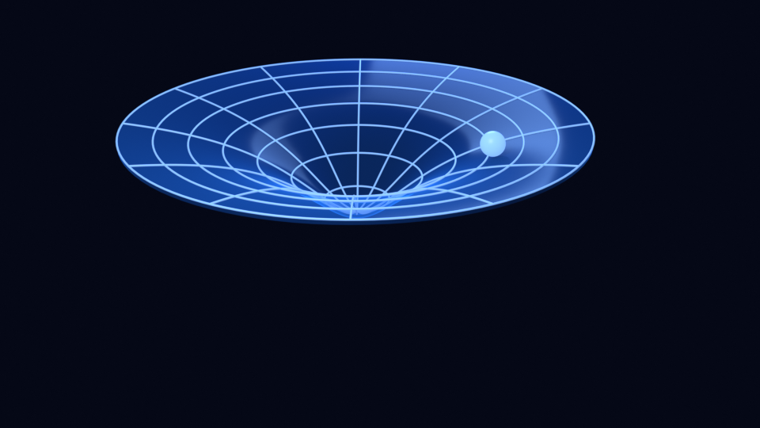

**Como se lê:** Funil de vidro com grade e uma bola circulando: lê-se como 'potencial gravitacional: a bola orbita no poço'.

**Usar quando**
- potencial gravitacional e energia potencial negativa (o poço é mais profundo perto do corpo)
- velocidade de escape: sair do poço (a escala de energia é do Manim)
- satélites e órbitas circulares como bolas no poço (analogia)

**Não usar quando**
- curvatura do espaço-tempo da relatividade geral (é só uma analogia de potencial)
- órbitas elípticas (use orbita_kepleriana)

**Limitações**
- é uma analogia visual: a bola gira sobre uma superfície, mas a força real é central no plano, não gravidade vertical sobre o funil
- a profundidade do poço é um parâmetro visual, não uma escala de energia
- o poço é suavizado pelo raio do núcleo `raio_nucleo` (evita a singularidade em r = 0)
- só a órbita circular é animada

| Parâmetro | Padrão | Unid. | Descrição |
|---|---|---|---|
| `raio_max` | 3.2 | u | raio da borda do poço |
| `profundidade` | 1.8 | u | profundidade no centro |
| `raio_nucleo` | 0.9 | u | raio de suavização do centro |
| `bola` | 1 | 0/1 | 1 = bola orbitando sobre a superfície |
| `raio_bola` | 1.9 | u | raio da órbita circular da bola |
| `movimento` | 0 | 0/1 | 1 = animação em loop (use animar.py ou a ponte com o Manim) |
| `fase` | 0.0 | 0-1 | fase do loop; fase=1 repete o quadro da fase 0 (loop perfeito) |

**Integração:** `png_seq_alpha` · custo 1.15 s/frame (1080p, Eevee)

**Animação (cargas em movimento):** `orbita` · loop sem emenda (`fase` de 0 a 1) · 60 quadros sugeridos · custo 1.15 s/frame (1080p, com alpha)

```powershell
& "C:\Program Files\Blender Foundation\Blender 5.2\blender.exe" -b -P experimentos\blender\arsenal\renderizar.py -- poco_gravitacional --res 1920x1080 --alpha
```

**No Manim:**

```python
from manim_solido3d import Solido3D   # sys.path: experimentos/blender/arsenal
img = Solido3D("poco_gravitacional").mobject(cena=self, altura=5)   # cargas em loop; img.pausar() / img.retomar()
```

Ficha: `solidos/poco_gravitacional.json`

### `polarizador_malus` — Polarizadores e lei de Malus

**Status:** aprovado · Aparência aprovada pelo usuário em 2026-10-07 (padrão visual de estilo.json); validado em 960x540 e 1080p.

Dois discos de vidro com o eixo de transmissão em linha branca. Antes do primeiro, setas ciano em várias direções (luz não polarizada); depois do primeiro, uma seta vertical (E0); depois do analisador (que gira de θ), E0 |cos θ| ao longo do eixo dele. A intensidade é ∝ cos²θ (Malus). Com movimento θ dá uma volta (loop).

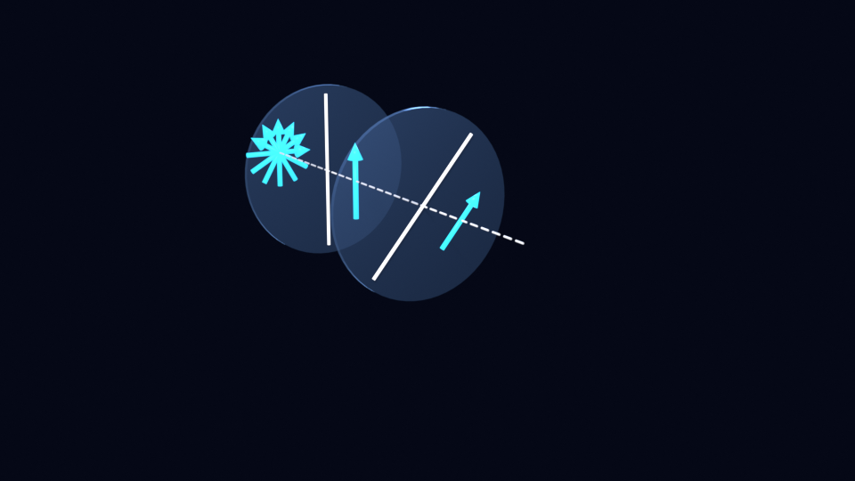

**Como se lê:** Setas ciano em várias direções entrando num disco, uma seta vertical saindo, e depois uma segunda que diminui conforme o segundo disco gira.

**Usar quando**
- luz polarizada e a lei de Malus I = I0 cos²θ
- polarização por absorção e por reflexão (ângulo de Brewster)
- campo E ao longo do eixo de transmissão

**Não usar quando**
- polarização circular ou elíptica
- luz com fase relativa (use onda_eletromagnetica)

**Limitações**
- só o objeto geométrico: valores, fórmulas, rótulos (n, θ, λ, ...) e o padrão de franjas/difração são do Manim
- a gramática de cor segue o padrão do arsenal (estilo.json): raios de luz = branco, campo E = ciano, objetos transparentes = vidro azul-claro, construções = violeta tracejado
- as setas não oscilam no tempo: mostram apenas a amplitude do campo, não a onda
- o eixo do primeiro polarizador é fixo (vertical)
- a amplitude é |cos θ|: o sinal (inversão do sentido) não é mostrado

| Parâmetro | Padrão | Unid. | Descrição |
|---|---|---|---|
| `raio` | 1.15 | u | raio dos discos |
| `separacao` | 2.6 | u | distância entre os polarizadores |
| `angulo_graus` | 40.0 | graus | ângulo θ do analisador (sem movimento) |
| `movimento` | 0 | 0/1 | 1 = animação (use animar.py ou a ponte com o Manim) |
| `fase` | 0.0 | 0-1 | fase da animação |

**Integração:** `png_seq_alpha` · custo não medido

**Animação (cargas em movimento):** `rotacao` · loop sem emenda (`fase` de 0 a 1) · 60 quadros sugeridos · custo 0.69 s/frame (1080p, com alpha)

```powershell
& "C:\Program Files\Blender Foundation\Blender 5.2\blender.exe" -b -P experimentos\blender\arsenal\renderizar.py -- polarizador_malus --res 1920x1080 --alpha
```

**No Manim:**

```python
from manim_solido3d import Solido3D   # sys.path: experimentos/blender/arsenal
img = Solido3D("polarizador_malus").mobject(cena=self, altura=5)   # cargas em loop; img.pausar() / img.retomar()
```

Ficha: `solidos/polarizador_malus.json`

### `pontos_criticos` — Pontos críticos (máximo, mínimo e sela)

**Status:** aprovado · Aparência aprovada pelo usuário em 2026-10-07 (padrão visual de estilo.json); validado em 960x540 e 1080p.

Superfície z = h sen(kx) sen(ky) de vidro azul com um máximo, um mínimo e uma sela, cada um marcado com um ponto branco e um plano tangente horizontal violeta translúcido.

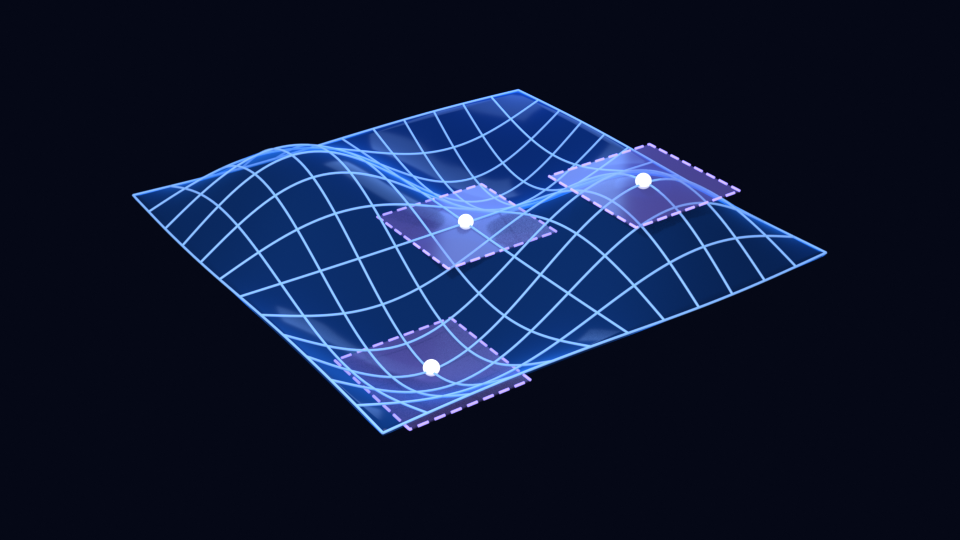

**Como se lê:** Superfície ondulada com três planos horizontais violeta encostados: lê-se como 'ponto crítico = plano tangente horizontal'.

**Usar quando**
- pontos críticos de f(x, y) e a Hessiana (a classificação é do Manim)
- distinguir máximo, mínimo e sela pela forma
- otimização em duas variáveis

**Não usar quando**
- máximos com restrição (use lagrange quando existir)
- funções com mais de três pontos críticos: a superfície é fixa

**Limitações**
- só o objeto geométrico: fórmulas, valores, gráficos e rótulos (inclusive N/S, +/−, nomes de vetores) são do Manim
- a gramática de cor segue o padrão do arsenal (estilo.json): E = ciano, B = magenta, vetores físicos = branco, normal = azul, construções = violeta
- a superfície é fixa (seno × seno); só altura e frequência mudam
- os pontos são em posições fixas (±π/2k e a origem)

| Parâmetro | Padrão | Unid. | Descrição |
|---|---|---|---|
| `altura` | 0.7 | u | amplitude h |
| `k` | 1.1 | 1/u | frequência k |
| `extensao` | 2.9 | u | meia largura da região |
| `planos` | 1 | 0/1 | planos tangentes horizontais |

**Integração:** `png_seq_alpha` · custo 1.17 s/frame (1080p, Eevee)

```powershell
& "C:\Program Files\Blender Foundation\Blender 5.2\blender.exe" -b -P experimentos\blender\arsenal\renderizar.py -- pontos_criticos --res 1920x1080 --alpha
```

**No Manim:**

```python
from manim_solido3d import Solido3D   # sys.path: experimentos/blender/arsenal
img = Solido3D("pontos_criticos").mobject(altura=5)   # estático: um quadro PNG com alpha
```

Ficha: `solidos/pontos_criticos.json`

### `prensa_hidraulica` — Prensa hidráulica (Pascal)

**Status:** aprovado · Aparência aprovada pelo usuário em 2026-10-07 (padrão visual de estilo.json); validado em 960x540 e 1080p.

Dois cilindros de vidro ligados por baixo e cheios de líquido, com êmbolos de áreas A1 e A2. Empurrar o êmbolo pequeno com F1 desce d1 e levanta o grande d2 = d1 A1/A2; F2 = F1 A2/A1 (setas brancas, a do êmbolo grande na escala `escala_forca`). fase 0 a 1 = um ciclo (desce e sobe).

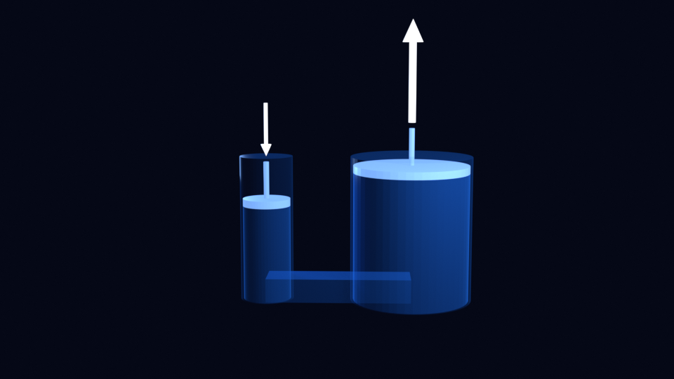

**Como se lê:** Um êmbolo pequeno descendo muito e um grande subindo pouco, com uma seta pequena e uma grande: lê-se como multiplicação de força.

**Usar quando**
- princípio de Pascal e a multiplicação de força F2 = F1 A2/A1
- conservação do volume (d1 A1 = d2 A2)
- freios e macacos hidráulicos

**Não usar quando**
- fluidos em movimento
- vasos comunicantes sem êmbolos

**Limitações**
- só o objeto geométrico: valores, fórmulas, gráficos e os nomes dos vetores são do Manim
- a gramática de cor segue o padrão do arsenal (estilo.json): E = ciano, vetores físicos = branco, construções = violeta, sinal da carga esculpido
- a seta F2 é desenhada na escala `escala_forca` (0,32), por isso o comprimento não é a razão exata das áreas
- os êmbolos são discos, sem vazamento nem atrito

| Parâmetro | Padrão | Unid. | Descrição |
|---|---|---|---|
| `raio1` | 0.45 | u | raio do êmbolo pequeno |
| `raio2` | 1.1 | u | raio do êmbolo grande |
| `altura` | 2.0 | u | altura inicial do líquido em cada coluna |
| `curso` | 0.55 | u | descida máxima do êmbolo pequeno |
| `escala_forca` | 0.32 | x | escala de desenho de F2 |
| `movimento` | 0 | 0/1 | 1 = animação (use animar.py ou a ponte com o Manim) |
| `fase` | 0.0 | 0-1 | fase da animação |

**Integração:** `png_seq_alpha` · custo não medido

**Animação (cargas em movimento):** `oscilacao` · loop sem emenda (`fase` de 0 a 1) · 60 quadros sugeridos · custo 0.77 s/frame (1080p, com alpha)

```powershell
& "C:\Program Files\Blender Foundation\Blender 5.2\blender.exe" -b -P experimentos\blender\arsenal\renderizar.py -- prensa_hidraulica --res 1920x1080 --alpha
```

**No Manim:**

```python
from manim_solido3d import Solido3D   # sys.path: experimentos/blender/arsenal
img = Solido3D("prensa_hidraulica").mobject(cena=self, altura=5)   # cargas em loop; img.pausar() / img.retomar()
```

Ficha: `solidos/prensa_hidraulica.json`

### `prisma_triangular` — Prisma triangular

**Status:** aprovado · Aparência aprovada pelo usuário em 2026-10-07 (padrão visual de estilo.json); validado em 960x540 e 1080p.

Prisma de vidro azul-claro de seção triangular isósceles (ângulo de ápice `angulo_apice`), com a seção no plano XY e extrusão ao longo de Z, apoiado na base. As nove arestas em azul-claro.

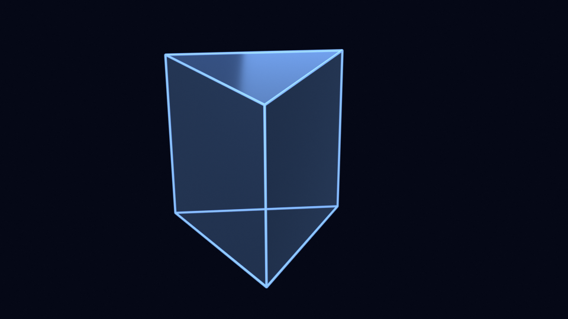

**Como se lê:** Prisma de vidro com arestas claras: lê-se como 'prisma óptico'. A direção dos raios, o desvio e a dispersão são do Manim.

**Usar quando**
- refração em um prisma, ângulo de desvio mínimo
- dispersão (as cores vêm do Manim)
- reflexão interna total

**Não usar quando**
- lentes (use lente_delgada)
- prismas não triangulares

**Limitações**
- só o objeto: raios, frentes de onda, ângulos e a figura de interferência são do Manim
- vidro translúcido azul-claro (padrão do arsenal): não representa cor, dispersão nem índice de refração
- os raios entrariam no plano da seção (XY); a extrusão em Z é só para dar volume

| Parâmetro | Padrão | Unid. | Descrição |
|---|---|---|---|
| `angulo_apice` | 60.0 | graus | ângulo de ápice |
| `base` | 2.0 | u | comprimento da base |
| `comprimento` | 2.0 | u | comprimento da extrusão (eixo Z) |
| `eixo` | 0 | 0/1 | 1 = eixo tracejado neutro ao longo de X |

**Integração:** `png_seq_alpha` · custo 0.76 s/frame (1080p, Eevee)

```powershell
& "C:\Program Files\Blender Foundation\Blender 5.2\blender.exe" -b -P experimentos\blender\arsenal\renderizar.py -- prisma_triangular --res 1920x1080 --alpha
```

**No Manim:**

```python
from manim_solido3d import Solido3D   # sys.path: experimentos/blender/arsenal
img = Solido3D("prisma_triangular").mobject(altura=5)   # estático: um quadro PNG com alpha
```

Ficha: `solidos/prisma_triangular.json`

### `produto_vetorial` — Produto vetorial a × b

**Status:** aprovado · Aparência aprovada pelo usuário em 2026-10-07 (padrão visual de estilo.json); validado em 960x540 e 1080p.

Vetores a (ao longo de X) e b (no plano XY) em branco, o paralelogramo que formam (violeta translúcido, arestas tracejadas) e a × b (azul, ao longo de +Z, comprimento ∝ área). Com movimento o ângulo entre a e b oscila entre 25° e 155°.

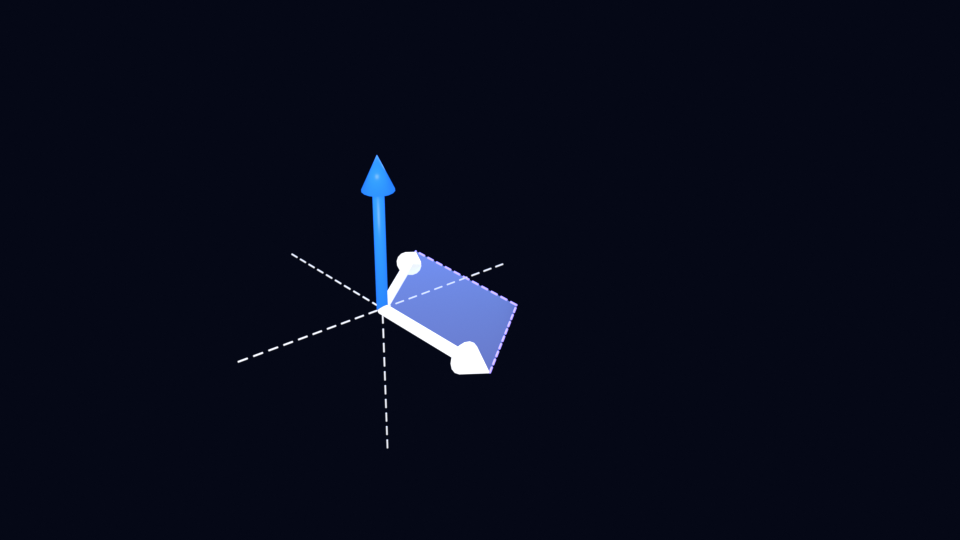

**Como se lê:** Dois vetores brancos, um paralelogramo violeta e uma seta azul perpendicular: lê-se como 'a × b é perpendicular ao plano e mede a área'.

**Usar quando**
- produto vetorial: direção (regra da mão direita) e módulo (área do paralelogramo)
- torque r × F, força magnética q v × B e Biot–Savart
- ver como a × b cresce e some quando o ângulo muda (movimento=1)

**Não usar quando**
- produto escalar e projeções
- vetores fora do plano XY: o plano de a e b é fixo

**Limitações**
- só o objeto geométrico: fórmulas, valores, gráficos e rótulos (inclusive N/S, +/−, nomes de vetores) são do Manim
- a gramática de cor segue o padrão do arsenal (estilo.json): E = ciano, B = magenta, vetores físicos = branco, normal = azul, construções = violeta
- a é fixo ao longo de X e b gira no plano XY: não representa vetores quaisquer
- o comprimento de a × b é ∝ à área (fator `escala_axb`), não igual a ela

| Parâmetro | Padrão | Unid. | Descrição |
|---|---|---|---|
| `a` | 2.2 | u | módulo de a |
| `b` | 1.8 | u | módulo de b |
| `angulo_graus` | 70.0 | graus | ângulo entre a e b (sem movimento) |
| `paralelogramo` | 1 | 0/1 | 1 = paralelogramo violeta |
| `movimento` | 0 | 0/1 | 1 = animação (use animar.py ou a ponte com o Manim) |
| `fase` | 0.0 | 0-1 | fase da animação |

**Integração:** `png_seq_alpha` · custo 0.55 s/frame (1080p, Eevee)

**Animação (cargas em movimento):** `oscilacao` · loop sem emenda (`fase` de 0 a 1) · 60 quadros sugeridos · custo 0.55 s/frame (1080p, com alpha)

```powershell
& "C:\Program Files\Blender Foundation\Blender 5.2\blender.exe" -b -P experimentos\blender\arsenal\renderizar.py -- produto_vetorial --res 1920x1080 --alpha
```

**No Manim:**

```python
from manim_solido3d import Solido3D   # sys.path: experimentos/blender/arsenal
img = Solido3D("produto_vetorial").mobject(cena=self, altura=5)   # cargas em loop; img.pausar() / img.retomar()
```

Ficha: `solidos/produto_vetorial.json`

### `rampa_rolamento` — Corrida de esfera, cilindro e aro numa rampa

**Status:** aprovado · Aparência aprovada pelo usuário em 2026-10-07 (padrão visual de estilo.json); validado em 960x540 e 1080p.

Esfera, cilindro e aro (mesmo raio) descem uma rampa a partir do repouso, lado a lado, com rolamento sem deslizamento: a = g sen θ/(1 + k) com k = 2/5, 1/2 e 1. A esfera chega primeiro, depois o cilindro e por fim o aro; a linha de chegada é tracejada em violeta. Ciclo único.

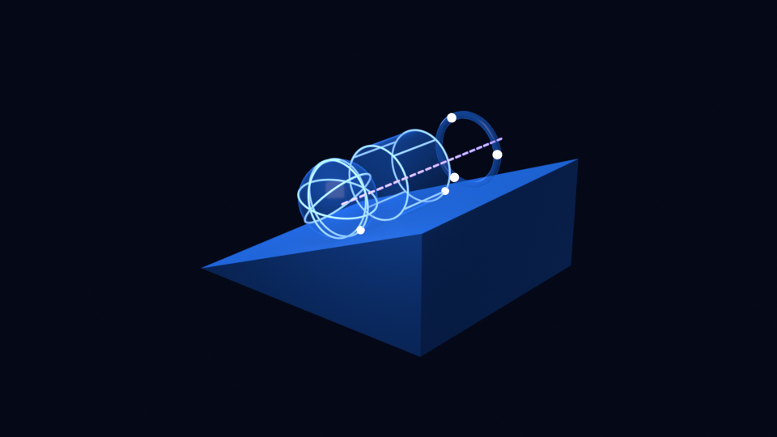

**Como se lê:** Três corpos descendo lado a lado, a esfera na frente e o aro atrás: lê-se como quanto maior o momento de inércia, mais devagar.

**Usar quando**
- rolamento em plano inclinado e a dependência da aceleração com o momento de inércia
- esfera × cilindro × aro: quem chega primeiro e por quê
- energia no rolamento (a conta é do Manim)

**Não usar quando**
- rolamento em chão plano (use esfera_rolando e companhia)
- corpos de massas ou raios diferentes

**Limitações**
- só o objeto geométrico: valores, fórmulas, gráficos e os nomes dos vetores são do Manim
- a gramática de cor segue o padrão do arsenal (estilo.json): vetores físicos = branco, construções = violeta tracejado, corpos = vidro azul
- os três corpos são de vidro de mesma aparência: a distinção maciço × oco vem só da forma e do rótulo
- a corrida termina quando o aro chega ao fim (a esfera e o cilindro esperam na linha)

| Parâmetro | Padrão | Unid. | Descrição |
|---|---|---|---|
| `angulo_graus` | 22.0 | graus | ângulo da rampa |
| `comprimento` | 5.2 | u | comprimento da rampa |
| `raio` | 0.62 | u | raio dos corpos |
| `linha_chegada` | 1 | 0/1 | linha de chegada |
| `movimento` | 0 | 0/1 | 1 = animação (use animar.py ou a ponte com o Manim) |
| `fase` | 0.0 | 0-1 | fase da animação |

**Integração:** `png_seq_alpha` · custo não medido

**Animação (cargas em movimento):** `corrida` · loop sem emenda (`fase` de 0 a 1) · 60 quadros sugeridos · custo 0.86 s/frame (1080p, com alpha)

```powershell
& "C:\Program Files\Blender Foundation\Blender 5.2\blender.exe" -b -P experimentos\blender\arsenal\renderizar.py -- rampa_rolamento --res 1920x1080 --alpha
```

**No Manim:**

```python
from manim_solido3d import Solido3D   # sys.path: experimentos/blender/arsenal
img = Solido3D("rampa_rolamento").mobject(cena=self, altura=5)   # cargas em loop; img.pausar() / img.retomar()
```

Ficha: `solidos/rampa_rolamento.json`

### `rede_de_difracao` — Rede de difração

**Status:** aprovado · Aparência aprovada pelo usuário em 2026-10-07 (padrão visual de estilo.json); validado em 960x540 e 1080p.

Anteparo opaco azul com `n_fendas` fendas verticais de largura `fenda` e período `separacao`, com as bordas em azul-claro: a generalização do anteparo_fenda_dupla. O padrão de difração é desenhado pelo Manim.

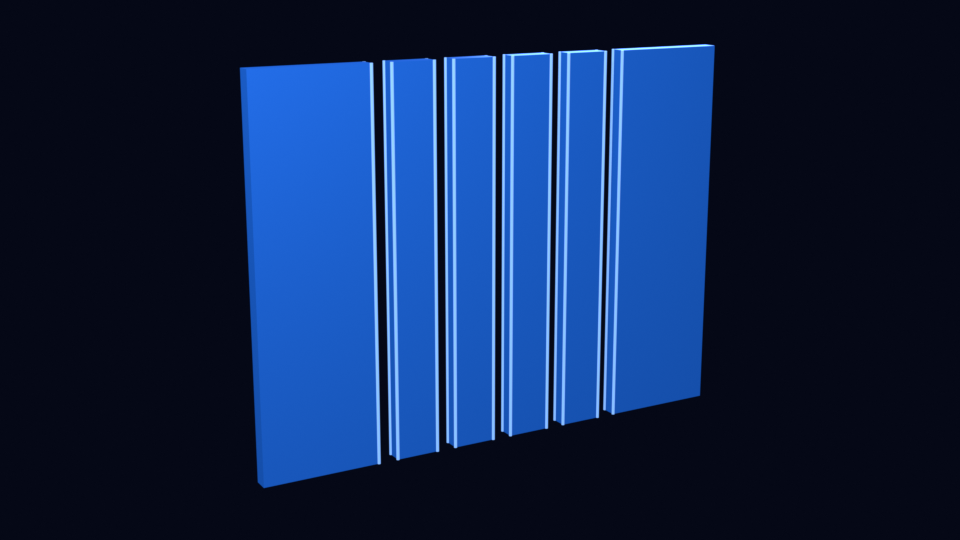

**Como se lê:** Uma placa com várias frestas verticais regularmente espaçadas: lê-se como rede de difração (ou fenda múltipla).

**Usar quando**
- rede de difração e a condição d sen θ = m λ
- fenda dupla (n_fendas = 2) e fenda múltipla
- resolução de uma rede com mais fendas

**Não usar quando**
- fenda simples (use n_fendas = 1)
- o padrão em si (do Manim)

**Limitações**
- só o objeto geométrico: valores, fórmulas, rótulos (n, θ, λ, ...) e o padrão de franjas/difração são do Manim
- a gramática de cor segue o padrão do arsenal (estilo.json): raios de luz = branco, campo E = ciano, objetos transparentes = vidro azul-claro, construções = violeta tracejado
- só o anteparo: a luz, os máximos e a intensidade ficam por conta do Manim
- as fendas são retângulos (sem rugosidade ou profundidade real)

| Parâmetro | Padrão | Unid. | Descrição |
|---|---|---|---|
| `n_fendas` | 5 | n | número de fendas |
| `largura` | 4.0 | u | largura do anteparo |
| `altura` | 3.0 | u | altura do anteparo |
| `espessura` | 0.12 | u | espessura do anteparo |
| `fenda` | 0.16 | u | largura de cada fenda |
| `separacao` | 0.5 | u | período (distância entre fendas) |

**Integração:** `png_seq_alpha` · custo não medido

```powershell
& "C:\Program Files\Blender Foundation\Blender 5.2\blender.exe" -b -P experimentos\blender\arsenal\renderizar.py -- rede_de_difracao --res 1920x1080 --alpha
```

**No Manim:**

```python
from manim_solido3d import Solido3D   # sys.path: experimentos/blender/arsenal
img = Solido3D("rede_de_difracao").mobject(altura=5)   # estático: um quadro PNG com alpha
```

Ficha: `solidos/rede_de_difracao.json`

### `relogio_de_luz` — Relógio de luz e dilatação do tempo

**Status:** aprovado · Aparência aprovada pelo usuário em 2026-10-07 (padrão visual de estilo.json); validado em 960x540 e 1080p.

Dois espelhos (vidro) separados de L e um fóton (esfera) entre eles. Visto num referencial em que o relógio se move com velocidade v (seta branca), o fóton percorre a diagonal: (c Δt)² = L² + (v Δt)² (triângulo violeta tracejado), Δt = γ L/c. Ciclo único: o relógio vai de x = 0 a x = v Δt enquanto o fóton sobe de um espelho ao outro.

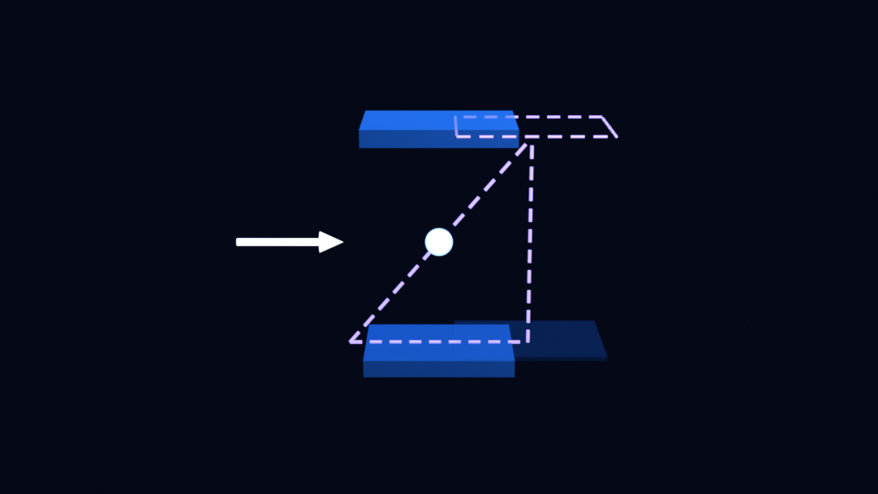

**Como se lê:** Um fóton subindo na diagonal entre dois espelhos que andam para a direita, com um triângulo tracejado: lê-se como dilatação do tempo.

**Usar quando**
- dilatação do tempo e o fator γ = 1/√(1 − v²/c²)
- o triângulo (c Δt)² = L² + (v Δt)²
- simultaneidade e referenciais (compare com o relógio parado)

**Não usar quando**
- contração do comprimento
- o relógio parado visto no seu referencial (só a diagonal é mostrada)

**Limitações**
- só o objeto geométrico: valores, fórmulas, rótulos (n, θ, λ, ...) e o padrão de franjas/difração são do Manim
- a gramática de cor segue o padrão do arsenal (estilo.json): raios de luz = branco, campo E = ciano, objetos transparentes = vidro azul-claro, construções = violeta tracejado
- c = 1 nas unidades do sólido e o valor de v é visual: o γ é do Manim
- a seta do vetor v tem comprimento fixo
- o triângulo mostra a metade do ciclo (só a subida)

| Parâmetro | Padrão | Unid. | Descrição |
|---|---|---|---|
| `altura` | 2.0 | u | distância entre os espelhos (L) |
| `velocidade` | 0.65 | c | velocidade v/c do relógio |
| `movimento` | 0 | 0/1 | 1 = animação (use animar.py ou a ponte com o Manim) |
| `fase` | 0.0 | 0-1 | fase da animação |

**Integração:** `png_seq_alpha` · custo não medido

**Animação (cargas em movimento):** `deslocamento` · loop sem emenda (`fase` de 0 a 1) · 60 quadros sugeridos · custo 0.63 s/frame (1080p, com alpha)

```powershell
& "C:\Program Files\Blender Foundation\Blender 5.2\blender.exe" -b -P experimentos\blender\arsenal\renderizar.py -- relogio_de_luz --res 1920x1080 --alpha
```

**No Manim:**

```python
from manim_solido3d import Solido3D   # sys.path: experimentos/blender/arsenal
img = Solido3D("relogio_de_luz").mobject(cena=self, altura=5)   # cargas em loop; img.pausar() / img.retomar()
```

Ficha: `solidos/relogio_de_luz.json`

### `rotacional_roda_de_pas` — Rotacional local (roda de pás)

**Status:** aprovado · Aparência aprovada pelo usuário em 2026-10-07 (padrão visual de estilo.json); validado em 960x540 e 1080p.

Roda de pás (duas placas em cruz, com uma ponta marcada em branco) sobre o plano z = 0 num campo de setas ciano. `campo`: rotacional (a roda gira no sentido anti-horário), cisalhamento (gira no horário) ou irrotacional (campo ∝ r/r²: não gira). Com movimento a roda dá uma volta (loop), no sentido do rotacional; a rapidez é visual.

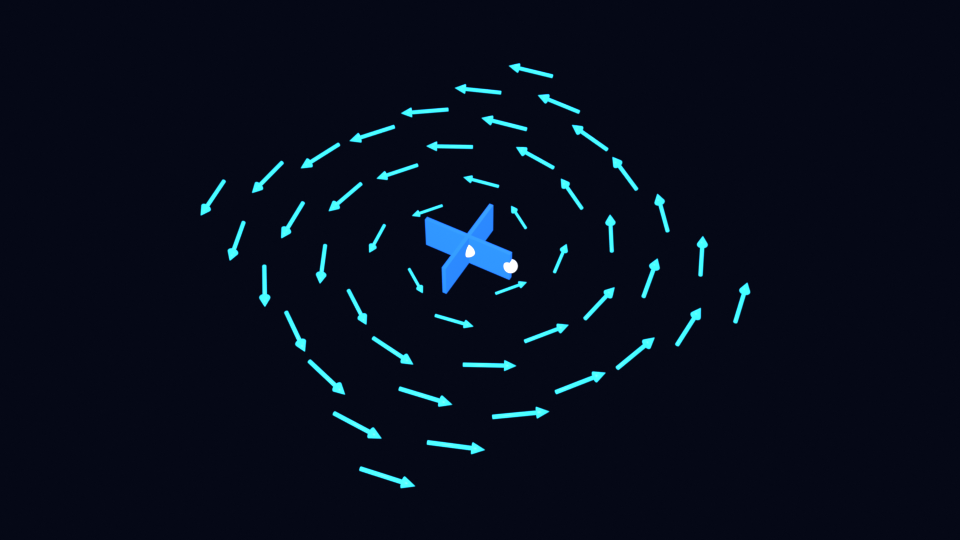

**Como se lê:** Uma cruz azul no centro de um redemoinho de setas ciano, girando com ele (ou parada, se não há rotação): lê-se como rotacional.

**Usar quando**
- rotacional como tendência a girar (roda de pás)
- campos com e sem rotacional
- ponte para o teorema de Stokes (teorema_stokes)

**Não usar quando**
- rotacional em 3D com os três componentes (o campo é plano)
- valores do rotacional (são do Manim)

**Limitações**
- só o objeto geométrico: valores, fórmulas, matrizes, resultados e rótulos são do Manim
- a gramática de cor segue o padrão do arsenal (estilo.json): superfícies = vidro azul, curvas = azul-claro, construções = violeta, vetores = branco, normal e ∇g = azul, campo = ciano
- a rapidez da roda é a mesma em todos os campos (uma volta por ciclo): só o sentido é o do rotacional
- o campo é plano e a roda gira só em torno de Z
- a roda não é arrastada pelo campo (fica na origem)

| Parâmetro | Padrão | Unid. | Descrição |
|---|---|---|---|
| `campo` | rotacional | texto | rotacional, cisalhamento ou irrotacional |
| `n_campo` | 7 | n | setas por lado |
| `extensao` | 2.8 | u | meia largura do campo |
| `angulo_graus` | 0.0 | graus | ângulo da roda (sem movimento) |
| `movimento` | 0 | 0/1 | 1 = animação (use animar.py ou a ponte com o Manim) |
| `fase` | 0.0 | 0-1 | fase da animação |

**Integração:** `png_seq_alpha` · custo não medido

**Animação (cargas em movimento):** `rotacao` · loop sem emenda (`fase` de 0 a 1) · 60 quadros sugeridos · custo 0.41 s/frame (1080p, com alpha)

```powershell
& "C:\Program Files\Blender Foundation\Blender 5.2\blender.exe" -b -P experimentos\blender\arsenal\renderizar.py -- rotacional_roda_de_pas --res 1920x1080 --alpha
```

**No Manim:**

```python
from manim_solido3d import Solido3D   # sys.path: experimentos/blender/arsenal
img = Solido3D("rotacional_roda_de_pas").mobject(cena=self, altura=5)   # cargas em loop; img.pausar() / img.retomar()
```

Ficha: `solidos/rotacional_roda_de_pas.json`

### `solenoide_corrente` — Solenoide (hélice de fio)

**Status:** aprovado · Aparência aprovada pelo usuário em 2026-10-07 (padrão visual de estilo.json); validado em 960x540 e 1080p.

Solenoide: fio azul (#267BFF) enrolado em hélice de passo constante ao longo do eixo X. Terminais retos nas pontas. Núcleo de vidro opcional e eixo de simetria opcional.

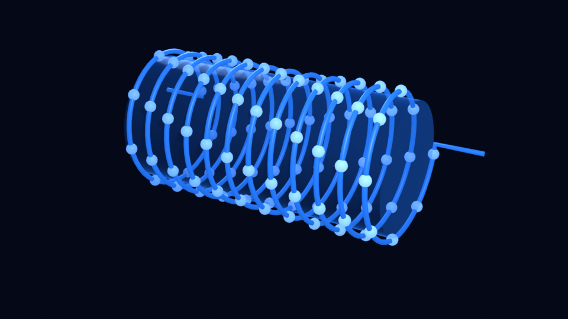

**Como se lê:** Hélice azul luminosa de espiras abertas em volta de um núcleo de vidro translúcido: lê-se como 'fio enrolado'. Sem núcleo (nucleo=0) o interior fica visível e vazio.

**Usar quando**
- campo B no interior de um solenoide longo (n espiras por comprimento, retângulo amperiano atravessando a parede)
- mostrar a densidade de espiras n e o efeito de enrolar o fio
- contraste com o toroide (enrolamento fechado) e com o fio reto
- corrente seguindo as espiras: cargas em movimento ao longo da hélice (cargas_moveis=1, animar.py)
- corrente seguindo as espiras: cargas em movimento ao longo da hélice (cargas_moveis=1)

**Não usar quando**
- o enrolamento é fechado em anel (use toroide_corrente)
- uma única espira (use anel_carregado como aro, ou espira no 2D)

**Limitações**
- só a fonte física (fio/enrolamento, azul): o campo B (ciano) e o sentido da corrente são desenhados no 2D/Manim
- sem noção de sentido: a hélice tem um sentido de enrolamento, mas ele não representa a corrente de forma legível; indicar I por rótulo/seta no Manim
- hélice ideal: espiras muito próximas aproximam o solenoide infinito, mas a hélice é finita (4 de comprimento)
- o fio é grosso para ser visível; o passo e o número de espiras são estilizados (12 por padrão)
- o sentido do movimento não codifica a corrente: a convenção (corrente convencional ou elétrons, que vão ao contrário) e o sinal vão por seta e rótulo no Manim
- o movimento não codifica a corrente: a convenção (corrente convencional ou elétrons, que vão ao contrário) e o sinal vão por seta e rótulo no Manim; o movimento é didático, não em escala

| Parâmetro | Padrão | Unid. | Descrição |
|---|---|---|---|
| `raio` | 1.0 | u | raio do solenoide |
| `comprimento` | 4.0 | u | comprimento ao longo do eixo X |
| `n_espiras` | 12 | n | número de espiras |
| `raio_fio` | 0.035 | u | raio do fio (visual) |
| `nucleo` | 1 | 0/1 | 1 = núcleo de vidro dentro (só visual, dá corpo ao solenoide; não representa um material magnético); 0 = só o fio |
| `eixo` | 0 | 0/1 | 1 = eixo de simetria tracejado neutro |
| `comprimento_eixo` | 6.0 | u | comprimento do eixo, se desenhado |
| `terminal` | 0.7 | u | comprimento dos terminais retos de fio nas duas pontas |
| `cargas_moveis` | 0 | 0/1 | 1 = cargas azul-claro deslizando ao longo do fio (corrente); o movimento é didático, não em escala |
| `fase` | 0.0 | 0-1 | fase do movimento: desloca as cargas de 0 a 1 espaçamento; fase=1 repete o quadro da fase 0 (loop perfeito) |
| `espaco_cargas` | 0.8 | u | distância entre cargas consecutivas ao longo do fio |
| `tamanho_carga_movel` | 0.08 | u | raio de cada carga móvel |

**Integração:** `png_seq_alpha` · custo 0.53 s/frame (1080p, Eevee)

**Animação (cargas em movimento):** `deslizamento` · loop sem emenda (`fase` de 0 a 1) · 60 quadros sugeridos · custo 0.55 s/frame (1080p, com alpha)

```powershell
& "C:\Program Files\Blender Foundation\Blender 5.2\blender.exe" -b -P experimentos\blender\arsenal\renderizar.py -- solenoide_corrente --res 1920x1080 --alpha
```

**No Manim:**

```python
from manim_solido3d import Solido3D   # sys.path: experimentos/blender/arsenal
img = Solido3D("solenoide_corrente").mobject(cena=self, altura=5)   # cargas em loop; img.pausar() / img.retomar()
```

Ficha: `solidos/solenoide_corrente.json`

### `solido_revolucao_arruela` — Sólido de revolução: método das arruelas

**Status:** aprovado · Aparência aprovada pelo usuário em 2026-10-07 (padrão visual de estilo.json); validado em 960x540 e 1080p.

Sólido de vidro azulado gerado pela rotação, em torno do eixo X, da região entre y = √x e y = x² (as duas curvas em azul-claro; o corpo fica oco por dentro), com o eixo tracejado e a fatia elementar (uma arruela, de raio externo f e interno g, espessura dx) em violeta com arestas tracejadas. Com movimento, a arruela varre o sólido e volta.

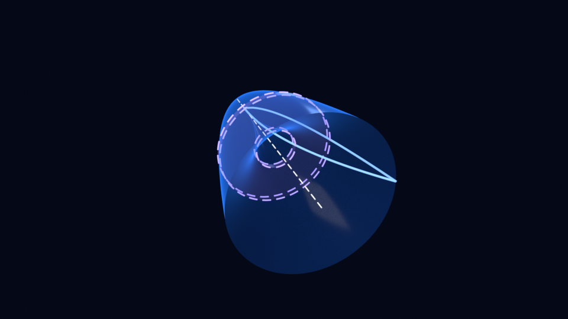

**Como se lê:** Corpo de vidro azul em forma de taça aberta, com uma arruela violeta de arestas tracejadas. Lê-se como 'o volume é a soma de arruelas: π (f² − g²) dx'.

**Usar quando**
- volume por arruelas: V = ∫ π (f(x)² − g(x)²) dx (região entre duas curvas girada em torno do eixo x)
- mostrar a arruela elementar varrendo o sólido (movimento=1)
- contraste com o método dos discos (sem furo)

**Não usar quando**
- a região vai até o eixo (use solido_revolucao_disco)
- eixo de rotação deslocado ou outras duas curvas: aqui a região é fixa (√x e x²)

**Limitações**
- a fatia mostra UM elemento dx exagerado, não a soma de Riemann: o limite dx→0 e a integral ficam para o Manim
- o violeta da fatia segue a gramática do arsenal (construção matemática, translúcida, nunca sólida): ela fica dentro do vidro azul e perde contraste em ângulos muito rasantes
- o sólido é vidro translúcido (culling de faces de trás já embutido); o interior de uma arruela só aparece pelo lado aberto
- a gramática de cor de Cálculo segue o padrão do arsenal (estilo.json)
- região fixa entre y = √x e y = x² normalizada em [0, comprimento]

| Parâmetro | Padrão | Unid. | Descrição |
|---|---|---|---|
| `comprimento` | 4.0 | u | extensão ao longo do eixo X |
| `raio_max` | 1.6 | u | raio onde as duas curvas se encontram (em x = comprimento) |
| `fatia` | 1 | 0/1 | 1 = desenha a fatia elementar (violeta, arestas tracejadas); 0 = só o sólido |
| `posicao_fatia` | 0.5 | 0-1 | posição da fatia ao longo do sólido (fração da extensão); ignorada com movimento=1 |
| `espessura_fatia` | 0.14 | u | espessura dx da fatia (exagerada para ser visível) |
| `perfil_visivel` | 1 | 0/1 | 1 = curva geratriz em azul-claro |
| `eixo` | 1 | 0/1 | 1 = eixo de revolução tracejado em cor neutra |
| `movimento` | 0 | 0/1 | 1 = a fatia varre o sólido em vaivém suave (use animar.py ou a ponte com o Manim) |
| `fase` | 0.0 | 0-1 | fase do vaivém; fase=1 repete o quadro da fase 0 (loop perfeito) |

**Integração:** `png_seq_alpha` · custo 0.91 s/frame (1080p, Eevee)

**Animação (cargas em movimento):** `varredura` · loop sem emenda (`fase` de 0 a 1) · 60 quadros sugeridos · custo 0.91 s/frame (1080p, com alpha)

```powershell
& "C:\Program Files\Blender Foundation\Blender 5.2\blender.exe" -b -P experimentos\blender\arsenal\renderizar.py -- solido_revolucao_arruela --res 1920x1080 --alpha
```

**No Manim:**

```python
from manim_solido3d import Solido3D   # sys.path: experimentos/blender/arsenal
img = Solido3D("solido_revolucao_arruela").mobject(cena=self, altura=5)   # cargas em loop; img.pausar() / img.retomar()
```

Ficha: `solidos/solido_revolucao_arruela.json`

### `solido_revolucao_cascas` — Sólido de revolução: método das cascas

**Status:** aprovado · Aparência aprovada pelo usuário em 2026-10-07 (padrão visual de estilo.json); validado em 960x540 e 1080p.

Sólido de vidro azulado (uma tigela) gerado pela rotação da região sob y = H (1 − (x/a)²) em torno do eixo Z (vertical), com a curva geratriz em azul-claro, o eixo tracejado e a fatia elementar (uma casca cilíndrica de raio r, altura f(r) e espessura dr) em violeta com arestas tracejadas. Com movimento, a casca cresce de dentro para fora e volta.

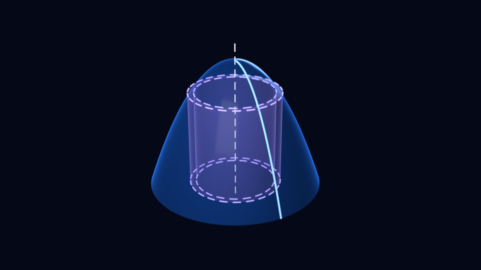

**Como se lê:** Tigela de vidro azul com uma casca cilíndrica violeta de arestas tracejadas, concêntrica ao eixo vertical. Lê-se como 'o volume é a soma de cascas: 2π r f(r) dr'.

**Usar quando**
- volume por cascas: V = ∫ 2π x f(x) dx (região sob a curva girada em torno do eixo y)
- mostrar a casca elementar varrendo o sólido (movimento=1)
- contraste com discos e arruelas (fatias perpendiculares ao eixo)

**Não usar quando**
- rotação em torno do eixo x com a região sob a curva (use solido_revolucao_disco)
- outra curva ou eixo deslocado: a parábola invertida é fixa

**Limitações**
- a fatia mostra UM elemento dx exagerado, não a soma de Riemann: o limite dx→0 e a integral ficam para o Manim
- o violeta da fatia segue a gramática do arsenal (construção matemática, translúcida, nunca sólida): ela fica dentro do vidro azul e perde contraste em ângulos muito rasantes
- o sólido é vidro translúcido (culling de faces de trás já embutido); o interior de uma arruela só aparece pelo lado aberto
- a gramática de cor de Cálculo segue o padrão do arsenal (estilo.json)
- perfil fixo: parábola invertida y = H (1 − (x/a)²) em [0, a]
- o eixo de rotação é Z (vertical), diferente dos outros dois métodos (eixo X)

| Parâmetro | Padrão | Unid. | Descrição |
|---|---|---|---|
| `raio_base` | 2.0 | u | raio a da base da tigela |
| `altura` | 3.0 | u | altura H da tigela (no eixo) |
| `fatia` | 1 | 0/1 | 1 = desenha a fatia elementar (violeta, arestas tracejadas); 0 = só o sólido |
| `posicao_fatia` | 0.5 | 0-1 | posição da fatia ao longo do sólido (fração da extensão); ignorada com movimento=1 |
| `espessura_fatia` | 0.14 | u | espessura dx da fatia (exagerada para ser visível) |
| `perfil_visivel` | 1 | 0/1 | 1 = curva geratriz em azul-claro |
| `eixo` | 1 | 0/1 | 1 = eixo de revolução tracejado em cor neutra |
| `movimento` | 0 | 0/1 | 1 = a fatia varre o sólido em vaivém suave (use animar.py ou a ponte com o Manim) |
| `fase` | 0.0 | 0-1 | fase do vaivém; fase=1 repete o quadro da fase 0 (loop perfeito) |

**Integração:** `png_seq_alpha` · custo 0.96 s/frame (1080p, Eevee)

**Animação (cargas em movimento):** `varredura` · loop sem emenda (`fase` de 0 a 1) · 60 quadros sugeridos · custo 0.96 s/frame (1080p, com alpha)

```powershell
& "C:\Program Files\Blender Foundation\Blender 5.2\blender.exe" -b -P experimentos\blender\arsenal\renderizar.py -- solido_revolucao_cascas --res 1920x1080 --alpha
```

**No Manim:**

```python
from manim_solido3d import Solido3D   # sys.path: experimentos/blender/arsenal
img = Solido3D("solido_revolucao_cascas").mobject(cena=self, altura=5)   # cargas em loop; img.pausar() / img.retomar()
```

Ficha: `solidos/solido_revolucao_cascas.json`

### `solido_revolucao_disco` — Sólido de revolução: método dos discos

**Status:** aprovado · Aparência aprovada pelo usuário em 2026-10-07 (padrão visual de estilo.json); validado em 960x540 e 1080p.

Sólido de vidro azulado gerado pela rotação de uma curva y = f(x) em torno do eixo X (4 perfis: raiz, parábola, cone, elipsoide), com a curva geratriz em azul-claro, o eixo tracejado e a fatia elementar (um disco de espessura dx) em violeta com arestas tracejadas. Com movimento, o disco varre o sólido de uma ponta à outra e volta.

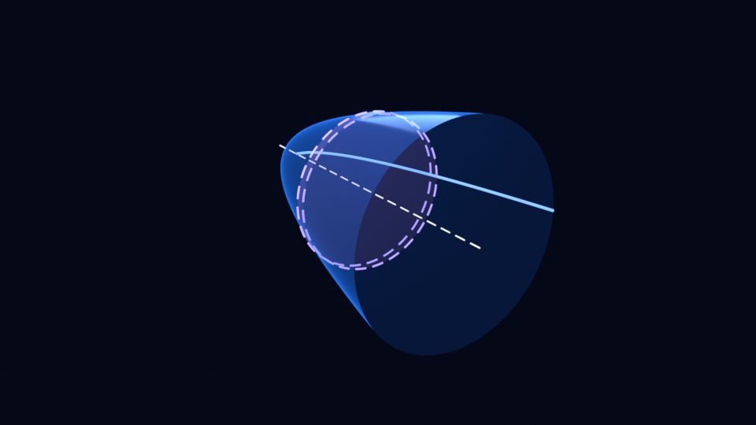

**Como se lê:** Corpo de vidro azul atravessado por um disco violeta de arestas tracejadas. Lê-se como 'o volume é a soma de discos de raio f(x) e espessura dx'.

**Usar quando**
- volume por discos: V = ∫ π f(x)² dx (região sob a curva girada em torno do eixo x)
- mostrar a fatia elementar varrendo o sólido (movimento=1)
- contraste com arruelas (região entre duas curvas) e cascas (eixo vertical)

**Não usar quando**
- a região é limitada por duas curvas (use solido_revolucao_arruela)
- o eixo de rotação é vertical e as fatias são paralelas a ele (use solido_revolucao_cascas)
- eixo de rotação deslocado (ex.: y = −1): só o eixo X é suportado

**Limitações**
- a fatia mostra UM elemento dx exagerado, não a soma de Riemann: o limite dx→0 e a integral ficam para o Manim
- o violeta da fatia segue a gramática do arsenal (construção matemática, translúcida, nunca sólida): ela fica dentro do vidro azul e perde contraste em ângulos muito rasantes
- o sólido é vidro translúcido (culling de faces de trás já embutido); o interior de uma arruela só aparece pelo lado aberto
- a gramática de cor de Cálculo segue o padrão do arsenal (estilo.json)
- só 4 perfis normalizados (parâmetro perfil); outra curva exige alterar PERFIS em revolucao.py

| Parâmetro | Padrão | Unid. | Descrição |
|---|---|---|---|
| `perfil` | raiz | texto | raiz (y=√x), parabola (y=x²), cone (y=x) ou elipsoide (semi-elipse) |
| `comprimento` | 4.0 | u | extensão ao longo do eixo X |
| `raio_max` | 1.6 | u | raio máximo do sólido |
| `fatia` | 1 | 0/1 | 1 = desenha a fatia elementar (violeta, arestas tracejadas); 0 = só o sólido |
| `posicao_fatia` | 0.5 | 0-1 | posição da fatia ao longo do sólido (fração da extensão); ignorada com movimento=1 |
| `espessura_fatia` | 0.14 | u | espessura dx da fatia (exagerada para ser visível) |
| `perfil_visivel` | 1 | 0/1 | 1 = curva geratriz em azul-claro |
| `eixo` | 1 | 0/1 | 1 = eixo de revolução tracejado em cor neutra |
| `movimento` | 0 | 0/1 | 1 = a fatia varre o sólido em vaivém suave (use animar.py ou a ponte com o Manim) |
| `fase` | 0.0 | 0-1 | fase do vaivém; fase=1 repete o quadro da fase 0 (loop perfeito) |

**Integração:** `png_seq_alpha` · custo 0.86 s/frame (1080p, Eevee)

**Animação (cargas em movimento):** `varredura` · loop sem emenda (`fase` de 0 a 1) · 60 quadros sugeridos · custo 0.86 s/frame (1080p, com alpha)

```powershell
& "C:\Program Files\Blender Foundation\Blender 5.2\blender.exe" -b -P experimentos\blender\arsenal\renderizar.py -- solido_revolucao_disco --res 1920x1080 --alpha
```

**No Manim:**

```python
from manim_solido3d import Solido3D   # sys.path: experimentos/blender/arsenal
img = Solido3D("solido_revolucao_disco").mobject(cena=self, altura=5)   # cargas em loop; img.pausar() / img.retomar()
```

Ficha: `solidos/solido_revolucao_disco.json`

### `superficie_parametrizada` — Superfície parametrizada com remendo dS

**Status:** aprovado · Aparência aprovada pelo usuário em 2026-10-07 (padrão visual de estilo.json); validado em 960x540 e 1080p.

Superfície de vidro azul (`tipo`: onda, sela ou esfera) com as curvas coordenadas u = cte e v = cte em azul-claro, um remendo elementar dS em violeta tracejado, os vetores tangentes r_u e r_v (brancos) e a normal n̂ = r_u × r_v (azul) no ponto (`u0`, `v0`). Com `movimento=1` o ponto percorre uma pequena volta.

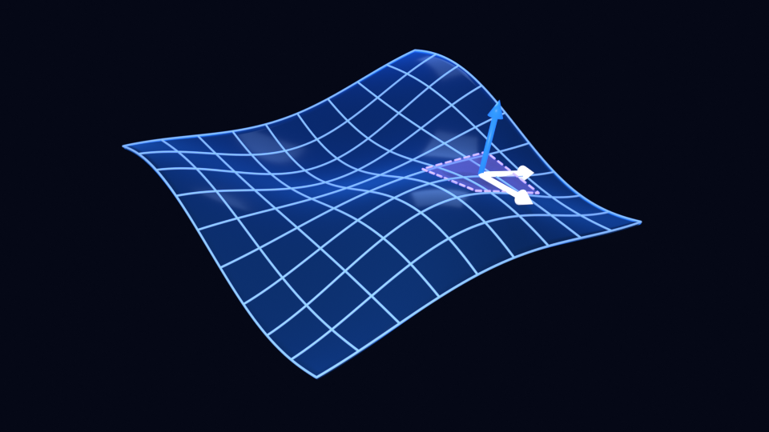

**Como se lê:** Superfície de vidro com malha, um quadrilátero violeta e três setas (duas brancas no plano tangente, uma azul normal). Lê-se como 'parametrização: elemento de área e orientação'.

**Usar quando**
- superfícies parametrizadas: vetores tangentes, elemento de área |r_u × r_v| du dv e orientação (Cálculo IV 11.6)
- integral de superfície e fluxo (o remendo é o dS)
- contraste entre onda, sela e esfera

**Não usar quando**
- superfícies de revolução com fatias (use solido_revolucao_*)
- superfícies fechadas com gaussianas (use as gaussianas)

**Limitações**
- a gramática de cor segue o padrão do arsenal: campo vetorial = ciano (reservado ao campo), normal n̂ = azul, tangentes = branco, construções (remendo, contorno) = violeta, nunca sólidas
- só o objeto geométrico: integrais, fórmulas e o sinal da circulação/fluxo são do Manim
- superfície fina de vidro com Solidify (espessura 0,03): vista de lado o vidro quase some
- sobre a esfera os vetores tangentes e a normal dependem do ponto: perto dos polos a parametrização é degenerada (domínio cortado em 5%)
- o remendo é plano (quadrilátero); a curvatura dentro dele não aparece

| Parâmetro | Padrão | Unid. | Descrição |
|---|---|---|---|
| `tipo` | onda | texto | onda, sela ou esfera |
| `u0` | 0.5 | 0-1 | posição de u no domínio |
| `v0` | 0.5 | 0-1 | posição de v no domínio |
| `tamanho_remendo` | 1.0 | x | tamanho relativo do remendo dS |
| `vetores` | 1 | 0/1 | 1 = r_u, r_v e n̂ |
| `linhas` | 1 | 0/1 | 1 = curvas coordenadas |
| `movimento` | 0 | 0/1 | 1 = animação em loop (use animar.py ou a ponte com o Manim) |
| `fase` | 0.0 | 0-1 | fase do loop; fase=1 repete o quadro da fase 0 (loop perfeito) |

**Integração:** `png_seq_alpha` · custo 1.06 s/frame (1080p, Eevee)

**Animação (cargas em movimento):** `percurso` · loop sem emenda (`fase` de 0 a 1) · 60 quadros sugeridos · custo 1.06 s/frame (1080p, com alpha)

```powershell
& "C:\Program Files\Blender Foundation\Blender 5.2\blender.exe" -b -P experimentos\blender\arsenal\renderizar.py -- superficie_parametrizada --res 1920x1080 --alpha
```

**No Manim:**

```python
from manim_solido3d import Solido3D   # sys.path: experimentos/blender/arsenal
img = Solido3D("superficie_parametrizada").mobject(cena=self, altura=5)   # cargas em loop; img.pausar() / img.retomar()
```

Ficha: `solidos/superficie_parametrizada.json`

### `superficie_quadrica` — Superfícies quádricas

**Status:** aprovado · Aparência aprovada pelo usuário em 2026-10-07 (padrão visual de estilo.json); validado em 960x540 e 1080p.

Quádrica de vidro azul com curvas coordenadas e os eixos x, y, z tracejados em branco neutro. `tipo`: elipsoide, hiperboloide_uma_folha, hiperboloide_duas_folhas, paraboloide_eliptico, paraboloide_hiperbolico ou cone (duas folhas).

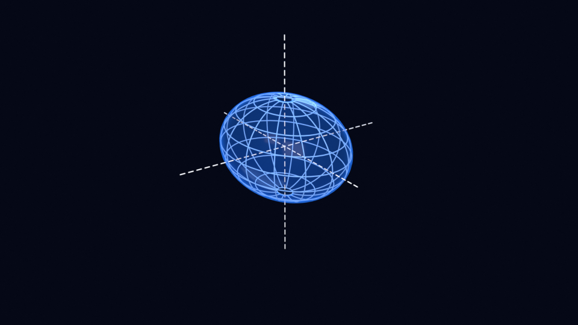

**Como se lê:** Superfície de vidro com a malha: lê-se como 'a forma da quádrica', e a diferença entre os seis tipos é clara pela silhueta.

**Usar quando**
- reconhecer e comparar as seis quádricas
- cortes e traços de uma superfície em R³
- preparar integrais triplas e coordenadas adaptadas

**Não usar quando**
- superfícies que não são quádricas
- cortes por planos (as seções não são desenhadas)

**Limitações**
- só o objeto geométrico: fórmulas, valores, gráficos e rótulos (inclusive N/S, +/−, nomes de vetores) são do Manim
- a gramática de cor segue o padrão do arsenal (estilo.json): E = ciano, B = magenta, vetores físicos = branco, normal = azul, construções = violeta
- os semieixos a, b, c são parâmetros globais: a mesma tripla vale para todos os tipos
- o hiperboloide de duas folhas e o cone aparecem em duas folhas, sem a seção que as une

| Parâmetro | Padrão | Unid. | Descrição |
|---|---|---|---|
| `tipo` | elipsoide | texto | elipsoide, hiperboloide_uma_folha, hiperboloide_duas_folhas, paraboloide_eliptico, paraboloide_hiperbolico ou cone |
| `a` | 2.0 | u | semieixo em x |
| `b` | 1.5 | u | semieixo em y |
| `c` | 1.3 | u | semieixo em z |
| `eixo` | 1 | 0/1 | 1 = eixos coordenados |
| `linhas` | 1 | 0/1 | curvas coordenadas |

**Integração:** `png_seq_alpha` · custo 0.75 s/frame (1080p, Eevee)

```powershell
& "C:\Program Files\Blender Foundation\Blender 5.2\blender.exe" -b -P experimentos\blender\arsenal\renderizar.py -- superficie_quadrica --res 1920x1080 --alpha
```

**No Manim:**

```python
from manim_solido3d import Solido3D   # sys.path: experimentos/blender/arsenal
img = Solido3D("superficie_quadrica").mobject(altura=5)   # estático: um quadro PNG com alpha
```

Ficha: `solidos/superficie_quadrica.json`

### `tanque_hidrostatico` — Tanque com pressão e empuxo

**Status:** aprovado · Aparência aprovada pelo usuário em 2026-10-07 (padrão visual de estilo.json); validado em 960x540 e 1080p.

Tanque de vidro com líquido até `nivel`, a superfície livre (violeta tracejado) e um bloco flutuante (fração submersa = densidade do bloco / densidade do líquido). Setas brancas horizontais na parede mostram a pressão crescendo com a profundidade; peso e empuxo (brancos) são iguais no equilíbrio. Com movimento o bloco oscila e o empuxo acompanha o volume submerso.

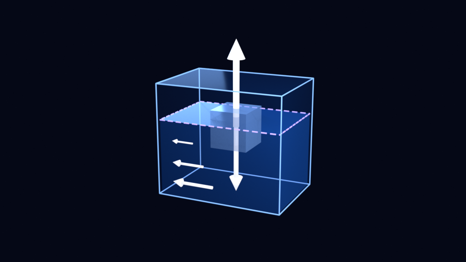

**Como se lê:** Um bloco boiando num tanque, com setas de pressão que crescem para baixo e duas setas verticais iguais: lê-se como pressão hidrostática e princípio de Arquimedes.

**Usar quando**
- pressão hidrostática p = ρ g h (as setas crescem com a profundidade)
- empuxo e flutuação: fração submersa = ρ_bloco/ρ_líquido
- oscilação vertical de um bloco flutuante (MHS, pequena amplitude)

**Não usar quando**
- fluidos em movimento (use tubo_escoamento ou tanque_torricelli)
- corpos de forma que não seja um cubo

**Limitações**
- só o objeto geométrico: valores, fórmulas, gráficos e os nomes dos vetores são do Manim
- a gramática de cor segue o padrão do arsenal (estilo.json): E = ciano, vetores físicos = branco, construções = violeta, sinal da carga esculpido
- o líquido é vidro translúcido: a transparência esconde a distinção entre ele e o ar quando visto de cima
- o módulo das setas é visual (peso fixo em 1,7 u)
- a oscilação é prescrita (cosseno), sem amortecimento

| Parâmetro | Padrão | Unid. | Descrição |
|---|---|---|---|
| `largura` | 3.2 | u | largura do tanque |
| `profundidade` | 2.2 | u | profundidade do tanque |
| `altura_tanque` | 2.8 | u | altura do tanque |
| `nivel` | 1.9 | u | altura do líquido |
| `densidade_bloco` | 0.6 | 0-1 | densidade do bloco / densidade do líquido (fração submersa) |
| `lado` | 0.95 | u | lado do bloco |
| `setas` | 1 | 0/1 | pressão, peso e empuxo |
| `movimento` | 0 | 0/1 | 1 = animação (use animar.py ou a ponte com o Manim) |
| `fase` | 0.0 | 0-1 | fase da animação |

**Integração:** `png_seq_alpha` · custo não medido

**Animação (cargas em movimento):** `oscilacao` · loop sem emenda (`fase` de 0 a 1) · 60 quadros sugeridos · custo 0.87 s/frame (1080p, com alpha)

```powershell
& "C:\Program Files\Blender Foundation\Blender 5.2\blender.exe" -b -P experimentos\blender\arsenal\renderizar.py -- tanque_hidrostatico --res 1920x1080 --alpha
```

**No Manim:**

```python
from manim_solido3d import Solido3D   # sys.path: experimentos/blender/arsenal
img = Solido3D("tanque_hidrostatico").mobject(cena=self, altura=5)   # cargas em loop; img.pausar() / img.retomar()
```

Ficha: `solidos/tanque_hidrostatico.json`

### `tanque_torricelli` — Jato de Torricelli

**Status:** aprovado · Aparência aprovada pelo usuário em 2026-10-07 (padrão visual de estilo.json); validado em 960x540 e 1080p.

Tanque com líquido até `nivel` e um furo a `altura_furo` do fundo: o jato sai com v = √(2 g h), h = nivel − altura_furo, e descreve uma parábola (violeta tracejado) até o chão; partículas marcadoras percorrem o jato continuamente (g = 1 nas unidades do sólido). fase 0 a 1 = um ciclo de emissão.

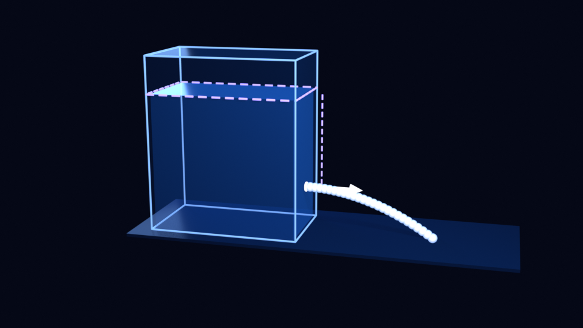

**Como se lê:** Um tanque com um jato curvo saindo de um furo, marcado por pontos: lê-se como velocidade de saída √(2gh) e o alcance parabólico.

**Usar quando**
- velocidade de saída (Torricelli) e o alcance do jato
- alcance máximo com o furo na metade da altura
- contraste com a continuidade (tubo_escoamento)

**Não usar quando**
- tanques que esvaziam (o nível é constante aqui)
- viscosidade ou turbulência

**Limitações**
- só o objeto geométrico: valores, fórmulas, gráficos e os nomes dos vetores são do Manim
- a gramática de cor segue o padrão do arsenal (estilo.json): E = ciano, vetores físicos = branco, construções = violeta, sinal da carga esculpido
- o nível do líquido é constante (reservatório grande)
- o jato é uma parábola perfeita, sem arrasto nem dispersão
- g = 1 nas unidades do sólido: as escalas são qualitativas

| Parâmetro | Padrão | Unid. | Descrição |
|---|---|---|---|
| `largura` | 2.4 | u | largura do tanque |
| `nivel` | 2.2 | u | altura do líquido |
| `altura_furo` | 0.7 | u | altura do furo |
| `n_particulas` | 26 | n | partículas marcadoras do jato |
| `setas` | 1 | 0/1 | seta da velocidade de saída |
| `movimento` | 0 | 0/1 | 1 = animação (use animar.py ou a ponte com o Manim) |
| `fase` | 0.0 | 0-1 | fase da animação |

**Integração:** `png_seq_alpha` · custo não medido

**Animação (cargas em movimento):** `escoamento` · loop sem emenda (`fase` de 0 a 1) · 60 quadros sugeridos · custo 1.09 s/frame (1080p, com alpha)

```powershell
& "C:\Program Files\Blender Foundation\Blender 5.2\blender.exe" -b -P experimentos\blender\arsenal\renderizar.py -- tanque_torricelli --res 1920x1080 --alpha
```

**No Manim:**

```python
from manim_solido3d import Solido3D   # sys.path: experimentos/blender/arsenal
img = Solido3D("tanque_torricelli").mobject(cena=self, altura=5)   # cargas em loop; img.pausar() / img.retomar()
```

Ficha: `solidos/tanque_torricelli.json`

### `teorema_stokes` — Teorema de Stokes (hemisfério e contorno)

**Status:** aprovado · Aparência aprovada pelo usuário em 2026-10-07 (padrão visual de estilo.json); validado em 960x540 e 1080p.

Hemisfério de vidro azul (a superfície S) com o contorno ∂S no plano z = 0 em violeta contínuo, normais n̂ para fora (azuis), setas do campo rotacional (ciano) e uma seta branca percorrendo ∂S no sentido anti-horário (regra da mão direita com n̂ para cima). Com `movimento=1` a seta percorre o contorno.

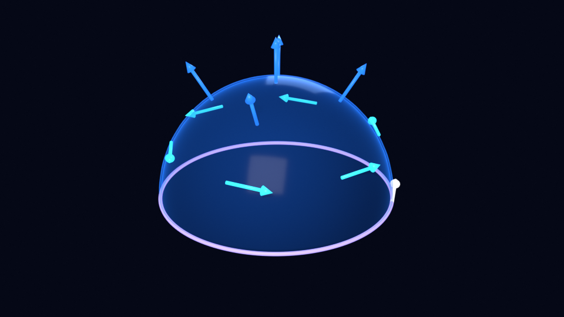

**Como se lê:** Cúpula de vidro com anel violeta na base, normais azuis para fora e setas ciano girando: lê-se como 'circulação no contorno = fluxo do rotacional pela superfície'.

**Usar quando**
- teorema de Stokes: ∮ F·dr = ∬ (∇×F)·dS (circulação e fluxo do rotacional)
- orientação: sentido do percurso × normal (regra da mão direita)
- relação com a lei de Ampère (superfície que apoia o contorno amperiano)

**Não usar quando**
- superfícies fechadas (use o teorema da divergência com as gaussianas)
- superfícies com buracos ou mais de um contorno

**Limitações**
- a gramática de cor segue o padrão do arsenal: campo vetorial = ciano (reservado ao campo), normal n̂ = azul, tangentes = branco, construções (remendo, contorno) = violeta, nunca sólidas
- só o objeto geométrico: integrais, fórmulas e o sinal da circulação/fluxo são do Manim
- a superfície é um hemisfério fixo (z ≥ 0) e o contorno é o equador; outra superfície com o mesmo contorno (um disco) não está no arsenal
- o campo desenhado é o rotacional (−y, x, 0) em 6 pontos: é ilustrativo, não é o ∇×F

| Parâmetro | Padrão | Unid. | Descrição |
|---|---|---|---|
| `raio` | 1.8 | u | raio do hemisfério |
| `com_campo` | 1 | 0/1 | 1 = setas ciano do campo rotacional |
| `normais` | 1 | 0/1 | 1 = normais n̂ para fora |
| `contorno_continuo` | 1 | 0/1 | 1 = contorno contínuo (circulação calculada); 0 = tracejado |
| `movimento` | 0 | 0/1 | 1 = animação em loop (use animar.py ou a ponte com o Manim) |
| `fase` | 0.0 | 0-1 | fase do loop; fase=1 repete o quadro da fase 0 (loop perfeito) |

**Integração:** `png_seq_alpha` · custo 1.02 s/frame (1080p, Eevee)

**Animação (cargas em movimento):** `circulacao` · loop sem emenda (`fase` de 0 a 1) · 60 quadros sugeridos · custo 1.02 s/frame (1080p, com alpha)

```powershell
& "C:\Program Files\Blender Foundation\Blender 5.2\blender.exe" -b -P experimentos\blender\arsenal\renderizar.py -- teorema_stokes --res 1920x1080 --alpha
```

**No Manim:**

```python
from manim_solido3d import Solido3D   # sys.path: experimentos/blender/arsenal
img = Solido3D("teorema_stokes").mobject(cena=self, altura=5)   # cargas em loop; img.pausar() / img.retomar()
```

Ficha: `solidos/teorema_stokes.json`

### `toroide_corrente` — Toroide (fio enrolado em anel)

**Status:** aprovado · Aparência aprovada pelo usuário em 2026-10-07 (padrão visual de estilo.json); validado em 960x540 e 1080p.

Toroide: fio azul (#267BFF) enrolado em torno da seção de um toro cujo eixo é X. Núcleo de vidro opcional e eixo de simetria opcional.

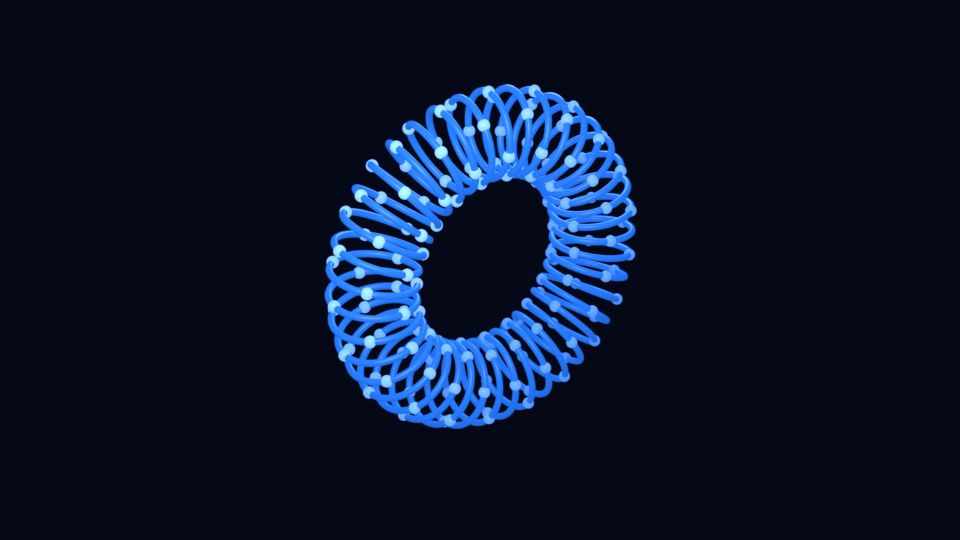

**Como se lê:** Anel formado por espiras azuis apertadas, com o buraco central visível. Lê-se como 'solenoide fechado sobre si mesmo'.

**Usar quando**
- campo B de um toroide (circulação amperiana circular dentro do núcleo; campo fora é nulo)
- contraste com o solenoide reto (enrolamento aberto)
- mostrar que o campo fica confinado ao interior do enrolamento
- corrente circulando pelas espiras do toroide (cargas_moveis=1)

**Não usar quando**
- enrolamento reto (use solenoide_corrente)
- toroide com seção retangular: aqui a seção é circular

**Limitações**
- só a fonte física (fio/enrolamento, azul): o campo B (ciano) e o sentido da corrente são desenhados no 2D/Manim
- sem noção de sentido: a hélice tem um sentido de enrolamento, mas ele não representa a corrente de forma legível; indicar I por rótulo/seta no Manim
- N espiras fixas e uniformes; o espaçamento interno é mais apertado que o externo, como num toroide real
- o fio é grosso para ser visível
- o movimento não codifica a corrente: a convenção (corrente convencional ou elétrons, que vão ao contrário) e o sinal vão por seta e rótulo no Manim; o movimento é didático, não em escala
- as cargas seguem o fio em volta do toroide; o campo B (ciano) circular no interior não é desenhado

| Parâmetro | Padrão | Unid. | Descrição |
|---|---|---|---|
| `raio_maior` | 1.6 | u | raio do círculo central do toro |
| `raio_menor` | 0.5 | u | raio da seção do toro |
| `n_espiras` | 40 | n | número de espiras |
| `raio_fio` | 0.04 | u | raio do fio (visual) |
| `nucleo` | 0 | 0/1 | 1 = núcleo de vidro (toro) dentro do enrolamento |
| `eixo` | 0 | 0/1 | 1 = eixo de simetria tracejado neutro |
| `comprimento_eixo` | 4.5 | u | comprimento do eixo, se desenhado |
| `cargas_moveis` | 0 | 0/1 | 1 = cargas em movimento (animação em loop); use com animar.py ou a ponte com o Manim |
| `fase` | 0.0 | 0-1 | fase do movimento; fase=1 repete o quadro da fase 0 (loop perfeito) |
| `espaco_cargas` | 0.9 | u | distância entre cargas ao longo do fio (ajustada para fechar a volta) |
| `tamanho_carga_movel` | 0.07 | u | raio de cada carga móvel |

**Integração:** `png_seq_alpha` · custo 0.45 s/frame (1080p, Eevee)

**Animação (cargas em movimento):** `circulacao` · loop sem emenda (`fase` de 0 a 1) · 60 quadros sugeridos · custo 0.5 s/frame (1080p, com alpha)

```powershell
& "C:\Program Files\Blender Foundation\Blender 5.2\blender.exe" -b -P experimentos\blender\arsenal\renderizar.py -- toroide_corrente --res 1920x1080 --alpha
```

**No Manim:**

```python
from manim_solido3d import Solido3D   # sys.path: experimentos/blender/arsenal
img = Solido3D("toroide_corrente").mobject(cena=self, altura=5)   # cargas em loop; img.pausar() / img.retomar()
```

Ficha: `solidos/toroide_corrente.json`

### `transformacao_linear_3d` — Transformação linear em R³

**Status:** aprovado · Aparência aprovada pelo usuário em 2026-10-07 (padrão visual de estilo.json); validado em 960x540 e 1080p.

Cubo unitário (violeta, tracejado, parado) e a sua imagem pela matriz A (vidro azul, arestas azul-claro), com os vetores A e1, A e2, A e3 (as colunas de A) em branco. Com movimento o cubo vai de I até A e volta (interpolação linear I → A → I): a fase 0 e a fase 1 são o cubo original.

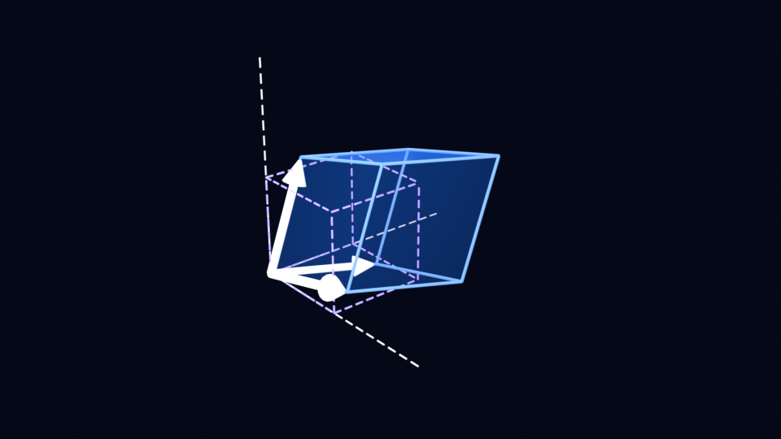

**Como se lê:** Uma caixa que se deforma a partir de uma caixa tracejada, com três setas brancas nas arestas: lê-se como a ação de uma matriz e suas colunas.

**Usar quando**
- a matriz como transformação linear (colunas = imagens da base)
- determinante como razão de volumes
- composição e inversa (compare no Manim)

**Não usar quando**
- transformações afins (a origem é fixa)
- mais que um cubo (não há uma grade completa)

**Limitações**
- só o objeto geométrico: valores, fórmulas, matrizes, resultados e rótulos são do Manim
- a gramática de cor segue o padrão do arsenal (estilo.json): superfícies = vidro azul, curvas = azul-claro, construções = violeta, vetores = branco, normal e ∇g = azul, campo = ciano
- a deformação é interpolada linearmente de I até A: o caminho intermediário não é uma transformação de mesma natureza
- a matriz tem de ser não singular para o cubo ter volume
- os elementos de A são parâmetros (a11 ... a33)

| Parâmetro | Padrão | Unid. | Descrição |
|---|---|---|---|
| `lado` | 1.5 | u | aresta do cubo unitário |
| `intensidade` | 1.0 | 0-1 | fração de I até A (sem movimento) |
| `a11` | 1.2 | n | elemento A[1][1] da matriz (linha 1, coluna 1) |
| `a12` | 0.5 | n | elemento A[1][2] da matriz (linha 1, coluna 2) |
| `a13` | 0.0 | n | elemento A[1][3] da matriz (linha 1, coluna 3) |
| `a21` | 0.0 | n | elemento A[2][1] da matriz (linha 2, coluna 1) |
| `a22` | 0.9 | n | elemento A[2][2] da matriz (linha 2, coluna 2) |
| `a23` | 0.4 | n | elemento A[2][3] da matriz (linha 2, coluna 3) |
| `a31` | 0.3 | n | elemento A[3][1] da matriz (linha 3, coluna 1) |
| `a32` | 0.0 | n | elemento A[3][2] da matriz (linha 3, coluna 2) |
| `a33` | 1.1 | n | elemento A[3][3] da matriz (linha 3, coluna 3) |
| `movimento` | 0 | 0/1 | 1 = animação (use animar.py ou a ponte com o Manim) |
| `fase` | 0.0 | 0-1 | fase da animação |

**Integração:** `png_seq_alpha` · custo não medido

**Animação (cargas em movimento):** `transformacao` · loop sem emenda (`fase` de 0 a 1) · 60 quadros sugeridos · custo 0.66 s/frame (1080p, com alpha)

```powershell
& "C:\Program Files\Blender Foundation\Blender 5.2\blender.exe" -b -P experimentos\blender\arsenal\renderizar.py -- transformacao_linear_3d --res 1920x1080 --alpha
```

**No Manim:**

```python
from manim_solido3d import Solido3D   # sys.path: experimentos/blender/arsenal
img = Solido3D("transformacao_linear_3d").mobject(cena=self, altura=5)   # cargas em loop; img.pausar() / img.retomar()
```

Ficha: `solidos/transformacao_linear_3d.json`

### `trilho_looping` — Looping (pista com laço vertical)

**Status:** aprovado · Aparência aprovada pelo usuário em 2026-10-07 (padrão visual de estilo.json); validado em 960x540 e 1080p.

Pista de vidro com uma rampa, uma concordância suave e um laço vertical (a pista se desloca lateralmente para não se cruzar). A bola parte do repouso na altura h0 (linha tracejada violeta) e a velocidade vem da energia, v = √(2 g (h0 − z)). Ciclo único.

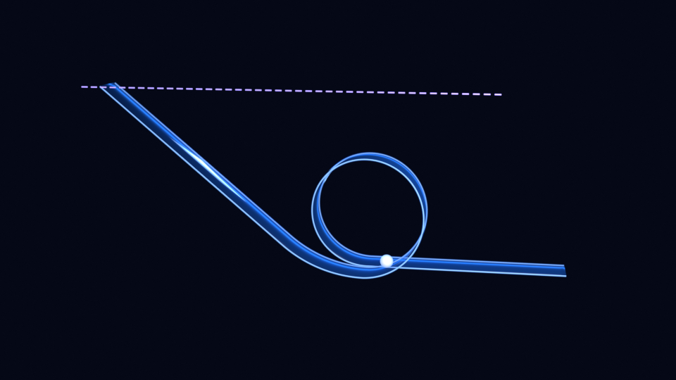

**Como se lê:** Uma bola descendo uma rampa, subindo o laço e saindo: lê-se como energia potencial virando cinética, e a condição para completar o looping.

**Usar quando**
- looping e a altura mínima h0 ≥ 2,5 R
- conservação da energia mecânica numa pista
- condições de contato (a normal no topo)

**Não usar quando**
- rolamento com rotação (a bola aqui desliza sem atrito)
- pistas que não sejam laço

**Limitações**
- só o objeto geométrico: valores, fórmulas, gráficos e os nomes dos vetores são do Manim
- a gramática de cor segue o padrão do arsenal (estilo.json): vetores físicos = branco, construções = violeta tracejado, corpos = vidro azul
- a bola desliza sem atrito e sem rotação (g = 1 nas unidades do sólido): a velocidade é qualitativa
- o deslocamento lateral do laço é uma convenção de desenho

| Parâmetro | Padrão | Unid. | Descrição |
|---|---|---|---|
| `raio_loop` | 1.4 | u | raio do laço |
| `altura_inicial` | 0.0 | u | altura h0 (0 = automática: 3,2 R) |
| `largura` | 0.9 | u | largura da pista |
| `deslocamento_y` | 1.0 | u | deslocamento lateral do laço |
| `raio_bola` | 0.16 | u | raio da bola |
| `linha_energia` | 1 | 0/1 | linha do nível h0 |
| `movimento` | 0 | 0/1 | 1 = animação (use animar.py ou a ponte com o Manim) |
| `fase` | 0.0 | 0-1 | fase da animação |

**Integração:** `png_seq_alpha` · custo não medido

**Animação (cargas em movimento):** `descida` · loop sem emenda (`fase` de 0 a 1) · 60 quadros sugeridos · custo 0.72 s/frame (1080p, com alpha)

```powershell
& "C:\Program Files\Blender Foundation\Blender 5.2\blender.exe" -b -P experimentos\blender\arsenal\renderizar.py -- trilho_looping --res 1920x1080 --alpha
```

**No Manim:**

```python
from manim_solido3d import Solido3D   # sys.path: experimentos/blender/arsenal
img = Solido3D("trilho_looping").mobject(cena=self, altura=5)   # cargas em loop; img.pausar() / img.retomar()
```

Ficha: `solidos/trilho_looping.json`

### `tubo_escoamento` — Tubo com estrangulamento (continuidade)

**Status:** aprovado · Aparência aprovada pelo usuário em 2026-10-07 (padrão visual de estilo.json); validado em 960x540 e 1080p.

Tubo de vidro azulado (eixo X) que se estreita no meio até `razao` do raio, com partículas marcadoras (brancas perto, azul-claro longe) fluindo em +X com v ∝ 1/r². As partículas são igualmente espaçadas no tempo, então ficam mais afastadas e mais rápidas no gargalo.

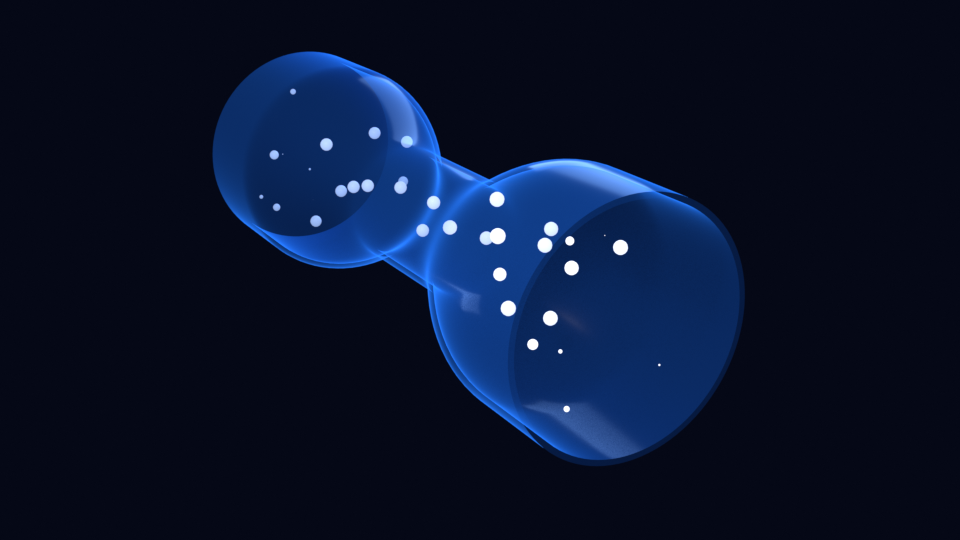

**Como se lê:** Tubo com um gargalo e pontos que aceleram ao passar por ele e ficam mais espaçados. Lê-se como 'A v = constante'.

**Usar quando**
- equação da continuidade: A₁v₁ = A₂v₂
- Bernoulli e efeito Venturi (a diferença de pressão é do Manim)
- mostrar que a velocidade cresce onde a seção diminui

**Não usar quando**
- escoamento turbulento ou viscoso (o campo de velocidades é uniforme na seção)
- fluido compressível

**Limitações**
- o campo de velocidade é uniforme na seção (escoamento ideal): não há perfil parabólico
- as partículas são marcadores, não representam a densidade do fluido nem a pressão
- o estrangulamento é fixo (suave, de 1,5 u de transição); só `razao` e o raio mudam

| Parâmetro | Padrão | Unid. | Descrição |
|---|---|---|---|
| `comprimento` | 6.0 | u | comprimento do tubo (eixo X) |
| `raio` | 1.0 | u | raio nas pontas |
| `razao` | 0.5 | 0-1 | raio do gargalo / raio nas pontas |
| `n_particulas` | 36 | n | número de partículas marcadoras |
| `semente` | 7 | n | semente do sorteio |
| `movimento` | 0 | 0/1 | 1 = animação em loop (use animar.py ou a ponte com o Manim) |
| `fase` | 0.0 | 0-1 | fase do loop; fase=1 repete o quadro da fase 0 (loop perfeito) |

**Integração:** `png_seq_alpha` · custo 1.15 s/frame (1080p, Eevee)

**Animação (cargas em movimento):** `escoamento` · loop sem emenda (`fase` de 0 a 1) · 60 quadros sugeridos · custo 1.15 s/frame (1080p, com alpha)

```powershell
& "C:\Program Files\Blender Foundation\Blender 5.2\blender.exe" -b -P experimentos\blender\arsenal\renderizar.py -- tubo_escoamento --res 1920x1080 --alpha
```

**No Manim:**

```python
from manim_solido3d import Solido3D   # sys.path: experimentos/blender/arsenal
img = Solido3D("tubo_escoamento").mobject(cena=self, altura=5)   # cargas em loop; img.pausar() / img.retomar()
```

Ficha: `solidos/tubo_escoamento.json`
